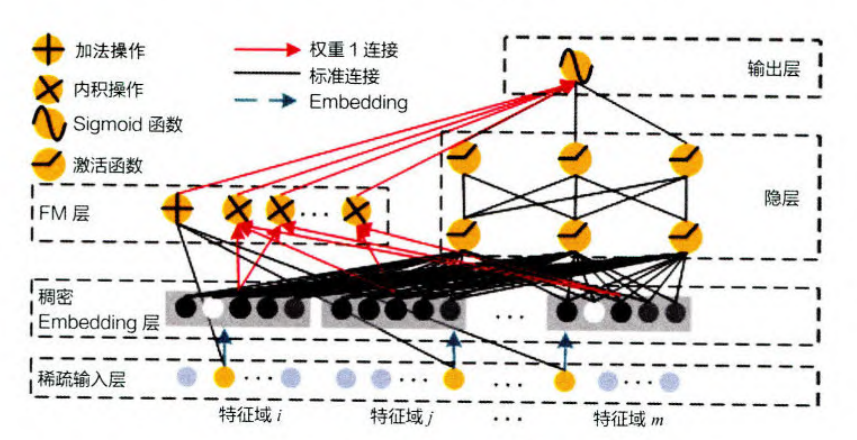

# 推荐系统

[TOC]

## 1. 推荐系统简介

### 1.1 推荐系统与互联网

- 推荐系统的作用和意义

  - 解决在“信息过载”和“用户需求不明确”情况下，如何让用户高效获得感兴趣的信息
  - 解决产品能够最大限度地吸引用户、留存用户、增加用户黏性、提高用户转化率的问题，从而达到公司商业目标连续增长的目的

- 什么是推荐系统

  - 不需要用户提供明确需求，通过分析用户历史行为给用户的兴趣进行建模，从而主动给用户推荐能够满足他们兴趣和需求的信息

  - 提供一个被动，模糊，强个性化，长尾效应，评估复杂的持续服务

- 推荐系统优化目标

  - 用户体验的优化
  - 满足公司商业利益

- 推荐系统的作用

  - 高效连接用户和物品,发现尾商品
  - 留住用户和内容生产者,实现商业目标

- 推荐系统的工作原理
  - 社会化推荐 向朋友咨询,社会化推荐,让好友给自己推荐物品
  - 基于内容的推荐 打开搜索引擎,输入自己喜欢的演员的名字,然后看看返回结果中还有什么电影是自己没看过的
  - 基于流行度的推荐 查看要房排行榜
  - 基于协同过滤的推荐 找到和自己历史兴趣相似的用户,看看他们最近在看什么电影
- 推荐系统应用场景
  - 推荐系统与 YouTube 的观符时长增长
    - YouTube 是全球最大的 UGC，其优化用户体验结果的最直接体现就是用户观看时长的增加
    - 因为总用户观看时长与广告的总曝光机会成正比
  - 推荐系统与电商网站的收入增长
    - 为推荐系统为用户推荐的商品是否合适，直接影响了用户的购买转化率

### 1.2 推荐系统的架构

- 推荐系统: 追求指标增长，留存率/阅读时间/GMV(Gross Merchandise Volume电商网站成交金额)/视频网站VV(Video View)

- 解决用户如何在“信息过载”的情况下高效地获得感兴趣的信息
  - 信息在不同场景中定义不同，商品信息 / 视频信息 / 新闻信息，可统称为 “**物品信息**”
  - 与 “人” 相关的信息，历史行为 / 人口属性 / 关系网络等，这些可统称为 “**用户信息**”
  - 用户的最终选择一般会受时间、地点、用户的状态等一系列环境信息的影响，可称为 “**场景信息**”

- 推荐系统的逻辑框架

  - 在获知“用户信息”“物品信息”“场景信息”的基础上，推荐系统要处理的问题可以较形式化地定义为：对于用户 U ( user ), 在特定场景 C ( context ) 下，针对海量的 “物品” 信息，构建一个函数f(U,I,C)，预测用户对特定候选物品 I ( item ) 的喜好程度，再根据喜好程度对所有候选物品进行排序，生成推荐列表的问题

    

- 推荐系统的技术架构

  - 解决两类问题：**数据和信息相关的问题** 和 **推荐系统算法和模型相关的问题**

  - “数据和信息” **系统架构部分**

    - 渐发展为推荐系统中融合了数据离线批处理、实时流处理的数据流框架

  - “算法和模型” **算法架构部分**

    - 进一步细化为推荐系统中集训练（ training )、评估（ evaluation )、部署（ deployment )、线上推断（online inference ) 为一体的模型框架

    

- 推荐系统的数据部分

  - 推荐系统的数据部分主要负责 “用户”“物品”“场景”的信息收集与处理
  - 将负责数据收集与处理的三种平台按照实时性的强弱排序，依次为
    -  “客户端及服务器端实时数据处理” “流处理平台准实时数据处理” “大数据平台离线数据处理”
    - 在实时性由强到弱递减的同时，三种平台的海量数据处理能力则由弱到强
    - 因此，一个成熟的推荐系统的数据流系统会将三者取长补短，配合使用

#### 1.2.1 Lambda 架构采集数据

- 大数据Lambda 架构由Twitter工程师Nathan Marz (storm项目发起人)提出
- Lambda系统架构提供了一个结合实时数据和Hadoop预先计算的数据环境和混合平台,提供一个实时的数据视图
- 分层架构
  - 批处理层
    - 数据不可变可进行任何计算,可水平扩展
    - 高延迟 几分钟~几小时(计算量和数据量不同)
    - 日志收集Flume
    - 分布式存储 Hadoop
    - 分布式计算Hadoop MapReduce & spark
    - ”视图存储数据库: Nosql(HBase/Cassandra)，Redis/memcache，MySql
  - 实时处理层
    - 流式处理持续计算
    - 存储和分析某个窗口期内的数据
    - 最终正确性(Eventual accuracy)
    - 实时数据收集 flume & kafka
    - 实时数据分析 spark streaming/storm/flink
  - 服务层
    - 支持随机读
    - 需要在非常短的时间内返回结果
    - 读取批处理层和实时处理层结果并对其归并

- 在得到原始的数据信息后，推荐系统的数据处理系统会将原始数据进一步加工，加工后的数据出口主要有三个：
  - 生成推荐模型所需的样本数据，用于算法模型的训练和评估
  - 生成推荐模型服务（ model serving )所需的“特征”，用于推荐系统的线上推断
  - 生成系统监控、商业智能（ Business Intelligence, BI ) 系统所需的统计型数据

#### 1.2.2 Netflix个性化推荐架构

- 将推荐系统按照对数据利用情况和系统响应要求出发，将整个架构分为离线层、近线层、在线层三个模块

  

- **离线层**：离线层是计算量最大的一个部分，它的特点是不依赖实时数据，也不需要实时提供服务

  - 需要实现：数据处理、数据存储；特征工程、离线特征计算；离线模型的训练；

  - 离线层面临的数据量级是最大的，面临主要的问题是海量数据存储、大规模特征工程、多机分布式机器学习模型训练。目前主流的做法是HDFS，收集到我们所有的业务数据，通过HIVE等工具，从全量数据中抽取出我们需要的数据，进行相应的加工，离线阶段主流使用的分布式框架一般是Spark

    

- 离线层优势和不足

  - 离线层有如下的优势：
    1. 可以处理大量的数据，进行大规模特征工程；
    2. 可以进行批量处理和计算；
    3. 不用有响应时间要求；
  - 最大的不足就是无法反应用户的实时兴趣变化，这就促使了近线层的产生

- **近线层**：特点是准实时，可以获得实时数据，然后快速计算提供服务，但是并不要求它和在线层一样达到几十毫秒这种延时要求

  - 近线层的产生是同时想要弥补离线层和在线层的不足，折中的产物

    

  - 它适合处理一些对延时比较敏感的任务

    1. 特征的事实更新计算：例如统计用户对不同type的ctr，推荐系统一个老生常谈的问题就是特征分布不一致怎么办，如果使用离线算好的特征就容易出现这个问题。近线层能够获取实时数据，按照用户的实时兴趣计算就能很好避免这个问题
    2. 实时训练数据的获取：比如在使用DIN、DSIN这行网络会依赖于用户的实时兴趣变化，用户几分钟前的点击就可以通过近线层获取特征输入模型
    3. 模型实时训练：可以通过在线学习的方法更新模型，实时推送到线上

- **在线层**：使用实时数据，保证实时在线服务

  - 主要承担的工作有
    1. 模型在线服务；包括了快速召回和排序
    2. 在线特征快速处理拼接：根据传入的用户ID和场景，快速读取特征和处理；
    3. AB实验或者分流：根据不同用户采用不一样的模型，比如冷启动用户和正常服务模型
    4. 运筹优化和业务干预：比如要对特殊商家流量扶持、对某些内容限流
  - 典型的在线服务是用RESTful/RPC等提供服务，一般是公司后台服务部门调用我们的这个服务，返回给前端
  - 在线服务的数据源就是在离线层计算好的每个用户和商品特征，事先存放在数据库中，在线层只需要实时拼接，不进行复杂的特征运算，然后输入近线层或者离线层已经训练好的模型，根据推理结果进行排序，最后返回给后台服务器，后台服务器根据对每一个用户的打分，再返回给用户

#### 1.2.3 算法架构

- 推荐系统的“模型部分”是推荐系统的主体，模型的结构一般由 “召回阶段”，“排序阶段”，“补充策略与算法层” 组成

- **“召回阶段”** 一般利用高效的召回规则、算法或简单的模型，快速从海量的候选集中召回用户可能感兴趣的物品

  - 召回决定了最终结果的天花板；
  - 如果没有召回层，理论上来说是效果最好，但是是不现实的，线上不延迟允许
  - 目前基本上采用多路召回解决范式，分为非个性化召回和个性化召回
    - 多路召回每一路召回可能采取一个不同的策略，对于每一路召回，会拉回K条相关物料，最后一起排序
    - 非个性化召回的作用就是一些热点item进行召回，比如最近7天点击高，成交高，评论量高，点赞高的样本
    - 个性化召回又有content-based、behavior-based、feature-based等多种方式
  - 召回主要考虑的内容有：
    1. 考虑用户层面：用户兴趣的多元化，用户需求与场景的多元化：例如：新闻需求，重大要闻，相关内容沉浸阅读等等
    2. 考虑系统层面：增强系统的鲁棒性；部分召回失效，其余召回队列兜底不会导致整个召回层失效；排序层失效，召回队列兜底不会导致整个推荐系统失效
    3. 系统多样性内容分发：图文、视频、小视频；精准、试探、时效一定比例；召回目标的多元化，例如：相关性，沉浸时长，时效性，特色内容等等
    4. 可解释性推荐一部分召回是有明确推荐理由的：很好的解决产品性数据的引入；

- **“排序阶段”** 利用排序模型对初筛的候选集进行精排序；排序无限逼近天花板，决定了最终推荐结果

  - 例如CTR预估 (点击率预估使用LR算法)估计用户是否会点击某个商品需要用户的点击数据
  - 粗排：粗排的原因是有时候召回的结果还是太多，精排层速度还是跟不上，所以加入粗排。粗排可以理解为精排前的一轮过滤机制，减轻精排模块的压力。粗排介于召回和精排之间，要同时兼顾精准性和低延迟
  - 精排：的任务是获取粗排模块的结果，对候选集进行打分和排序。精排需要在最大时延允许的情况下，保证打分的精准性，和粗排不同的是，精排只需要对少量的商品(即粗排输出的商品集合的topN)进行排序即可。因此，精排中可以使用比粗排更多的特征，更复杂的模型和更精细的策略

- **“补充策略与算法层”**，也被称为 “再排序层”，可以在将推荐列表返回用户之前，为兼顾结果的“多样性”“流行度”“新鲜度”等指标，结合一些补充的策略和算法对推荐列表进行一定的调整，最终形成用户可见的推荐列表

  - 重排常见的有三种优化目标：Point Wise、Pair Wise 和 List Wise
  - 重排序阶段对精排生成的Top-N个物品的序列进行重新排序，生成一个Top-K个物品的序列，作为排序系统最后的结果，直接展现给用户。重排序的原因是因为多个物品之间往往是相互影响的，而精排序是根据PointWise得分，容易造成推荐结果同质化严重，有很多冗余信息。而重排序面对的挑战就是海量状态空间如何求解的问题，一般在精排层我们使用AUC作为指标，但是在重排序更多关注NDCG等指标
  - 重排序在业务中，获取精排的排序结果，还会根据一些策略、运营规则参与排序，比如强制去重、间隔排序、流量扶持等、运营策略、多样性、context上下文等，重新进行一个微调

  

- 从推荐模型接收所有候选物品集，到最后产生推荐列表，这一过程一般称为**模型服务过程**

- 在线环境进行模型服务之前，需要通过模型训练（ model training ) 确定模型结构、结构中不同参数权重的具体数值，以及模型相关算法和策略中的参数取值
  - 模型的训练方法又可以根据模型训练环境的不同，分为“离线训练”和 “在线更新” 两部分
  - 离线训练的特点是可以利用全量样本和特征，使模型逼近全局最优点
  - 在线更新则可以准实时地“消化”新的数据样本，更快地反映新的数据变化趋势，满足模型实时性的需求

- 为了评估推荐模型的效果，方便模型的迭代优化，推荐系统的模型部分提供了“离线评估”和“线上 A/B 测试”
  - 用得岀的线下和线上评估指标，指导下一步的模型迭代优化

  


## 2. 前深度学习 推荐系统演化

### 2.1 传统推荐模型

- 传统推荐模型的发展脉络主要由以下几部分组成

  - 协同过滤算法族：

    - 经典的协同过滤算法曾是推荐系统的首选模型，从物品相似度和用户相似度角度出发，协同过滤衍生出物品协同过滤（ **ItemCF** ) 和用户协同过滤（ **UserCF** )两种算法
    - 为了使协同过滤能够更好地处理稀疏共现矩阵问题、增强模型的泛化能力，从协同过滤衍生出矩阵分解模型（ **Matrix** **Factorization**, **MF** )，并发展出矩阵分解的各分支模型

  - 逻辑回归模型族

    - 与协同过滤仅利用用户和物品之间的显式或隐式反馈信息相比，逻辑回归能够利用和融合更多用户、物品及上下文特征
    - 从 LR 模型衍生出的模型同样 “枝繁叶茂”，包括增强了非线性能力的大规模分片线性模型 ( Large Scale Piece-wise Linear Model, LS-PLM ), 由逻辑回归发展出来的 FM 模型，以及与多种不同模型配合使用后的组合模型

  - 因子分解机模型族

    - 因子分解机在传统逻辑回归的基础上，加入了二阶部分，使模型具备了进行特征组合的能力
    - 更进一步，在因子分解机基础上发展出来的域感知因子分解机（ Field-aware Factorization Machine, FFM )则通过加入特征域的概念，进一步加强了因子分解机特征交叉的能力

  - 组合模型

    - 为了融合多个模型的优点，将不同模型组合使用是构建推荐模型常用的方法
    - Facebook 提出的 GBDT+LR [梯度提升决策树(Gradient Boosting Decision Tree )+逻辑回归] 组合模型是在业界影响力较大的组合方式
    - 此外，组合模型中体现出的特征工程模型化的思想，也成了深度学习推荐模型的引子和核心思想之一

    

### 2.2 协同过滤

- Amazon 发表论文 *Amazon.com Recommenders Item-to-Item Collaborative Filtering*

- 协同过滤 Collaborative Filtering 算法思想：物以类聚，人以群分

  - 协同大家的反馈、评价和意见一起对海量的信息进行过滤，从中筛选出目标用户可能感兴趣的信息的推荐过程
  - 将有向图转换成共现矩阵，找到最相似的n个用户，得出目标用户 X的预测

- 基本的协同过滤推荐算法基于以下假设：

  - “跟你喜好**相似的人**喜欢的东西你也很有可能喜欢”: 基于用户的协同过滤推荐算法 (UserCF)
  - “跟你喜欢的东西**相似的东西**你也很有可能喜欢”: 基于物品的协同过滤推荐算法 (ItemCF)

- 相似度计算

  - 用户相似度的计算是算法中最关键的一步，共现矩阵中的行向量代表相应用户的用户向量，计算用户 i 和用户 j 的相似度问题，就是计算用户向量 **i** 和用户向量 **j** 之间的相似度

  - 杰卡德 Jaccard 相似系数是衡量两个集合的相似度一种指标

    $ sim_{ij}=\frac{|N(i) \cap N(j)|}{|N(i)| \cup|N(j)|} $，其中 $N(i)$和$N(j)$ 分别表示用户i和用户j交互物品的集合

  - 余弦相似度 Cosine Similarity 衡量用户向量i和用户向量j之间的向量夹角大小，夹角越小，相似度越大

    $sim_{ij} = cos(i，j)=\frac{i \times j}{||i|| \times ||j||}$

  - 皮尔逊 Pearson 相似系数是对余弦的优化，通过使用用户平均分对各独立评分进行修正，减小了用户评分偏置的影响

    $sim_{XY} = \frac{\sum_{i=1}^n(X_i-\overline{X})(Y_i-\overline{Y})} {\sqrt{\sum_{i=1}^n(X_i-\overline{X})^ 2}\sqrt{\sum_{i=1}^n(Y_i-\overline{Y})^2}}$

#### 2.2.1 UserCF

- UserCF **基于用户相似度**进行推荐的协同过滤算法

- UserCF 的具体步骤

  - 计算用户之间的相似度
- 利用目标用户与相似用户之间的相似度以及相似用户对物品的评分，来预测目标用户对候选物品的评分估计
  - 对用户进行物品推荐

- 最终结果的排序

  - 在获得 Top N 相似用户之后，利用 Top N 用户生成最终推荐结果

    - 最常用的方式是利用用户相似度和相似用户的评价的加权平均获得目标用户的评价预测

      权重 $W_{u,s}$ 是用户u和用户s的相似度，$R_{s,p}$ 是用户s对物品p的评分

      $R_{u,p} = \frac{\sum_{s\in S}(W_{u,s}R_{s,p})}{\sum_{s\in S}W_{u,s}}$

    - 在获得用户 U 对不同物品的评价预测后，最终的推荐列表根据预测得分进行排序，完成协同过滤的全部推荐过程

- UserCF两点缺点
  - 互联网应用场景，用户数往往远大于物品数，**UserCF** 需要维护用户相似度矩阵以便快速找出 **Top N** 相似用户。用户相似度矩阵的存储开销随着用户数量的增加而增加
  - 用户的历史数据向量往往非常稀疏，对于只有几次购买或者点击行为的用户来说，找到相似用户的准确度是非常低的，导致 **UserCF** 不适用于那些正反馈获取较困难的应用场景（如酒店预定、大件商品购买）

#### 2.2.2 ItemCF

- ItemCF 是**基于物品相似度**进行推荐的协同过滤算法

- 通过计算共现矩阵中物品列向量的相似度得到物品之间的相似矩阵，再找到用户的历史正反馈物品的相似物品进行进一步排序和推荐

- ItemCF 稠密评分矩阵具体步骤

  - 基于用户历史行为数据，构建以用户为行坐标，物品为列坐标的 mxn 维的共现矩阵

  - 计算共现矩阵两两列向量间的相似性，构建 nxn 维的物品相似度矩阵

  - 获得用户历史行为数据中的正反馈物品列表

  - 利用物品相似度矩阵，针对目标用户历史行为中的正反馈物品，找出相似的 Top A 个物品，组成相似物品集合

  - 对相似物品集合中的物品，利用相似度分值进行排序，生成最终的推荐列表

    $R_{u,p} = \sum(W_{p,h}R_{u,h})$, p是目标物品，h是已知物品

- UserCF 和 ItemCF 的应用场景

  - 由于 **UserCF** 基于用户相似度进行推荐，使其具备更强的社交特性，用户能够快速得知与自己兴趣相似的人最近喜欢的是什么，即使某个兴趣点以前不在自己的兴趣范围内，也有可能通过“朋友”的动态快速更新自己的推荐列表。非常适用**用户少， 物品多， 时效性较强的场合**，比如新闻推荐场景，因为新闻本身的兴趣点往往是分散的
  - **ItemCF** 更适用**物品少，用户多，用户兴趣固定持久， 物品更新速度不是太快的场合**，比如在 **Amazon** 的电商场景中，用户在一个时间段内更倾向于寻找一类商品，这时利用物品相似度为其推荐相关物品是契合用户动机的

#### 2.2.3 算法评估

- 召回率：在模型召回预测的物品中，预测准确的物品占用户实际喜欢的物品的比例

  召回率定义 $\operatorname{Recall}=\frac{\sum_{u}|R(u) \cap T(u)|}{\sum_{u}|T(u)|} $

- 精确率：推荐的物品中，对用户准确推荐的物品占总物品的比例

  精确率定义为： $\operatorname{Precision}=\frac{\sum_{u} \mid R(u) \cap T(u)|}{\sum_{u}|R(u)|} $

- 覆盖率：推荐系统能够推荐出来的物品占总物品集合的比例

  - 反映了推荐算法发掘长尾的能力， 覆盖率越高， 说明推荐算法越能将长尾中的物品推荐给用户

  $\text { Coverage }=\frac{\left|\bigcup_{u \in U} R(u)\right|}{|I|} $

- 新颖度：用推荐列表中物品的平均流行度度量推荐结果的新颖度。 如果推荐出的物品都很热门， 说明推荐的新颖度较低。 由于物品的流行度分布呈长尾分布， 所以为了流行度的平均值更加稳定， 在计算平均流行度时对每个物品的流行度取对数


### 2.3 Model Based CF

#### 2.3.1 Graph-based Model

- 之前方法局限性
  - 基于 Cosine, Jaccard, 皮尔逊相关性等相似度计算的协同过滤算法，在计算邻居关联强度的时候只关注于 Item-based，Item-based CF 只关注于 Item-User-Item 的路径，把所有的User-Item交互都平等得看待，从而忽视了 User-Item 交互中的大量噪声，推荐精度存在局限性
  - 对互补性产品的建模不足，可能会导致用户购买过手机之后还继续推荐手机，但用户短时间内不会再继续购买手机，因此产生无效曝光
- 原理
  - 将用户的行为数据表示为二分图
  - 基于二分图为用户进行推荐
  - 根据两个用户顶点之间的路径数、路径长度和经过的顶点数来评价两个顶点的相关性
- Swing算法
  - Swing 通过利用 User-Item-User 路径中所包含的信息，考虑 User-Item 二部图中的鲁棒内部子结构计算相似性
  - 若用户u和用户v之间除了购买过i外，还购买过商品j，则认为两件商品是具有某种程度上的相似的。也就是说，商品与商品之间的相似关系，是通过用户关系来传递的。为了衡量物品i和j的相似性，比较同时购买了物品i和j的用户u和用户v， 如果这两个用户共同购买的物品越少，即这两个用户原始兴趣不相似，但仍同时购买了两个相同的物品i和j， 则物品i和j的相似性越高
  - 计算公式：$s(i,j)=\sum\limits_{u\in U_i\cap U_j} \sum\limits_{v \in U_i\cap U_j}w_u*w_v* \frac{1}{\alpha+|I_u \cap I_v|}$

#### 2.3.2 MF 矩阵分解

- 协同过滤算法处理稀疏矩阵的能力比较弱，为了使得协同过滤更好处理稀疏矩阵问题，增强泛化能力，从协同过滤中衍生出矩阵分解模型 (Matrix Factorization, MF) 或者叫隐语义模型

  - 把大的共现矩阵拆成两个小的用户矩阵和物品矩阵，在协同过滤共现矩阵的基础上，使用更稠密的隐向量表示用户和物品
  - 通过挖掘用户和物品的隐含兴趣和隐含特征，在一定程度上弥补协同过滤模型处理稀疏矩阵能力不足的问题

- 隐语义模型

  - 核心思想是通过隐含特征（latent factor）联系用户兴趣和物品（item），基于用户的行为找出潜在的主题和分类，然后对物品进行自动聚类，划分到不同类别/主题(用户的兴趣)

- 矩阵分解算法的原理

  - 通过分解协同过滤的共现矩阵来得到用户和物品的隐向量，将用户和物品定位到隐向量的表示空间上，距离相近的用户和物品表明兴趣特点接近，可以根据向量距离由近到远的顺序生成的推荐列表
  - 用户和物品的隐向量是通过分解协同过滤生成的共现矩阵得到的，这也是“矩阵分解”名字的由来
  - 矩阵分解算法将 $m\times n$ 维的共现矩阵 R 分解为 $m \times k$  维的用户矩阵 U 和 $k \times n$ 维的物品矩阵 V 相乘的形式
  - m 是用户数量，n 是物品数量，k 是隐向量的维度。k的大小决定了隐向量表达能力的强弱。k值越大，隐向量承载的信息内容越多，表达能力也会更强，但学习难度增加，泛化程度相应降低

- 矩阵分解的求解过程

  - 对矩阵进行矩阵分解的主要方法有三种：特征值分解( Eigen Decomposition )、奇异值分解（ Singular Value Decomposition , SVD ) 、交替最小二乘法（ALS）和梯度下降（ Gradient Descent )，梯度下降法是进行矩阵分解的主要方法

  - 奇异值分解

    - 奇异值分解 $M_{m\times n}=U_{m\times m}\sum_{m\times n} V^T_{n\times n}$, 取对角阵$\sum$中较大的 k个元素作为隐含特征，删除$\sum$的其他维度及 U 和 V 中对应的维度，M被分解为 $U_{m\times k}\sum_{k\times k} V^T_{k\times n}$
    - 奇异值分解其存在两点缺陷：要求原始的共现矩阵是稠密的；计算复杂度达到了$O(mn^2)$的级别

  - 梯度下降法

    - 矩阵分解的目标函数是让原始评分$r_{ui}$与用户向量和物品向量之积$q_i^Tp_u$的差尽量小，最大限度地保存共现矩阵的原始信息，为了减少过拟合现象再加入正则化

      $L = \underset{q^*,p^*}{min}\sum(r_{ui}-q_i^Tp_u)^2 + \lambda(||q_i||+||p_u||)^2$

    - 对目标函数$q_i$偏导，$L' = 2(r_{ui} - q_i^Tp_u)p_u - 2\lambda q_i$
    - 对目标函数$p_u$偏导，$L' = 2(r_{ui} - q_i^Tp_u)q_i - 2\lambda p_u$
    - 沿梯度的反方向更新$q_i$参数，$q_i = q_i - \gamma((r_{ui} - q_i^Tp_u)p_u - \lambda q_i)$
    - 沿梯度的反方向更新$p_u$参数，$p_u = p_u - \gamma((r_{ui} - q_i^Tp_u)q_i - \lambda p_u)$
    - 在完成矩阵分解过程后，即可得到所有用户和物品的隐向量，利用某用户的隐向量与所有物品的隐向量进行逐一的内积运算，得出某用户对所有物品的评分预测，再依次进行排序，得到最终的推荐列表

- 消除用户和物品打分的偏差

  - 由于不同用户的打分体系不同，为了消除用户和物品打分的偏差（ Bias ), 常用的做法是在矩阵分解时加人用户和物品的偏差向量

    $r_{ui} = \mu + b_i + b_u + q_i^Tp_u$，$\mu$是全局偏差常数，$b_i$是物品偏差系数,  $b_u$是用户偏差系数

  - 矩阵分解目标函数也需要做相应改变

### 2.4 LR 逻辑回归

- 逻辑回归模型能够综合利用用户、物品、上下文等多种不同的特征，生成较为“全面”的推荐结果
- 逻辑回归将推荐问题看成一个分类问题，通过预测正样本的概率对物品进行排序
- 基于逻辑回归模型的推荐流程
  - 将用户年龄、性别、物品属性、物品描述、当前时间、当前地点等特征转换成数值型特征向量
  - 确定逻辑回归模型的优化目标，利用已有样本数据对逻辑回归模型进行训练，确定逻辑回归模型的内部参数
  - 在模型服务阶段，将特征向量输入逻辑回归模型，经过逻辑回归模型的推断，得到用户“点击”概率
  - 利用“点击” 概率对所有候选物品进行排序，得到推荐列表
- 逻辑回归模型的数学形式
  - 模型输入特征向量**x** = $(x_1,x_2,x_3...x_n)$
  - 为各特征赋予相应的权重**w** = $(w_1,w_2,w_3...w_n)$ 表示各特征的重要性差异，将各特征进行加权求和，得到 $x^Tw$
  - 将$x^Tw$ 输入 sigmoid 函数数，使之映射到 0~ 1 的区间，sigmoid 函数为 $f(z) = \frac{1}{1+e^{-z}}$
- 逻辑回归模型的训练方法
  - 逻辑回归模型常用的训练方法是梯度下降法、牛顿法、拟牛顿法等，应用最广泛的是梯度下降法
  - 确定逻辑回归的目标函数 $\left\{\begin{aligned} P(y=1|(x;w)=f_w(x) \\ P(y=0|(x;w)=1-f_w(x)\end{aligned}\right. => P(y|(x;w)=f_w(x) = f_w(x)^y(1-f_w(x))^{1-y}$
  - 模型参数的更新公式 $w_j=w_j-\gamma\frac{1}{m}\sum_{i=1}^m(f_w(x^i)-y^i)x_j^i$
- 逻辑回归模型的优势
  - 模型形式简单，可解释性强，从特征的权重可以看到不同的特征对最后结果的影响
  - 训练时便于并行化，在预测时只需要对特征进行线性加权，所以**性能比较好**，往往适合处理**海量id类特征**，就是**防止信息损失**
  - 资源占用小,尤其是内存
  - 方便输出结果调整。逻辑回归可以很方便的得到最后的分类概率分数，很容易的对概率分数划分阈值
- 逻辑回归模型的局限性
  - 缺点是表达能力不强，无法进行特征交叉、特征筛选等一系列较为高级”的操作，因此不可避免地造成信息的损失
  - 准确率并不是很高，形式非常的简单，很难去拟合数据的真实分布
  - 处理非线性数据较麻烦，需要进行**人工特征组合**，模型迁移比较困难
  - 解决问题：衍生出因子分解机等高维的复杂模型，多层神经网络可以完全替代逻辑回归模型

### 2.5 FM到FFM

- 逻辑回归模型缺点

  - 逻辑回归模型表达能力不强，会不可避免地造成有效信息的损失；

  - 仅利用单一特征而非交叉特征进行判断的情况下，甚至会得出错误的结论，“辛普森悖论”说明了进行多维度特征交叉的重要性

  - 什么是辛普森悖论

    > 一种有悖常理的现象：在对样本集合进行分组研究时，在分组比较中都占优势的一方，在总评中有时反而是失势的一方

  - 逻辑回归只对单一特征做简单加权，不具备进行特征交叉生成高维组合特征的能力，因此表达能力很弱

- 特征交叉 - POLY2 模型
  - 由于LR模型无法手动做特征交叉，所以干脆考虑所有的二阶交叉项

    $\phi POLY2(w,x)=\sum_{j_1=1}^n\sum_{j_2=j_1+1}^nw_{h(j_1,j_2)}x_{j1}x_{j2}$

  - POLY2 模型对所有特征进行两两交叉 $x_{j1}$ 和 $x_{j2}$ ，并对所有的特征组合赋予权重$w_{h(j_1,j_2)}$

  - 通过暴力组合特征的方式，在一定程度上解决了特征组合的问题，本质上仍是线性模型，其训练方法与逻辑回归并无区别

  - POLY2 模型两个较大的缺陷
    - 互联网数据特征向量极度稀疏，POLY2 模型进行无选择的特征交叉使特征向量更加稀疏，导致大部分交叉特征的权重缺乏有效的数据进行训练，无法收敛
    - 权重参数的数量由 $n$ 直接上升到 $n^2$, 极大地增加了训练复杂度

- 隐向量特征交叉 - FM (Factorization Machine) 模型
  
  - FM 的 LR部分就是 $w_0+\sum_{i=1}^nw_ix_i$
  
  - FM 二阶部分的数学形式 $\phi FM(x)=\sum_{j_1=1}^n\sum_{j_2=j_1+1}^n(v_{j_1}v_{j_2})x_{j1}x_{j2}$
  
  - 与 POLY2 相比，FM用两个向量的内积$w_{j_1}w_{j_2}$取代了单一的权重系数$w_{h(j_1,j_2)}$, FM 为每个特征学习了一个隐权重向量，实质上就是给每个$x$计算一个embedding，然后将两个向量之间的embedding做内积得到之前所谓的$w_{h(j_1,j_2)}$，好处就是模型泛化能力强 ，即使两个特征之前从未在训练集中**同时**出现，只需要$x_{j1}$和其它任意特征组合出现过就可以计算出$x_i$的embedding
  
  - 优化FM的计算效率：从$kn^2$提升到$nk$
  
    -  二阶部分特征交叉化简 $FM(x)=\frac{1}{2} \sum_{i=1}^k ((\sum_{j_1=1}^n	v_{j_1,i}x_{j1})^2- \sum_{j_1=1}^n v_{j_1,i}^2x_{j1}^2)$
  
  - FM 通过引入特征隐向量的方式，直接把 P0LY2 模型 $n^2$ 级别的权重参数数量减少到了 $nk$ (k为隐向量维度)，极大地降低了训练开销，更好地解决数据稀疏性的问题
  
- 引入特征域 - FFM (Field-aware Factorization Machines) 模型
  - 相比 FM 模型，FFM 模型引人了特征域感知 (Field-aware) 这一概念，使模型的表达能力更强
  - FFM 二阶部分的数学形式 $\phi FFM(x) = \sum_{j_1=1}^n\sum_{j_2=j_1+1}^n (v_{j_1,f_2}v_{j_2,f_1}) x_{j1}x_{j2}$
  - FFM 与 FM 的区别在于隐向量由原来的 $v_{j_1}$ 变成了 $v_{j_1,f_2}$，意味着每个特征对应的不是唯一一个隐向量，而是一组隐向量
  - 域 field ) 具体代表特征域，域内的特征一般是采用 one hot 编码形成的一段 one hot 特征向量
  - 例如一个样本：Publisher = ESPN，Advertiser = NIKE，Gender = Male
    - 在 FM 中，特征 ESPN,NIKE 和 Male 都有对应的隐向量 $w_{ESPN},w_{Nike},w_{Male}$
    - 在 FFM 中，特征 ESPN 与 NIKE，ESPN 与 Male 交叉特殊的权重分别是$w_{ESPN,A}*w_{Nike,P}$ 和 $w_{ESPN,G}*w_{Male,P}$
  - 在 FFM 模型的训练过程中，需要学习 n 个特征在 f 个域上的 k 维隐向量，参数数量共 n f k 个。相比FM，FFM无法做到类似的化简，所以其复杂度为$kn^2$

- 从 POLY2 到 FFM 的模型演化
  - POLY2 模型型直接学习每个交叉特征的权重，若特征数量为则权重数量为$n^2$量级
  - FM 模型学习每个特征的 k维隐向量，交叉特征由相应特征隐向量的内积得，权重数量共 $nk$ 个
  - FFM 模型引入了特征域的概念，在做特征交叉时，每个特征选择与对方域对应的隐向量做内积运算，得到交叉特征的权重，，在有n个特征，f个特征域，隐向量维度为k的前提下，参数数量共 $nfk$ 个

### 2.6 GBDT+LR

- GBDT+LR 的引入

  - 协同过滤和矩阵分解存在的劣势就是仅利用了用户与物品相互行为信息进行推荐， 忽视了用户自身特征， 物品自身特征以及上下文信息等，导致生成的结果往往会比较片面
  - FFM 模型采用引入特征域的方式增强了模型的特征交叉能力，但也只能做二阶的特征交叉，继续提高特征交叉的维度，会不可避免地产生组合爆炸和计算复杂度过高的问题
  - Facebook 提出了基于GBDT+LR 组合模型，利用GBDT自动进行特征筛选和组合， 进而生成新的离散特征向量，再把该特征向量当作 LR 模型输入，来产生最后较为全面的的预测结果
  - 用 GBDT 构建特征工程，和利用 LR 预估结果这两步是独立训练

- GBDT 模型结构

  - GBDT全称梯度提升决策树 (Gradient-boosted decision trees)，基本结构是决策树组成的树林，学习的方式是梯度提升

  - GBDT是通过采用加法模型(即基函数的线性组合），以及不断减小训练过程产生的误差来达到将数据分类或者回归的算法， 其训练过程如下：

    

  - 具体地讲，GBDT 作为集成模型，预测的方式是把所有子树的结果加起来

    $D(x) = d_{tree1}(x) + d_{tree2}(x) + \dots$

  - GBDT  每轮迭代会产生一个弱分类器(决策子树)，生成新子树的过程是基于样本标签值与上一轮分类器的残差

  - 假设当前已经生成了 3 棵子树，则当前的预测值为

    $D(x) = d_{tree1}(x) + d_{tree2}(x) + d_{tree3}(x)$

  - 构建第 4 棵子树期望当前树林的预测结果 D(x)与第 4 棵子树的预测结果 $d_{tree4}(x)$ 之和逼近理论上的拟合函数 $f(x)$

    $D(x) + d_{tree4}(x) = f(x)$

  - 第 4 棵子树生成的过程是以目标拟合函数和已有树林预测结果的残差 $R(x)$ 为目标

    $R(x) = f(x)-D(x)$

  - 理论上如果无限生成决策树，GBDT 可以无限逼近由所有训练集样本组成的目标拟合函数，从而达到减小预测误差的目的

- GBDT 特征转换的过程

  - 利用训练集训练好 GBDT 模型之后，就可以利用该模型完成从原始特征向量到新的离散型特征向量的转化
  - 一个训练样本在输入 GBDT 的某一子树后，会根据每个节点的规则最终落人某一叶子节点，把该叶子节点置为 1，其他叶子节点置为 0, 所有叶子节点组成的向量即形成了该棵树的特征向量，把 GBDT 所有子树的特征向量连接起来，即形成了后续 LR 模型输入的离散型特征向量
  - 决策树的深度决定了特征交叉的阶数，如果深度为 4 , 则通过 3 次节点分裂，最终的叶节点实际上是进行三阶特征组合后的结果
  - GBDT 容易产生过拟合，以及GBDT 的特征转换方式实际上丢失了大量特征的数值信息

- GBDT的优缺点

  - 树的生成过程可以理解成自动进行多维度的特征组合的过程；对于连续型特征的处理，GBDT 可以拆分出一个临界阈值
  - 对于海量的 id 类特征，GBDT 由于树的深度和棵树限制（防止过拟合），不能有效的存储
  - 另外海量特征在也会存在性能瓶颈，当 GBDT 的 one hot 特征大于 10 万维时，就必须做分布式的训练才能保证不爆内存

- GBDT+LR 特征工程新趋势

  - GBDT和LR的优缺点可以进行互补
  - GBDT+LR 组合模型对于推荐系统领域的重要性在于大大推进了特征工程模型化这一重要趋势，意味着特征工程可以完全交由一个独立的模型来完成，模型的输入可以是原始的特征向量，不必在特征工程上投人过多的人工筛选和模型设计的精力，实现真正的端到端 End to End ) 训练

### 2.7 LS-PLM

- 大规模分段线性模型 LS-PLM 又被称为 MLR( Mixed Logistic Regression, 混合逻辑回归）模型

- LS-PLM 可以看作对逻辑回归的自然推广，它在逻辑回归的基础上采用分而治之的思路，先对样本进行分片，再在样本分片中应用逻辑回归进行 CTR预估

- 在逻辑回归的基础上加人聚类的思想，为了让模型对不同用户群体、不同使用场景更有针对性，其采用的方法是先对全量样本进行聚类，再对每个分类施以逻辑回归模型进行预估

- LS-PLM 数学形式，用聚类函数 $\pi$ 对样本进行分类，再用 LR 模型计算样本在分片中具体的 CTR 然后将二者相乘后求和

  $f(x) = \sum_{i=1}^m\pi_i\eta_i(x) = \sum_{i=1}^m\frac{e^{\mu_ix}}{\sum_{j=1}^me^{\mu_jx}}\frac{1}{1+e^{-w_ix}}$

- 超参数 分片数 m 可以较好地平衡模型的拟合与推广能力
  - 当 m=1，LS-PLM就退化为普通的逻辑回归，m 越大，模型的拟合能力越强
  - 模型参数规模也随 m 的增大而线性增长，模型收敛所需的训练样本也随之增长
-  优点
  - 适用于工业级的推荐、广告等大规模稀疏数据的场景，因为以下两个优势
  - 端到端的非线性学习能力：样本分片能力能够挖掘出数据中蕴藏的非线性模式
  - 模型的稀疏性强：LS-PLM 在建模时引人了 L1 和 L2 范数，使最终训练出来的模型具有较高的稀疏度，使模型的部署更加轻量级


## 3. 深度学习 推荐系统应用

### 3.1 深度学习推荐模型演化关系

- 改变神经网络的复杂程度

  - 最简单的单层神经网络模型 AutoRec (自编码器推荐)
  - 经典的深度神经网络结构 Deep Crossing (深度特征交叉)
  - 主要的进化方式在于增加了深度神经网络的层数和结构复杂度

- 改变特征交叉方式

  - 主要改变在于丰富了深度学习网络中特征交叉的方式
  - 改变了用户向量和物品向量互操作方式的 NeuralCF (Neural Collaborative Filtering, 神经网络协同过滤)
  - 定义了多种特征向量交叉操作的PNN (Product-based Neural Network, 基于积操作的神经网络) 模型

- 组合模型

  - 主要是指 Wide&Deep 模型及其后续变种Deep&Cross，DeepFM 等
  - 其思路是通过组合两种不同特点、优势互补的深度学习网络，提升模型的综合能力

- FM 模型的深度学习演化版本

  - 传统推荐模型 FM 在深度学习时代有了诸多后续版本，其中包括 NFM (Neural Factorization Machine, 神经网络因子分解机)，FNN (Factorization-machine supported Neural Network, 基于因子分解机支持的神经网络)，AFM (Attention neural Factorization Machine, 注意力因子分解机）等
  - 它们对 FM 的改进方向各不相同：NFM 主要使用神经网络提升 FM 二阶部分的特征交叉能力，AFM 是引入了注意力机制的 FM 模型，FNN利用 FM 的结果进行网络初始化

- 注意力机制与推荐模型的结合

  - 这类模型主要是将“注意力机制”应用于深度学习推荐模型中
  - 主要包括结合了 FM 与注意力机制的 AFM 和引入了注意力机制的 CTR 预估模型 DIN (Deep Interest Network, 深度兴趣网络)

- 序列模型与推荐模型的结合

  - 这类模型的特点是使用序列模型模拟用户行为或用户兴趣的演化趋势
  - 代表模型是 DIEN (Deep Interest Evolution Network, 深度兴趣进化网络)

- 强化学习与推荐模型的结合

  - 这类模型将强化学习应用于推荐领域，强调模型的在线学习和实时更新
  - 其代表模型是 DRN( Deep Reinforcement Learning Network, 深度强化学习网络)

  

### 3.2 AutoRec

#### 3.2.1 AutoRec 模型的基本原理

- AutoRec (单隐层神经网络推荐模型) 结合了编码器 AutoEncoder 的思想和协同过滤
- AutoRec 模型是一个标准的自编码器，基本原理是利用协同过滤中的共现矩阵，完成物品向量或者用户向量的自编码。再利用自编码的结果得到用户对物品的预估评分，进而进行推荐排序
- 什么是自编码器
  - 自编码器是指能够完成数据“自编码”的模型，任何输入都可以转换成向量的形式进行表达
  - 目标函数 $R(r) = \underset{\theta}{min}\underset{r\in S}{\sum}||r-h(r;\theta)||_2^2$，有所有该重建函数生成的向量与原向量的平方残差和最小
  - 重建函数的参数数量远小于输入向量的维度数量，因此自编码器相当于完成了数据压缩和降维的工作

- 在得到 AutoRec 模型的重建函数后，还要经过评分预估和排序的过程才能得到最终的推荐列表

#### 3.2.2 AutoRec 模型的结构

- AutoRec 使用单隐层神经网络的结构来解决构建重建函数的问题，是一个非常标准的三层神经网络

- 网络的输入层是物品的评分向量 $r$, 输出层是一个多分类层。蓝色的神经元代表模型的 $k$ 维单隐层， k<<m

- $v$ 和 $w$ 分别代表输入层到隐层，以及隐层到输出层的参数矩阵; g() 和 f() 表示为输出层和隐层神经元的激活函数

- 模型结构代表的重建函数：$h(r;\theta)=f(W+g(Vr+\mu)+b)$

  

- 加入L2正则化项后的AutoRec 目标函数：$R(r)=\underset{\theta}{min}\sum_{i=1}^n||r^{(i)}-h(r^{(i)};\theta)||_0^2+ \frac{\lambda}{2}(||W||_F^2+||V||_F^2)$

#### 3.2.3 AutoRec 模型的推荐过程

- 当输入物品 $i$ 的评分向量为$r^{(i)}$ 时，模型的输出向量 $h(r^{(i)};\theta)$ 就是所有用户对物品 $i$ 的评分预测，第 $u$ 维就是用户 $u$ 对物品 $i$ 的评分预测 $R_{ui} = (h(r^{(i)};\theta))_u$

- AutoRec 也分为基于物品的 AutoRec 和基于用户的 AutoRec

  - 输入向量是物品的评分向量，可称为 I-AutoRec (Item based AutoRec)
  - 输入向量是用户的评分向量，称为U-AutoRec (User based AutoRec)

  - 推荐列表生成过程中，U-AutoRec 相比 I-AutoRec 优势在于仅需输入一次目标用户的用户向量，就可以重建所有物品的评分向量

#### 3.2.4 AutoRec 模型的特点和局限

- AutoRec 模型使用一个单隐层的 AutoEncoder 泛化用户或物品评分，使模型具有一定的泛化和表达能力
- AutoRec 模型的结构比较简单，使其存在一定的表达能力不足的问题

### 3.3 Deep Crossing 模型

- Deep Crossing 模型完整地解决了从特征工程、稀疏向量稠密化、多层神经网络进行优化目标拟合等深度学习推荐系统应用问题

#### 3.3.1 Deep Crossing 模型的应用场景

- Deep Crossing模型的应用场景是微软搜索引擎 Bing中的搜索广告推荐场景：用户在搜索引擎中输入搜索词之后，搜索引擎除了会返回相关结果，还会返回与搜索词相关的广告，这也是大多数搜索引擎的主要赢利模式
- 使用的特征可以分为三类
  - 一类是类别型特征，可以被处理成 one-hot 或者 multi-hot 向量
  - —类是数值型特征，微软称其为计数型 ( counting ) 特征，可以直接拼接进特征向量
  - —类是需要进一步处理的特征

#### 3.3.2 Deep Crossing 模型的网络结构

- Deep Crossing 模型要在其内部网络中解决如下问题

  - 离散类特征编码后过于稀疏，不利于直接输入神经网络进行训练，如何解决稀疏特征向量稠密化
  - 如何解决特征自动交叉组合的问题
  - 如何在输出层中达成问题设定的优化目标

- Deep Crossing 模型分别设置了不同的神经网络层来解决上述问题

  - 网络结构主要包括 4 层 - Embedding 层、Stacking 层、Multiple Residual Units 层和 Scoring 层

  - Embedding 层的作用是将稀疏的类别型特征转换成稠密的Embedding 向量

  - Stacking 层 (堆叠层) 的作用比较简单，是把不同的 Embedding特征和数值型特征拼接在一起，形成新的包含全部特征的特征向量，该层通常也被称为连接 (concatenate) 层

  - Multiple Residual Units 层主要结构是多层感知机，相比标准的以感知机为基本单元的神经网络 ，Deep Crossing 模型采用了多层残差网络 (Multi-Layer Residual Network) 作为 MLP 的具体实现

  - Scoring 层作为输出层，就是为了拟合优化目标而存在的

    

#### 3.3.3 Deep Crossing 模型的意义

- Deep Crossing 模型只是采用了常规的 "Embedding+多层神经网络" 的经典深度学习结构
- 但出现是有革命意义的，Deep Crossing 模型中没有任何人工特征工程的参与，原始特征经 Embedding 后输入神经网络层，将全部特征交叉的任务交给模型
- Deep Crossing 模型可以通过调整神经网络的深度进行特征之间的 “深度交叉”

### 3.4 NeuralCF 模型

#### 3.4.1 NeuralCF 模型的结构

- NeuralCF 模型用“多层神经网络+输出层” 的结构替代了矩阵分解模型中简单的内积操作

  - 一可以让用户向量和物品向量做更充分的交叉，得到更多有价值的特征组合信息

  - 二可以引人更多的非线性特征，让模型的表达能力更强

    

- 用户和物品向量的互操作层可以被任意的互操作形式所代替，称为 “广义矩阵分解” 模型 (Generalized Matrix Factorization)

- NeuralCF 利用 元素积 (element-wise product) 代替原始的矩阵分解的内积，再通过逻辑回归等输出层拟合最终预测目标

#### 3.4.2 NeuralCF 模型的优势和局限

- 优势
  - 利用神经网络理论上能够拟合任意函数的能力，灵活地组合不同的特征，按需增加或减少模型的复杂度
  - 并不是模型结构越复杂、特征越多越好，要防止过拟合和使复杂的模型收敛
- 局限
  - 由于是基于协同过滤的思想进行构造的，所以NeuralCF 模型并没有引人更多其他类型的特征，浪费其他有价值的信息
  - 对于模型中互操作的种类并没有做进一步的探究和说明

### 3.5 PNN 模型

#### 3.5.1 PNN 模型的网络架构

- 相比 Deep Crossing 模型，PNN模型用乘积层 (Product Layer) 代替了 Deep Crossing 模型中的 Stacking 层，不同特征的 **Embedding** 向量不再是简单的拼接，而是用 **Product** 操作进行两两交互，更有针对性地获取特征之间的交叉信息

  

#### 3.5.2 Product 的多种特征交叉方式

- PNN 模型的乘积层由线性操作部分和乘积操作部分组成
  - 线性操作部分即对各特征向量进行线性拼接
  - 乘积特征交叉部分又分为内积操作和外积操作
    - 使用内积操作的 PNN 模型被称为 IPNN (Inner Product-based Neural Network)
    - 使用外积操作的 PNN 模型被称为 OPNN (Outer Product-based Neural Network)
  - 内积操作就是向量内积运算 $g_{inner}(f_i,f_j)=\langle f_i,f_j \rangle$
  - 外积操作就是对输入特征向量 $f_i,f_j$ 各维度进行两两交叉，生成特征交叉矩阵 $g_{outer}(f_i,f_j)=f_if_j^T$
- 外积生成的矩阵会提升问题的复杂度，PNN 模型提出一种降维方法
  - 把所有两两特征 Embedding 向量外积互操作的结果叠加 Superposition ),形成一个叠加外积互操作矩阵 $P$
  - p = $\sum_{i=1}^N\sum_{j=1}^N g_{inner}(f_i,f_j) = \sum_{i=1}^N\sum_{j=1}^N f_if_j^T = \sum_{i=1}^Nf_i \sum_{i=1}^Nf_i^T$
  - 叠加矩阵p的最终形式类似于让所有特征Embedding 向量通过一个平均池化层 Average Pooling )后，再进行外积互操作
  - 注意：把不同特征对应维度进行平均，会模糊很多有价值的信息

#### 3.5.3 PNN 模型的优势和局限

- PNN 优点在于强调了特征 Embedding 向量之间的交叉方式是多样化，PNN 模型定义的内积和外积操作显然更有针对性地强调了不同特征之间的交互，从而让模型更容易捕获特征的交叉信息
- PNN 局限是在外积操作的实际应用中，为了优化训练效率进行了大量的简化操作
- 对所有特征进行无差别的交叉，在一定程度上忽略了原始特征向量中包含的有价值信息

### 3.6 Wide&Deep 模型

- 2016 年谷歌提出的 Wide&Deep 模型，思路是由单层的 Wide 部分和多层的 Deep 部分组成的混合模型
  - Wide 部分的主要作用是让模型具有较强的“记忆能力” (memorization)
  - Deep 部分的主要作用是让模型具有 “泛化能力” (generalization)
- 这使得模型能够快速处理并记忆大量历史行为特征，并且具有强大的表达能力

#### 3.6.1 模型的记忆能力与泛化能力

- Wide&Deep 模型的设计初衷和其最大的价值在于同时具备较强的 “记忆能力” 和“泛化能力”
- “记忆能力”可以被理解为模型直接学习并利用历史数据中物品或者特征的“共现频率”的能力
  - lr或者cf，由于模型的结构简单，原始数据往往可以直接影响推荐结果
- “泛化能力”可以被理解为模型传递特征的相关性，以及发掘稀疏甚至从未出现过的稀有特征与最终标签相关性的能力
  - 矩阵分解，因为引入了隐向量，将全局数据传递到稀疏物品上，从而提高泛化能力

#### 3.6.2 Wide&Deep 模型的结构

- Wide&Deep 模型的直接动机就是将“记忆能力”强的简单模型和“泛化能力”强的深度神经网络融合

  

- Wide&Deep 模型把单输入层的 Wide 部分与由 Embedding 层和多隐层组成的Deep 部分连接起来，一起输入最终的输出层
  - 单层的 Wide 部分善于处理大量稀疏的 id 类特征
  - Deep 部分利用神经网络表达能力强的特点，进行深层的特征交叉，挖掘藏在特征背后的数据模式
- 最终，利用逻辑回归模型，输出层将 Wide部分和 Deep 部分组合起来，形成统一的模型
- 针对Google Play 的业务场景，Deep 部分的输入是全量的特征向量，其中类别型特征，需要经过 Embedding 层；Wide 部分的输入仅仅是已安装应用和曝光应用两类特征，使用交叉积变换 ( Cross Product Transformation ) 函数组合（也就是两者皆为1的时候才输出1），最后输入最终的 LogLoss 输出层，与 Deep 部分的输出一同参与最后的目标拟合

#### 3.6.3 Deep&Cross 模型

- 在 Wide&Deep 模型之后，有越来越多的工作分别改进 Wide&Deep模型的 Wide部分或是 Deep部分

- 较典型的工作是Deep&Cross 模型 (简称 DCN)，主要思路是使用 Cross 网络替代原来的 Wide 部分，Deep 部分没有本质改变

  

- 设计 Cross 网络的目的是增加特征之间的交互力度，使用多层交叉层 (Cross layer )对输入向量进行特征交叉
  - 对于第 l 层交叉层的输出向量为 $x_l$，第 l+1 层输出向量为 $x_{l+1}=x_0x_l^TW_l+b_l+x_l$

#### 3.6.4 Wide&Deep 模型的影响力

- Wide&Deep 模型能够取得成功的关键在于
  - 抓住了业务问题的本质特点，能够融合传统模型记忆能力和深度学习模型泛化能力的优势
  - 模型的结构并不复杂，比较容易在工程上实现、训练和上线，这加速了业界的推广应用

### 3.7 FM 深度学习模型

#### 3.7.1 FNN 模型

- FNN 模型很像经典深度神经网络，改进了Embedding 层

- 由于 Embedding 层的输入极端稀疏化，导致 Embedding 层的收敛速度非常缓慢

  - Embedding 层的参数数量巨大，权重占了整个网络权重的绝大部分
  - 由于输入向量过于稀疏，在随机梯度下降的过程中，只有与非零特征相连的 Embedding 层权重会被更新

- **FNN 模型用 FM 模型训练好的各特征隐向量初始化 Embedding 层的参数**，加速了整个神经网络的收敛过程

  - FM 各参数和 FNN 中 Embedding 层各参数的对应关系:

  

- FNN 模型特征被分成了不同特征域，因此每个特征域具有对应的 Embedding 层

#### 3.7.2 DeepFM 模型

- DeepFM 将 FM 的模型结构与 Wide&Deep 模型进行了整合，**用FM 替换了原来的 Wide 部分**，加强了浅层网络部分特征组合的能力

- 左边的 FM 部分与右边的深度神经网络部分共享相同的 Embedding 层

  - 左侧的FM部分对不同的特征域的Embedding进行了两两交叉,也就是将 Embedding向量当作原 FM 中的特征隐向量

  - 最后将 FM 的输出与 Deep 部分的输出一同输入最后的输出层，参与最后的目标拟合

    

#### 3.7.3 NFM 模型

- 局限：无论是 FM 还是 FFM，只是一个二阶特征交叉的模型

- 2017 年，新加坡国立大学提出了 NFM 模型，用表达能力更强的函数 f(x) 替代原 FM 中二阶隐向量内积的部分

  $\hat{y}_{NFM}(x) = w_0+\sum_{i=1}^nw_ix_i+f(x)$

- NFM 网络架构是在 Embedding 层和多层神经网络之间加入特征交叉池化层 (Bi-Interaction Pooling Layer)

  

- 特征交叉池化层 $f_{BI}(V_x) = \sum_{i=1}^n\sum_{j=i+1}^n(x_iv_i)\cdot (x_jv_j)$ 
  - 对向量的元素积操作，向量对应维相乘得

#### 3.7.4 基于 FM 深度学习模型的优点和局限

- FNN, DeepFM, NFM三个结合 FM 思路的深度学习模型特点都是在经典多层神经网络的基础上加入有针对性的特征交叉操作，让模型具备更强的非线性表达能力
- 特征工程的思路走到这里几乎已经穷尽了可能的尝试，模型进一步提升的空间非常小

### 3.8 注意力机制在推荐模型中的应用

#### 3.8.1 AFM - 引入注意力机制的 FM

- NFM 模型中不同域的特征 Embedding 向量经过特征交叉池化层的交叉，将各交叉特征向量进行“加和”，输人最后由多层神经网络组成的输出层。加和池化( Sum Pooling ) 操作同等对待所有交叉特征，不考虑不同特征对结果的影响程度

  

- AFM 模型认为不同的交叉特征对于结果的影响程度不同，需要投入了更多的 “注意力” 在某些特征

  - 同NFM，AFM 的特征交叉过程同样采用了元素积操作，但在特征交叉层和最终的输出层之间加入注意力网络 (Attention Net)

  - 注意力网络的作用是为每一个交叉特征提供权重，也就是注意力得分 $a_{ij}$

    $f_{att}(f(_{PI}(\epsilon))) = \underset {{i,j \in R_x}}{\sum} a_{ij}(v_i \odot v_i) (x_ix_j)$

- 注意力网络的结构是一个简单的单全连接层加 softmax 输出层的结构

  $a_{ij} = softmax( h^TReLU(W(v_i \odot v_i))x_ix_j+b )$

#### 3.8.2 DIN - 引入注意力机制的 DNN

- 针对电商广告推荐，阿里巴巴提出的 DIN 模型

  - 计算一个用户 u 是否点击一个广告 a 时，模型的输入特征自然分为两大部分：用户 u 和候选广告 a 的特征组

  - 利用候选商品和历史行为商品之间的相关性计算出一个权重，这个权重就代表了“注意力”的强弱

    

- 注意力部分的形式化表达

  - $V_u$ 是用户的 Embedding 向量，$V_a$ 是候选广告商品的 Embedding 向量

  - $V_i$ 是用户 u 的第 i 次行为的 Embedding 向量，$g(V_i, V_a)$ 是注意力得分

    $V_u = f(V_a) = \sum_{i=1}^Nw_iV_i = \sum_{i=1}^Ng(V_i, V_a)V_i$

  - $g(V_i, V_a)$ 函数使用一个注意力激活单元（ activation unit ) 来生成注意力得分，输入两个Embedding 向量，经过元素减 (element-wise minus ) 操作后，与原 Embedding 向量一同连接后形成全连接层的输入，最后通过单神经元输出层生成注意力得分

### 3.9 DIEN 序列模型与推荐系统的结合

#### 3.9.1 DIEN 的主要思路

- 阿里巴巴于2019 年正式提出了 DIN 模型的演化版本 DIEN 模型
- 特定用户的历史行为是一个随时间排序的序列，存在或深或浅的前后依赖关系，序列信息对推荐来说是有价值的
  - 对于电商，用户兴趣的迁移其实非常快
  - 序列模型能够学习到购买趋势的信息，一定程度上建立不同商品的转移概率
- 如果放弃序列信息，推荐模型是基于用户所有购买历史的综合推荐，而不是针对下一次购买推荐

#### 3.9.2 DIEN 模型的架构

- DIEN 对 DIN进行了改进，模型仍是输入层+Embedding 层+连接层+多层全连接神经网络+输出层的整体架构

- 彩色的 “兴趣进化网络” 被认为是一种用户兴趣的 Embedding 方法，它最终的输出是 $h'(T)$ 这个用户兴趣向量

  

- 兴趣进化网络分为三层，从下至上依次是
  - 行为序列层（ Behavior Layer , 浅绿色部分）：其主要作用是把原始的 id类行为序列转换成 Embedding 行为序列
  - 兴趣抽取层（ Interest Extractor Layer , 米黄色部分）：其主要作用是通过模拟用户兴趣迁移过程，抽取用户兴趣
  - 兴趣进化层（ Interest Evolving Layer , 浅红色部分）：其主要作用是通过在兴趣抽取层基础上加人注意力机制，模拟与当前目标广告相关的兴趣进化过程
- 行为序列层的结构与普通的 Embedding 层是一致的，模拟用户兴趣进化的关键在于“兴趣抽取层” 和 “兴趣进化层”

#### 3.9.3 兴趣抽取层的结构

- 兴趣抽取层的基本结构是 GRU ( Gated Recurrent Unit, 门循环单元）网络

  - 相比传统的序列模型 RNN (Recurrent Neural Network , 循环神经网络) 和 LSTM (Long Short-Term Memory , 长短期记忆网络), GRU 解决了 RNN 的梯度消失问题 (Vanishing Gradients Problem)
  - 与 LSTM 相比，GRU 的参数数量更少，训练收敛速度更快，因此成了 DIEN 序列模型的选择

- GRU 单元的具体形式:

  $u_t = \sigma(W^u i_t + U^u h_{t-1} + b^u)$

  $r_t = \sigma(W^r i_t + U^r h_{t-1} + b^r)$

  $\tilde{h_t} = tanh(W^h i_t + r_t \circ U^h h_{t-1} + b^h)$

  $h_t = (1 - u^t) \circ h_{t-1} + u_t \circ \tilde{h_t}$

  

  - $i_t$ 是输入状态向量，也就是各行为的embedding向量
  - 经过由 GRU 组成的兴趣抽取层后，用户的行为向量 $b(t)$ 被进一步抽象化，形成了兴趣状态向量 $h(t)$

#### 3.9.4 兴趣进化层的结构

- DIEN 兴趣进化层相比兴趣抽取层最大的特点是加人了注意力机制

- 完成注意力机制的引入是通过 AUGRU (GRU with Attentional Update gate,基于注意力更新门的 GRU 结构)

  - AUGRU 在原GRU的更新门 (update gate) 结构上的 $u_t'$ 加入了注意力得分 $a_t$

    $\tilde{u_t'} = a_t \cdot u_t'$

    $h_t' = (1-\tilde{u_t'}) \circ h_{t-1}' + \tilde{u_t'}\circ\tilde{h_t'}$

### 3.10 强化学习与推荐系统的结合

#### 3.10.1 深度强化学习推荐系统框架

- 强化学习 (Reinforcement Learning) 起源于机器人领域，针对智能体 (Agent ) 在不断变化的环境 (Environment) 中决策和学习的过程进行建模。在智能体的学习过程中收集外部反馈 (Reward), 改变自身状态 (State)，再根据自身状态对下一步的行动 (Action) 进行决策，在行动之后持续收集反馈的循环，简称“行动反馈 - 状态更新”的循环
- 深度强化学习推荐系统框架是基于强化学习的经典过程提出的
  - 智能体 agent：推荐系统本身，它包括基于深度学习的推荐模型、探索 (explore) 策略，以及相关的数据存储 (memory)
  - 环境 environment：由新闻网站或app，用户组成的整个推荐系统外部环境。在环境中，用户接收推荐的结果并做出相应反馈
  - 行动 action：对一个新闻推荐系统来说，“行动” 指的就是推荐系统进行新闻排序后推送给用户的动作
  - 反馈 reward：用户收到推荐结果后，进行正向的或负向的反馈。例如，曝光点击行为被认为是一个典型的正反馈
  - 状态 state：状态指的是对环境及自身当前所处具体情况的刻画。站在传统机器学习的角度，“状态”可以被看作已收到的、可用于训练的所有数据的集合
- 模型学习的迭代过程
  - 初始化推荐系统 (智能体)
  - 推荐系统基于当前已收集的数据 (状态) 进行新闻排序 (行动)，并推送到网站或 app (环境) 中
  - 用户收到推荐列表，点击或者忽略（反馈 ）某推荐结果
  - 推荐系统收到反馈，更新当前状态或通过模型训练更新模型
  - 重复第 2 步

#### 3.10.2 深度强化学习推荐模型

- DRN 框架中，推荐模型是 Deep Q-Network (深度Q网络，简称 DQN)，其中 Q 是 Quality 的简称，指通过对行动进行质量评估，得到行动的效用得分，以此进行行动决策

  

- DQN 在特征工程中套用强化学习状态向量和行动向量的概念

  - 把用户特征 (user features) 和环境特征 (context features) 归为状态向量，因为它们与具体的行动无关
  - 把用户新闻交叉特征和新闻特征归为行动特征，因为其与推荐新闻这一行动相关
  - 用户特征和环境特征经过左侧多层神经网络的拟合生成价值 (value) 得分 V(s), 利用状态向量和行动向量生成优势 (advantage) 得分 A(s,a), 最后把两部分得分综合起来，得到最终的质量得分 Q(s,a)

#### 3.10.3 DRN 学习过程

- DRN 学习过程中的重要步骤

  - 在离线部分，根据历史数据训练好 DQN 模型，作为智能体的初始化模型

  - 在 $t_1 \rightarrow t_2$ 阶段，利用初始化模型进行一段时间的推送（ push ) 服务，积累反馈（ feedback ) 数据

  - 在 $t_2$ 时间点，利用 $t_1 \rightarrow t_2$ 阶段积累的用户点击数据，进行模型微更新 ( minor update )

  - 在 $t_4$ 时间点，利用 $t_1 \rightarrow t_4$ 阶段的用户点击数据及用户活跃度数据进行模型的主更新（ major update )

  - 重复第 2~4 步

    	

- 第 3 步中出现的模型微更新牵扯到 DRN 使用的一种新的在线训练方法—竞争梯度下降算法 (Dueling Bandit Gradient Descent Algorithm)
- 第 4 步中出现的模型主更新操作可以理解为利用历史数据的重新训练，用训练好的模型替代现有模型

#### 3.10.4 DRN 的在线学习方法—竞争梯度下降算法

- 主要步骤:
  - 对于已经训练好的当前网络 Q 对其模型参数 W 添加一个较小的随机扰动 $\delta W$, 得到新的模型参数 $\tilde {W}$，这里称 $\tilde {W}$ 对应的网络为探索网络 $\tilde {Q}$
  - 对于当前网络 Q 和探索网络 $\tilde {Q}$,分别生成推荐列表 L 和 $\tilde {L}$，用 Interleaving 将两个推荐列表组合成一个推荐列表后推送给用户
  - 实时收集用户反馈。如果探索网络 $\tilde {Q}$ 生成内容的效果好于当前网络 Q, 则用探索网络代替当前网络，进人下一轮迭代；反之则保留当前网络
- 由当前网络 Q 生成探索网络 $\tilde {Q}$，产生随机扰动的公式为 $\delta W = \alpha \cdot rand(-1,1) \cdot W$
- DRN 的在线学习过程利用了“探索”的思想，其调整模型的粒度可以精细到每次获得反馈之后，这一点很像随机梯度下降的思路，
- 虽然一次样本的结果可能产生随机扰动，但只要总的下降趋势是正确的，就能通过海量的尝试最终达到最优点
- DRN 正是通过这种方式，让模型时刻与最 “新鲜”的数据保持同步，将最新的反馈信息实时地融人模型中


## 4. Embedding 技术在推荐系统中的应用

### 4.1 什么是 Embedding

- Embedding，中文直译为“嵌入”，常被翻译为“向量化”或者 “向量映射”
- Embedding 操作主要作用是将稀疏向量转换成稠密向量，便于上层深度神经网络处理

- 词向量的例子

  - Embedding 方法的流行始于自然语言处理领域对于词向量生成问题的研究

  - 在词向量空间内，甚至在完全不知道一个词的向量的情况下，仅靠语义关系加词向量运算就可以推断出这个词的词向量

- 其他领域的Embedding 技术
  - Embedding 能够其他应用领域的物品生成其向量化表示
  - 不同领域的训练样本肯定是不同的，比如视频推荐往往使用用户的观看序列进行电影的 Embedding 化，而电商平台则会使用用户的购买历史作为训练样本

- Embedding 技术对于深度学习推荐系统的重要性（三个原因）
  - 推荐场景中大量使用 one-hot 编码对类别、id 型特征进行编码，导致样本特征向量极度稀疏，而深度学习的结构特点使其不利于稀疏特征向量的处理，因此几乎所有深度学习推荐模型都会由 Embedding 层负责将高维稀疏特征向量转换成稠密低维特征向量
  - Embedding 本身就是极其重要的特征向量
  - Embedding 对物品、用户相似度的计算是常用的推荐系统召回层技术

### 4.2 Word2vec

- 什么是 Word2vec：Word2vec 是一个生成对“词”的向量表达的模型

- 训练 Word2vec 模型，准备由一组句子组成的语料库，针对每个句子

  - 假定每个词都是由相邻的词决定的 $\rightarrow$ CBOW 模型主要原理，输入是w(t-1)，w(t+1)，输出是w(t)
  - 每个词都决定了相邻的词 $\rightarrow$ Skip-gram 模型的主要原理，输入是w(t)，输出是w(t-1)，w(t+1)

  * 经验上 Skip-gram 模型效果更好

- Word2vec 模型训练过程
  * 针对每个句子，设置长度 2j+1 的滑动窗口，滑动一遍形成训练样本
    * Word2vec 目标函数 $\frac{1}{T} \sum_{t=1}^T \underset{-c<j<c}{\sum}log p(w_{t+j}|w_t)$
    * 条件概率使用 softmax 方法：$p(w_{t+j}|w_t) = \frac{exp(V_{t+j}^TV_t)}{\sum_{w=1}^{w}exp(V_{w}^TV_t)}$

- 负采样方法减轻训练负担
  *  负采样方法只需要对采样出的几个负样本计算预测误差，从一个多分类问题退化成了一个近似二分类问题
  *  $E=-log\sigma({v^{'}_{w_o}}^Th)-\sum_{w_j\in W_{neg}}log\sigma({v^{'}_{w_j}}^Th)$ 

> 推荐系统负采样
>
> - 一般来说在模型训练过程中，我们需要同时提供正例和负例给模型，然后基于损失函数来学习，最终完成模型的训练
> - 但在实际推荐场景中，考虑到数据收集的难度，我们很难获取用户的显式反馈信息，绝大部分的数据都是用户的隐式反馈信息
> - 对于隐式反馈来说，一般假设用户交互过的商品都是正例，并通过采样的方式，从用户未交互过的商品集中选择一部分作为负例
> - 从用户未交互商品集中基于一定策略进行负例选择的这一过程，就被称为负采样（Negative Sampling）

> 主流推荐系统负采样算法
>
> - 启发式负采样算法
>   - 随机负采样（Random Negative Sampling, RNS）
>   - 基于流行度的负采样（Popularity-biased Negative Sampling, PNS）
> - 基于模型的负采样算法
>   - 动态采样（Dynamically Negative Sampling, DNS）
>   - 基于GAN的负采样算法
>   - SRNS （Simplify and Robustify Negative Sampling）

### 4.3 Item2vec

- 微软于 2016 年提出了计算物品 Embedding 向量的方法 Item2vec
- 相比 Word2vec 利用词序列生成Word Embedding，Item2vec 利用用户的浏览、购买等行为产生的历史行为记录序列
- Item2vec 的基本原理
  - 矩阵分解产生的用户隐向量和物品隐向量就是一种用户 Embedding 向量和物品 Embedding 向量
  - 类比 Word2vec，Item2vec 的优化目标即 $\frac{1}{K}\sum_{i=1}^K\sum_{j\neq i}^Klog p(w_j|w_i)$，不同在于，Item2veC 摒弃了时间窗口的概念，认为序列中任意两个物品都相关
  - Item2vec 剩余的训练过程和最终物品 Embedding 的产生过程都与 Word2vec 完全一致
- 广义上任何能够生成物品向量的方法都可以称为 Item2vec，典型例子广告场景下的双塔模型
  - 广告侧的模型结构 “物品塔” 本质上是接收物品相关的特征向量，生成物品的 Embedding 向量
  - 用户侧的模型 “用户塔” 输入用户行为，变成了可包含更多信息的、全面的物品特征向量
- Item2vec 方法的特点和局限性
  - 理论上可以利用任何序列型数据生成物品的 Embedding 向量
  - 只能利用序列型数据，面对网络化数据时往往显得捉襟见肘

### 4.4 Graph Embedding 引入更多结构信息的图嵌人技术 ..

- 在互联网场景下，数据对象之间更多呈现的是图结构
- 典型的场景是由用户行为数据生成的物品关系图，以及由属性和实体组成的知识图谱 (Knowledge Graph)
- Graph Embedding 是一种对图结构中的节点进行 Embedding 编码的方法。最终生成的节点 Embedding 向量一般包含图的结构信息及附近节点的局部相似性信息

#### 4.4.1 DeepWalk

- DeepWalk，基础的 Graph Embedding 方法，其主要思想是在由物品组成的图结构上进行随机游走，产生大量物品序列，然后将这些物品序列作为训练样本输入 Word2vec 进行训练 ，得到物品的 Embedding

- DeepWalk 的算法流程

  - (a)是原始的用户行为序列

  - (b)基于这些用户行为序列构建了物品关系图，物品 A和 B 之间的边产生的原因是用户认先后购买了物品 A 和物品 B，多条相同的有向会加强有向边的权重

  - (c)采用随机游走的方式随机选择起始点，重新产生物品序列

  - 物品序列输入(d)所示的 Word2vec 模型中，生成最终的物品 Embedding 向量

    

- DeepWalk 的算法需要形式化定义的是随机游走的跳转概率，也就是到达节点 $v_i$ 后，下一步遍历 $v_i$ 的邻接点 $v_j$ 的概率
  $$
  P(v_j | v_i) =
  \begin{cases}
  \frac{M_{ij}}{\sum_{j\in N_+(v_i)}M_{ij}},\quad v_j\in N_+(v_i) \\[2ex]
  0, \quad e_{ij}\notin \epsilon
  \end{cases}
  $$

  - 其中 $\epsilon$ 是物品关系图中所有边的集合，$N_+(v_i)$是节点 $v_i$ 所有的出边集合，$M_{ij}$ 是节点 $v_i$ 到节点 $v_j$ 边的权重，即 DeepWalk 的跳转概率就是跳转边的权重占所有相关出边权重之和的比例
  - 如果物品关系图是无向无权图，那么跳转概率将是一个特例，即权重 $M_{ij}$ 将为常数 1 , 且 $N_+(v_i)$ 应是节点 $v_i$ 所有“边”的集合，而不是所有 “出边” 的集合

#### 4.4.2 Node2vec

- Node2vec 模型通过调整随机游走权重的方法使 Graph Embedding 的结果更倾向于体现网络的同质性 (homophily) 或结构性 (structural equivalence)

  - **同质性**指的是距离相近节点的 Embedding 应尽量近似
  - 为了表达“同质性”，需要让随机游走的过程更倾向于 DFS，因为 DFS更有可能通过多次跳转，游走到远方的节点上，但无论怎样，DFS 的游走更大概率会在一个大的集团内部进行，这就使得一个集团或者社区内部的节点的Embedding 更为相似，从而更多地表达网络的 “同质性”。
  - **结构性**指的是结构上相似的节点的 Embedding 应尽量近似
  - 为了表达“结构性”，在随机游走的过程中，需要让游走的过程更倾向于 BFS , 因为 BFS 会更多地在当前节点的邻域中游走遍历，相当于对当前节点周边的网络结构进行一次 “微观扫描”。当前节点是“局部中心节点”，还是 “边缘节点”，或是 “连接性节点”，其生成的序列包含的节点数量和顺序必然是不同的，从而让最终的 Embedding 抓取到更多结构性信息

- 怎样控制 BFS 和 DFS 的倾向性：主要是通过节点间的跳转概率

  - 节点 V 跳转到下一个节点 X 的概率 $\pi_vx = \alpha_{pq}(t,x) \cdot \omega_{vx}$
    $$
    \alpha_{pq}(t,x) = 
    \begin{cases}
    \frac{1}{p}, if \quad d_{tx} = 0 \\[2ex]
    1, if \quad d_{tx} = 1 \\[2ex]
    \frac{1}{q}, if \quad d_{tx} = 2
    \end{cases}
    $$

  - $d_{tx}$ 指节点 t 到节点 x 的距离，参数 p 和 q 共同控制着随机游走的倾向性

  - 参数 p 被称为返回参数（ return parameter )，p 越小，随机游走回节点t的可能性越大，Node2veC 就更注重表达网络的结构性

  - 参数 q 被称为进出参数（ in-out parameter )，q 越小，随机游走到远方节点的可能性越大，Node2vec 就更注重表达网络的同质性

#### 4.4.3 EGES

* 2018 年，阿里巴巴公布了其在淘宝应用的 Embedding 方法 EGES (Enhanced Graph Embedding with Side Information)，其基本思想是在 DeepWalk 生成的Graph Embedding 基础上引人补充信息
* 单纯使用用户行为生成的物品相关图，如果遇到新加入的物品，或者没有过多互动信息的“长尾”物品，则推荐系统将出现严重的冷启动问题，为了使“冷启动”的商品获得“合理”的初始 Embedding
  * 通过引人更多补充信息（ side information ) 来丰富 Embedding 信息的来源，从而使没有历史行为记录的商品获得较合理的初始 Embedding
* 算法过程
  * 第一步是生成物品关系图，通过用户行为序列可以生成物品关系图，也可以利用“相同属性”“相同类别” 等信息建立物品之间的边，生成基于内容的知识图谱，基于知识图谱生成的物品向量可以被称为补充信息 Embedding 向量
  * 融合一个物品的多个 Embedding 向量，使之形成物品最后的 Embedding。最简单的方法是在深度神经网络中加入平均池化层，将不同 Embedding 平均起来。为了防止简单的平均池化导致有效 Embedding 信息的丢失，对每个 Embedding 加上了权重（ 类似于 DIN 模型的注意力机制 ），对每类特征对应的 Embedding 向量，分别赋予权重 $a_1,a_2...a_n$
  * 将加权平均后的 Embedding 向量输人 softmax 层，通过梯度反向传播，求得每个 Embedding 的权重 $a_i$

### 4.5 Embedding 与深度学习推荐系统的结合

- Embedding 技术主要应用有三个方向

- 在深度学习网络中作为 Embedding 层，完成从高维稀疏特征向量到低维稠密特征向量的转换
  - 高维稀疏特征向量天然不适合多层复杂神经网络的训练，因此会在输入层到全连接层之间加入Embedding 层
  - 在结构上，深度神经网络中的Embedding 层是一个高维向量向低维向量的直接映射
  - Embedding 层与整个深度学习网络整合缺点是维度很大，参数数量巨大，会拖慢整个神经网络的收敛速度
- 作为预训练的 Embedding 特征向量，与其他特征向量连接后，一同输入深度学习网络进行训练
  - Embedding 层训练开销巨大，所以Embedding 的训练往往独立于深度学习网络进行
  - FNN 模型将FM 模型训练得到的各特征隐向量作为 Embedding 层的初始化权重，从而加快了整个网络的收敛速度
  - 即使将 Embedding 过程与深度神经网络的训练过程割裂会损失一定的信息，但训练过程的独立也带来了训练灵活性的提升。物品或用户的Embedding 是比较稳定的，Embedding 的训练频率其实不需要很高，甚至可以降低到周的级别，但上层神经网络为了尽快抓住最新的数据整体趋势信息，往往需要高频训练甚至实时训练
- 通过计算用户和物品的 Embedding 相似度，Embedding 可以直接作为推荐系统的召回层或者召回策略之一
  - YouTube 推荐系统召回层的解决方案是典型的利用 Embedding 进行候选物品召回的做法
  - 只需要将用户 Embedding 和物品 Embedding 存储到线上内存数据库，通过内积运算再排序的方法就可以得到物品的排序，再通过取序列中 Top N 的物品即可得到召回的候选集合，这就是利用 Embedding 作为召回层的过程

### 4.6 局部敏感哈希

- 快速 Embedding 最近邻搜索

  - 传统的 Embedding 相似度的计算方法是 Embedding 向量间的内积运算，意味着为了筛选某个用户的候选物品，需要对候选集合中的所有物品进行遍历
  - 需要找到高维空间快速搜索最近邻点的方法
  - 通过建立 kd ( k-dimension ) 树索引结构进行最近邻搜索是常用的快速最近邻搜索方法，时间复杂度可以降低到 $O(log_2n)$，但是kd 树的结构较复杂，而且时间复杂度并不是完全理想的状态
  - 使用主流快速 Embedding 向量最近邻搜索方法：局部敏感哈希 (Locality Sensitive Hashing, LSH)

- 局部敏感哈希的基本原理

  - 局部敏感哈希的基本思想是让相邻的点落人同一个 “桶”，这样在进行最近邻搜索时，仅需要在一个桶内，或相邻的几个桶内的元素中进行搜索即可

  - 在欧式空间中，将高维空间的点映射到低维空间，原本相近的点在低维空间中肯定依然相近，但原本远离的点则有一定概率变成相近的点。利用低维空间可以保留高维空间相近距离关系的性质，就可以构造局部敏感哈希桶

  - Embedding 向量也可以用内积操作构建局部敏感哈希桶

    $h(v) = v \cdot x$

- 局部敏感哈希多桶策略

  - 如果仅采用一个哈希函数进行分桶，则必然存在相近点误判的情况。有效的解决方法是采用 m 个哈希函数同时进行分桶。同时掉进 m 个哈希函数的同一个桶的两点，是相似点的概率将大大增加
  - 采用多个哈希函数进行分桶，存在一个待解决的问题:到底是通过 AND 操作还是 OR 操作生成最终的候选集
    - AND 操作: 那么候选集中近邻点的准确率将提高，候选集的规模减小使需要遍历计算的量降低，减少了整体的计算开销，但有可能会漏掉一些近邻点
    - OR 操作: 那么候选集中近邻点的召回率提高，但候选集的规模变大，计算开销升高
  - 局部敏感哈希不光可以使用欧式相对距离，也可以使用余弦相似度，曼哈顿距离，切比雪夫距离，汉明距离

### 4.7 总结深度学习推荐系统的核心操作

- 从最开始的 Word2vec，到应用于推荐系统的 Item2vec，再到融合更多结构信息和补充信息的 Graph Embedding
- 在局部敏感哈希应用于相似 Embedding 搜索肩 Embedding 技术无论在理论方面，还是在工程实践方面都日趋成熟

- Word2vec
  - 利用句子中词的相关性建模，利用单隐层神经网络获得词的Embedding向量
  - 经典Embedding方法，仅能针对词序列样本进行训练
- Item2vec
  - 把Word2vec的思想扩展到任何序列数据上
  - 将Word2vec应用于推荐领域，仅能针对序列样本进域行训练
- DeepWalk
  - 在图结构上进行随机游走，生成序列样本后利用Word2vec的思想建模
  - 易用的Graph Embedding方法，随机游走进行抽样的针对性不强
- Node2vec
  - 在 DeepWalk的基础上，通过调整随机游走权重的方法使Graph Embedding的结果在网络的同质性和结构性之间进行权衡
  - 可以有针对性地挖掘不同网络特征，需要较多的人工调参工作
- EGES
  - 将不同信息对应的Embedding 加权融合后生成最终的 Embedding向量
  - 融合多种补充信息，解决Embedding的冷启动问题，没有较大的学术创新，更多是从工程角向量度解决多Embedding融合问题
- 局部敏感哈希
  - 利用局部敏感哈希的原理进行快速的Embedding向量最近邻搜索
  - 解决利用 Embedding 作为推荐系统召回层的快速计算问题， 存在小概率的最近邻遗漏的可能，需要进行较多的人工调参


## 5. 多角度审视推荐系统

### 5.1 推荐系统的特征工程

- 构建推荐系统特征工程的原则

  - 在推荐系统中，特征的本质其实是对某个行为过程相关信息的抽象表达
    - 具体的行为转化成抽象的特征涉及信息的损失
      - 具体的推荐行为和场景中包含大量原始的场景、图片和状态信息
      - 具体的推荐场景中包含大量冗余的、无用的信息

  - **推荐系统特征工程的原则**
    - 尽可能地让特征工程抽取出的一组特征能够保留推荐环境及用户行为过程中的所有有用信息，尽量摒弃冗余信息

- 推荐系统中的常用特征
  - **用户行为数据**是推荐系统最常用，也是最关键的数据
    - 用户行为在推荐系统中一般分为显性反馈行为 (explicit feedback) 和隐性反馈行为 (implicit feedback)
    - 显性反馈行为包括评分，赞踩等
    - 隐性反馈行为包括点击，加入购物车，浏览时间，评论等
  - **用户关系数据**就是人与人之间连接的记录
    - 用户关系数据分为“强关系”和“弱关系”
    - 用户与用户之间可以通过“关注”“好友关系”等连接建立 “强关系”，也可以通过 “互相点赞”“同处一个社区”，甚至 “同看一部电影” 建立 “弱关系”
  - **属性、标签类数据**都是直接描述用户或者物品的特征
    - 属性和标签的主体可以是用户，也可以是物品，用户属性、物品属性、标签类数据是最重要的描述型特征
  - **内容类数据**可以看作属性标签型特征的延伸
    - 它们同样是描述物品或用户的数据，但相比标签类特征，内容类数据往往是大段的描述型文字、图片，甚至视频
    - 内容类数据无法直接转换成推荐系统可以 “消化”的特征，需要通过自然语言处理、计算机视觉等技术手段提取关键内容特征，再输入推荐系统
  - **上下文信息 (context )**是描述推荐行为产生的场景的信息
    - 最常用的上下文信息是 “时间” 和通过 GPS 获得的 “地点”信息
  - **统计类特征**是指通过统计方法计算出的特征
    - 例如历史 CTR、历史 CVR、物品热门程度、物品流行程度等
    - 统计类特征一般是连续型特征，仅需经过标准化归一化等处理就可以直接输人推荐系统进行训练
  - **组合类特征**是指将不同特征进行组合后生成的新特征
    - 最常见的是 “年龄+性别”组成的人口属性分段特征（segment )

- 常用的特征处理方法
  - 连续型特征 (continuous)
    - 连续型特征的典型例子是用户年龄、统计类特征、物品的发布时间、影片的播放时长等数值型的特征
    - 最常用的处理手段包括归一化、离散化、加非线性函数等方法
  - 类别型特征 (categorical )
    - 类别型特征的典型例子是用户的历史行为数据、属性标签类数据等
    - 最常用的处理方法是使用 one-hot 编码转换成一个数值向量，面对同一个特征域非唯一的类别选择可以采用 multi-hot 编码
    - Embedding 技术成熟之后，先将类别型特征编码成稠密 Embedding 向量，再与其他特征组合，形成最终的输入特征向量

### 5.2 召回层的主要策略

- 推荐模型部分有两个主要阶段—召回阶段和排序阶段
  - 召回阶段负责将海量的候选集快速缩小为几百到几千的规模
  - 排序阶段则负责对缩小后的候选集进行精准排序
- 召回层和排序层的功能特点
  - 召回阶段利用少量的特征和简单的模型或规则进行候选集的快速筛选，减少精准排序阶段的时间开销	
  - **召回层**：数据量大、速度快、模型简单、特征较少
  - 排序阶段会使用复杂模型，利用多特征进行精准排序
  - **排序层**：数据量小、排序精准、复杂模型、特征较多
  - 计算速度 和 召回率 其实是矛盾的两个指标，权衡计算速度和召回率，主流的召回方法是采用多路召回策略

- 多路召回策略
  - 多路召回策略是指采用不同的策略、特征或简单模型，分别召回一部分候选集，然后把候选集混合在一起供后续排序模型使用
  - “多路召回策略” 是在 “计算速度” 和 “召回率”之间进行权衡的结果
  - 每一路召回策略会拉回尺个候选物品，对于不同的召回策略，K值可以选择不同的大小
    - 超参数K值一般需要通过离线评估加线上 A/B 测试的方式确定合理的取值范围

- 基于 Embedding 的召回方法
  - 利用深度学习网络生成的Embedding 作为召回层，再加上可以使用局部敏感哈希进行快速的Embedding 最近邻计算，基于 Embedding 的召回方法在效果和速度上均不逊色于多路召回
  - 多路召回中使用的信息息都可以作为 Embedding 召回方法中的附加信息 (side information) 融合进最终的 Embedding 向量中
  - 另一个优势在于评分的连续性，多路召回中不同召回策略产生的相似度、热度等分值不具备可比性，Embedding 召回可以把 Embedding 间的相似度作为唯一的判断标准

### 5.3 推荐系统的实时性

- 为什么推荐系统的实时性重要
  - Facebook 曾利用 “GBDT+LR” 模型进行过实时性的实验，基于模型训练结束到模型测试的时间间隔和损失函数的对比，损失函数的值都跟模型更新延迟有正相关的关系，意味着模型更新的间隔时间越长，推荐系统的效果越差

- 推荐系统 “特征” 的实时性
  - 推荐系统特征的实时性指的是“实时”地收集和更新推荐模型的输入特征，使推荐系统总能使用最新的特征进行预测和推荐
  - 特征的实时性力图用更准确的特征描述用户、物品和相关场景，从而让推荐系统给岀更符合当时场景的推荐结果
  - 三个主要阶段增强“特征”实时性
    - 客户端实时特征：经典的推荐系统利用客户端收集时间、地点、推荐场景等上下文特征，然后让这些特征随 http 请求一起到达服务器端
    - 流计算平台的准实时特征处埋：将日志以流的形式进行微批处理 (mini batch)，计算出的特征可以立刻存人特征数据库供推荐模型使用
    - 分布式批处埋平台的全量特征处理：模型训练和离线评估；特征保存入特征数据库，供之后的线上推荐模型使用

- 推荐系统“模型”的实时性
  - 推荐系统 “模型”的实时性是希望更快地抓住全局层面的新数据模式，发现新的趋势和相关性
  - 模型的实时性是与模型的训练方式紧密相关
  - 模型的实时性由弱到强的训练方式分别是全量更新、增量更新和在线学习 (Online Learning)
    - 全量更新是指模型利用某时间段内的所有训练样本进行训练，实时性最差
    - 增量更新仅将新加人的样本“喂”给模型进行增量训练，提高训练效率，无法找到全局最优点
    - 在线学习在获得一个新的样本的同时更新模型，稀疏性不强
    - 局部更新降低训练效率低的部分的更新频率，提高训练效率高的部分的更新频率

### 5.4 如何合理设定推荐系统中的优化目标

- YouTube 以观看时长为优化目标的合理性

  - YouTube 的主要商业模式是免费视频带来的广告收入，广告收入是与用户观看时长成正比
  - YouTube 推荐系统的优化目标是用户的播放时长
    - 点击率、播放率会导致推荐系统会倾向于标题党或者预览图劲爆的短视频
    - 推荐目标的差异会导致推荐系统倾向性的不同，进而影响到能否完成 “增加用户播放时长” 这一商业目标
  - YouTube 推荐系统排序模型把推荐问题当作分类问题对待的，即预测用户是否点击某个视频。
    - 巧妙地把播放时长转换成正样本的权重，输出层利用加权逻辑回归 (Weighted Logistic) 进 行 训 练，预测过程中利用 $e^{wx+b}$ 算式计算样本的概率 (Odds)，这一概率就是模型对播放时长的预测

- 模型优化和应用场景的统一性

  - 电商类商业目标是通过推荐使用户产生更多的购买行为，推荐模型是一个 CVR 预估模型

  - 用户从登录到购买的过程可以抽象成两步：产品曝光，用户浏览商品 + 用户购买

  - 第一步是CTR问题， 第二步是CVR问题

  - 为了达到同时优化 CTR 和 CVR 模型的目的，阿里巴巴提出了多目标优化模型 ESMM (Entire Space Multi-task Model)

    - ESMM 可以被当作一个同时模拟 “曝光到点击” 和 “点击到转化” 两个阶段的模型

  - 模型结构:

    - 底层的 Embedding 层是 CVR 部分和 CTR 部分共享，共享 Embedding 层的目的主要是解决 CVR 任务正样本稀疏的问题，利用 CTR 的数据生成更准确的用户和物品的特征表达
    - 中间层是 CVR 部分和 CTR 部分各自利用完全隔离的神经网络拟合自己的优化目标 pCVR ( post-click CVR, 点击后转化率 ）和 pCTR ( post-view Click-through Rate, 曝光后点击率)
    - 最终，将 pCVR 和 pCTR 相乘得到 pCTCVR
    - $\underbrace{p(y=1,z=1|x)}_{pCTCVR} = \underbrace{p(y=1|x)}_{pCTR} \times \underbrace{p(z=1|y=1,x)}_{pCVR}$

    

  - [阿里CVR预估模型之ESMM](https://www.jianshu.com/p/714bd44ac354)

### 5.5 推荐系统中比模型结构更重要的是什么

- 有解决推荐问题的 “银弹” 吗
  - 在构建推荐模型的过程中，从应用场景出发，基于用户行为和数据的特点，提出合理的改进模型的动机才是最重要的
  - 推荐模型的结构不是构建一个好的推荐系统的 “银弹”，真正的“银弹”是对用户行为和应用场景的观察，基于这些观察，改进出最能表达这些观察的模型结构
- Netflix 对用户行为的观察
  - Netflix 是美国最大的流媒体公司，其推荐系统会根据用户的喜好生成影片的推荐列表
  - 除了影片的排序，最能影响点击率的要素其实是影片的海报预览图
  - 在具体的优化过程中，模型会根据不同用户的喜好，使用不同的影片预览图模板，填充以不同的前景、背景、文字等。通过使用简单的线性 “探索与利用” (Exploration&Exploitation)，模型验证哪种组合才是最适合某类用户的个性化海报
- 观察用户行为 ，在模型中加入有价值的用户信息
  - 美国最大的 Smart TV (智能电视) 平台 Roku
  - 如果用户对某个类型的影片感兴趣，则必然会向右滑动鼠标或者遥控器，浏览这个类型下其他影片，这个滑动的动作很好地反映了用户对某类型影片的兴趣
- DIN 模型的改进动机
  - 阿里巴巴的推荐模型 DIEN 模型的前身是 DIN，其基本思想是将注意力机制跟深度神经网络结合起来
  - DIN出发点同样是用户的行为特点，电商网站，只有收集与候选物品相关的用户历史行为记录才是有价值的，基于这个出发点，引人相关物品的开关和权重结构，最终发现注意力机制恰巧是能够解释这个动机的最合适的技术结构

### 5.6 冷启动的解决办法

- 冷启动问题是推荐系统必须面对的问题。任何推荐系统都要经历数据从无到有、从简单到丰富的过程
- 冷启动问题根据数据匮乏情况的不同，主要分为三类：
  - 用户冷启动，新用户注册后，没有历史行为数据时的个性化推荐
  - 物品冷启动，系统加入新物品后（ 新的影片、新的商品等 ），在该商品还没有交互记录时，如何将该物品推荐给用户
  - 系统冷启动，在推荐系统运行之初，缺乏所有相关历史数据时的推荐
- 针对不同应用场景可以把主流的冷启动策略归为以下三类：
  - 基于规则的冷启动过程
  - 丰富冷启动过程中可获得的用户和物品特征
  - 利用主动学习、迁移学习和 “探索与利用” 机制

- 基于规则的冷启动过程
  - 在冷启动过程中，由于数据的缺乏，个性化推荐引擎无法有效工作，自然可以让系统回退到“前推荐系统”时代，采用基于规则的推荐方法
  - 例如，在用户冷启动场景下，可以使用“热门排行榜”“最近流行趋势”“最高评分”等榜单作为默认的推荐列表
  - Airbnb 是全球最大的短租房中介平台，在新上线短租房时，Airbnb 会根据该房屋的属性对该短租房指定一个 “聚类”，位于同样 “聚类” 中的房屋会有类似的推荐规则
    - 同样的价格范围；相似的房屋属性 (面积、房间数等)；距目标房源的距离在 10 公里以内
- 丰富冷启动过程中可获得的用户和物品特征
  - 通过改进推荐模型达到冷启动的目的，在模型中加人更多用户或物品的属性特征，而非历史数据特征
  - 在历史数据特征缺失的情况下，推荐系统仍然可以凭借用户和物品的属性特征完成较粗粒度的推荐
    - 用户的注册信息；第三方 DMP (Data Management Platform, 数据管理平台) 提供的用户信息；物品的内容特征；引导用户输入的冷启动特征
- 利用主动学习、迁移学习和 “探索与利用” 机制
  - **主动学习**是相比“被动学习”而言的，被动学习是在已有的数据集上建模，学习过程中不对数据集进行更改，也不会加人新的数据，学习的过程是 “被动的”。而主动学习不仅利用已有的数据集进行建模，而且可以主动” 发现哪些数据是最急需的，主动向外界发出询问，获得反馈，从而加速整个学习的过程，生成更全面的模型
  - **迁移学习**是在某领域知识不足的情况下，迁移其他领域的数据或知识，用于本领域的学习。**ESSM** 模型阿里巴巴利用 CTR 数据生成了用户和物品的 Embedding,然后共享给 CVR 模型，这本身就是迁移学习的思路。这就使得 CVR 模型在没有转化数据时能够用 CTR模型的 “知识” 完成冷启动过程

### 5.7 探索与利用

#### 5.7.1 传统的探索与利用方法

- 传统的探索与利用方法要解决的是一个多臂老虎机 (Multi-Armed Bandit problem, MAB) 问题，假设每台老虎机的回报期望对所有用户一视同仁，所以并不是一个个性化问题，而是只针对老虎机的优化问题，解决传统多臂老虎机问题的主要算法有三个

- $\epsilon -Greedy$ 贪婪算法

  - $\epsilon -Greedy$ 算法的主要流程是选一个[0,1]的数 $\epsilon$ ，每次以$\epsilon$的概率在所有老虎机中进行随机选择，以 $1-\epsilon$ 概率选择截至当前平均收益最大的老虎机，在摇臂后，根据回报值对老虎机的回报期望进行更新
  - $\epsilon$ 代表探索的偏好程度，每次以概率$\epsilon$ 去探索，以 $1-\epsilon$ 概率概率来“利用”，基于被选择的物品的回报更新该物品的回报期望

- Thompson Sampling 汤普森采样算法

  - Thompson Sampling 是一种经典的启发式探索与利用算法，假设每个老虎机能够赢钱的概率是p，同时概率 p 的分布符合 beta(win, lose)分布，每个老虎机都维护一组 beta 分布的参数。每次试验后，选中一个老虎机，摇臂后，有收益则该老虎机的 win 参数增加 1 , 否则该老虎机的 lose 参数增加 1

- UCB 算法

  - UCB 是经典的启发式探索与利用算法，与 Thompson Sampling 算法的理论基础一样，二者都利用了分布的不确定性作为探索强弱程度的依据

  - 算法流程如下：

    - 假设有 k 个老虎机，对每个老虎机进行随机摇臂 m 次，获得老虎机 j 收益的初始化经验期望 $\bar{x_j}$

    - 用 t 表示至今摇臂的总次数，用 $n_j$ 表示第 j 个老虎机至今被摇臂的次数，计算每个老虎机的 UCB 值：

      $UCB = \bar{x_j}+\sqrt{\frac{2logt}{n_j}}$

    - 选择 UCB 值最大的老虎机 i 摇臂，并观察其收益 $x_{i,t}$
    - 根据 $x_{i,t}$ 更新老虎机 i 的收益期望值 $\bar{x_j}$
    - 重复第 2 步

#### 5.7.2 个性化的探索与利用方法

- 传统的探索与利用方法的弊端是无法引人用户的上下文和个性化信息，只能进行全局性的探索
- 引入个性化信息是非常重要的，这类方法通常被称为基于上下文的多臂老虎机算法 (Contextual-Bandit Algorithm)
- 2010 年雅虎实验室提岀 LinUCB 算法，Lin 代表的是 Linear (线性)
- 。。。
- LinUCB 的提出无疑大大增强了模型预测的准确度和探索的针对性，但是也存在着一定的局限性，为了针对线性模型找到合适的探索分数，LinUCB 需要严格的理论支撑才能得到预测标准差的具体形式。深度学习的数学形式难以被正确表达，预测标准差几乎不可能通过严格的理论推导得到

#### 5.7.3 “探索与利用” 机制在推荐系统中的应用

- 探索与利用算法在推荐系统中的应用场景是多样的，主要包括以下3个方面
  - 物品冷启动
  - 发掘用户新兴趣
  - 增加结果多样性
- 总的来说，探索与利用思想是所有推荐系统不可或缺的补充。相比推荐模型的优化目标—利用已有数据做到现有条件下的利益最大化，探索与利用的思想实际上是着眼于未来的，着眼于用户的长期兴趣和公司的长期利益


## 6. 深度学习推荐系统的工程实现

- 从工程的角度来看推荐系统，可以将其分为两大部分：数据部分和模型部分
  - 数据部分主要指推荐系统所需数据流的相关工程实现 - 数据流
  - 模型部分指的是推荐模型的相关工程实现，根据模型应用阶段的不同，可进一步分为离线训练部分和线上服务部分

### 6.1 推荐系统的数据流

- 按照发展的先后顺序，大数据平台主要有批处理、 流计算、Lambda、Kappa 4 种架构模式

#### 6.1.1 批处理大数据架构

- 批处理大数据架构 (Batch Processing) 就是对已经落盘的全量静态数据进行处理，也就是所谓的"分布式存储 + Map Reduce" 架构

- 这一架构的缺点很明显，他只能处理已经落盘的数据，无法在数据采集、传输等数据流动的过程中处理数据

  - 数据处理的延迟较大，严重影响相关应用的实时性

- 批处理大数据架构示意图

  

#### 6.1.2 流计算大数据架构

- 流计算大数据架构 (Streaming Processing) 在数据流产生及传递的过程中流式地消费并处理数据

- 流计算架构中 “滑动窗口 Sliding Window”的概念非常重要，在每个“窗口”内部，数据被短暂缓存并消费，在完成一个窗口的数据处理后，流计算平台滑动到下一时间窗口进行新一轮的数据处理

  - 流计算平台的延迟仅与滑动窗口的大小有关

- 流计算大数据架构示意图

  

- 流计算大数据架构的优点非常明显：数据处理的延迟小，数据流的灵活性非常强
- 但是由于抛弃了批量处理，流计算在全量分析、数据回放方面会显得力不从心；另外，当时间窗口变得很小时，日志乱序、Join 操作造成的数据遗漏而导致的数据误差会不断累积

#### 6.1.3 Lambda 架构

- Lambda 架构在一开始的数据收集阶段裂变为两条分支：实时流和离线处理

  - 实时流部分保持了流计算架构，保障了数据的实时性，以增量计算为主；
  - 离线处理以批处理的方式为主，则力求保证数据最终的一致性，对数据进行全量运算

- Lambda 架构示意图

  

- Lambda 架构通过保留流处理和批处理两条数据处理流程，使系统兼具实时性和全面性
- 但是实时流处理和批处理可能会有大量冗余的重复逻辑，进行重复的编码工作，造成资源的浪费

#### 6.1.4 Kappa 架构

- Kappa 架构是为了解决 Lambda 架构的代码冗余问题而产生的，核心思想就是 “Everything is streaming”

  - 也就是说，无论是真正的实时流，还是离线批处理，都被以流计算的形式执行
  - Kappa 架构也可以看作流计算架构的 “升级” 版本

- Kappa 架构是如何通过同样的流计算框架实现批处理

  - 流处理的时间窗口可能是 5 分钟，而批处理可能需要 1 天 (会造成大量的数据积压，堵塞住数据通路)
  - 解决这个问题，在离线环境利用流处理框架进行数据批处理，并需要在原有流处理的框架上加上两个新的通路“原始数据存储”和“数据重播”
  - 原始数据存储： 将未经过流处理的数据/日志原封不动存入分布式文件系统
  - 数据重播：将分布式存储系统中存入的原始数据按照时间进行排序，进行重播，让其通过流处理框架，从而完成离线状态批处理

- Kappa 架构示意图

  

- Kappa 架构仍存在一些难点：数据回放过程的效率问题、批处理和流处理操作能否完全共享的问题

#### 6.1.5 大数据平台与推荐系统的整合

- 大数据平台与推荐系统的整合主要体现在两个方面：

  - 训练数据的处理
  - 特征的预计算

- 根据业务场景的不同，完成特征处理之后，样本和特征数据最终流向两个方向：

  - 以 HDFS 为代表的离线海量数据存储平台。主要存储离线训练使用的训练数据
  - 以 Redis 为代表的在线实时特征数据库。主要为模型的在线训练提供实时特征

- 大数据平台与推荐系统的整合

  

### 6.2 推荐模型离线训练之 Spark MLlib

- Spark 的分布式计算原理

  - Spark 是一个分布式计算平台，所谓分布式，指的是计算节点之间不共享内存，需要通过网络通信的方式交换数据

  - Spark 主体架构

    - Cluster Manager (集群管理节点) 进行资源调度，Worker Node (工作节点) 进行具体的计算任务执行，最终结果返回 Drive Program (驱动程序)，Worker Node 上数据还可能分为不同的 Partition (数据分片，基础处理单元)

    

  - 在执行具体的程序流程

    - Spark 会将程序拆解成一个任务 DAG (Directed Acyclic Graph, 有向无环图)，再根据 DAG 将工作流程先拆分为多个 stages
    - Spark 平台上并行处理时，最关键的过程是找到哪些是可以并行处理的部分，哪些是必须 shuffle (混洗) 和 reduce 的部分
    - shuffle 指的是所有 Partition 的数据必须进行洗牌后才能得到下一步的数据，最典型的操作就是 groupByKey 和 join
    - map filter 等操作仅需逐条地进行数据处理和转换，不需要进行数据间的操作，因此各 Partition 之间可以并行处理
    - 在得到最终的计算结果之前，程序需要进行 reduce 操作，从各Partition 上汇总统计结果
    - 划分 stages 的依据在于Narrow Transformation 会被归纳为 1 个 stage，Wide Transaformation 定义 2 个 stages 的边界
    - 总结 Spark 的计算过程：Stage 内部数据高效并行计算，Stage 边界处进行消耗资源的 shuffle 操作或者最终的 reduce 操作

- Spark MLlib 的模型并行训练原理

  - 在分布式模型训练中，梯度下降的并行程度直接决定了深度学习模型的训练速度

  - Spark MLlib 做 mini Batch 梯度下降的源码 (简化版)，可以看出只做了三件事

    ```scala
    while (i <= numlterations){
        val bcWeights = data.context.broadcast(weights) //广播模型所有权重参数
        val (gradientSum, lossSum, miniBatchSize) = data.sample(false, miniBatchFraction, 42 + i)
        	.treeAggregate() //各节点釆样后计算梯度，通过treeAggregate汇总梯度
        val weights = updater.compute(weights, gradientSum / miniBatchSize) //根据梯度更新权重
        i += 1 //迭代次数+1
    }
    ```

    - 把当前的模型参数 Parameters 广播到各个数据 Partition (可当作虚拟的计算节点)
    - 各计算节点进行数据抽样 Sampling 得到 mini batch 的数据，分别计算梯度，再通过 treeAggregate 操作汇总梯度，得到最终梯度 gradientSum
    - 利用 gradientSum 更新模型权重

  - 结合之前的 DAG，Stage 内部的并行部分是各节点**分别采样并计算**梯度的过程，Stage 的边界是**汇总加和**各节点梯度的过程

  - 在迭代次数达到上限或者模型已经充分收敛后，模型停止训练

- Spark MLlib 并行训练的局限性

  - 每轮迭代前需要全局广播模型所有参数，让每个节点都知道当前模型使用的参数是怎样的。 这种操作非常消耗带宽资源
  - 阻断式的梯度下降机制，每轮更新的时长由最慢的节点决定。因为当前这一轮迭代中，模型的梯度是由所有节点的梯度汇总才能得到，在得到这个最终梯度之前，无法更新模型。如果某个节点计算其梯度的速度很慢，就会大大拖慢更新速度
  - Spark MLlib 不支持结构复杂的深度学习模型的训练，只支持标准的 MLP (多层感知机) 训练，并不支持 RNN、LSTM 等复杂网络结构
  - [spark-deep-learning](https://blog.51cto.com/u_13658130/6131697)

### 6.3 推荐模型离线训练之 Parameter Server

#### 6.3.1 Parameter Server 的分布式训练原理

- 最基本的机器学习模型训练过程，带有正则化项 $\Omega(w)$ 的损失函数 F(w)

  $F(w) = \sum_{i=1}^nl(x_i,y_i,w)+\Omega(w)$

- Parameter Server 的主要作用就是并行进行梯度下降的计算，完成模型参数的更新直至最终收敛
  - Parameter Server 采取了和 Spark MLlib —样的数据并行训练产生局部梯度，再汇总梯度更新参数权重
- Parameter Server 主要由分为两大部分：**服务器节点组 (server group)** 和多个**工作节点组 (worker group)**
  - 资源管理中心 (resource manager) 负责总体的资源分配调度
  - 服务器节点组内部包含多个服务器节点 (Server node)，每个 Server node 会维护一部分参数
  - Server node 用以保存模型参数、接受 Worker 节点计算出的局部梯度、汇总计算全局梯度并更新模型参数
  - 每个工作节点组就对应一个模型训练任务，Worker Group 之间以及 Worker Group 内部的任务节点之间都不会有任何交流，任务节点只会和 Server 通信
  - Worker node 会保存部分训练数据并从 Server 节点拉取最新的模型参数，使用训练数据计算局部梯度，上传给 Server
- Parameter Server 并行训练过程的梯度下降流程中，最关键的两个操作就是 Push 和 Pull
  - Push：Worker 节点利用本地的训练数据，计算出梯度，上传给 Server 节点
  - Pull：Worker 节点从 Server 节点获取最新的模型参数以进行下一轮计算
- 整个 Parameter Server 的分布式训练流程如下
  - 每个 Worker 节点存入一部分训练数据
  - Worker 节点从 Server 节点拉取 (Pull) 最新的模型参数
  - Worker 节点使用本地数据计算梯度
  - Wroker 节点将计算好的梯度推送 (push) 到 Server 节点
  - Server 节点汇总梯度并且更新模型
  - 重复步骤 2 直到迭代次数达到上限或模型收敛

#### 6.3.2 一致性与并行效率之间的取舍

- Spark MLlib并行训练效率低下原因之一是采用 “同步阻断式” 的并行梯度下降策略
  - 慢节点会阻断其他所有节点的梯度更新过程
  - 同步阻断式并行梯度下降是一致性最强的梯度下降方法，因为其计算结果与串行梯度下降的计算结果严格一致
- Parameter Server 采用了完全不同的 “异步非阻断式” 的梯度下降
  - 节点在做第 11 次迭代计算时，第 10 次迭代后的 push&pull 过程并没有结束，也就是说，最新的模型权重参数还没有被拉取到本地，该节点仍在使用 iter 10的权重参数计算 iter 11 的梯度
  - 这就是所谓的异步非阻断式梯度下降法，其他节点计算梯度的进度不会影响本节点的梯度计算
- 异步梯度更新的方式虽然大幅加快了训练速度，但带来的是模型一致性的损失
  - 并行训练的结果与原来的单点串行训练的结果是不一致的，会对模型收敛的速度造成一定影响
  - 但是整体来说，“异步非阻断式” 策略无论从计算效率还是收敛速度来说，都比同步策略更好

6.3.3 多 server 节点的协同和效率问题

- Spark MLlib并行训练效率低下原因之二是每次迭代都需要将模型的全部参数广播给所有worker 节点
  - master 节点作为一个瓶颈节点，受带宽条件的制约，发送全部模型参数的效率不高
  - 同步地广播发送所有权重参数，使系统的整体网络负载非常大
- Parameter Server 采用了服务器节点组内多 server 的架构，每个 server主要负责部分模型参数
  - 模型参数使用 key-value 的形式，因此每个 server 负责一个参数键范围（ key range ) 内的参数更新
- 每个 Server 节点如何确定自己该负责的参数范围 ---- 一致性哈希 (Consistent Hashing)
  - Parameter Server 节点组成的一致性哈希环
  - 将模型参数的 key 映射到一个环形的哈希空间
  - 根据 server 节点的数量 n，将环形哈希空间等分成 nm 个范围，让每个server 间隔地分配 m 个哈希范围
  - 在新加入一个 server 节点时，让新加入的server 节点找到哈希环上的插入点，让新的 server 负责插人点到下一个插人点之间的哈希范围，相当于把原来的某段哈希范围分成两份
  - 删除一个 server 节点时，移除该节点相关的插入点，让临近节点负责该节点的哈希范围。

- 只要遵循上面的这一系列流程，某个 Worker 拉取 (Pull) 模型参数时，只需要发送不同的 “范围拉取请求 (Range Pull)” 到不同的节点，之后各节点并行发送自己负责的权值参数给 Worker 节点即可。在进行 Push 时，也可进行同样的操作，即利用范围推送 (Range Push) 将梯度发送给一部分相关的 Server 节点即可

#### 6.3.4 Parameter Server 技术要点总结

- 使用 “异步非阻断式” 梯度更新策略替代 Spark MLlib 中的 “同步阻断式” 策略
- 实现多 Server 节点的架构，避免单 Master 节点带来的低效问题
- 使用一致性哈希、Range Pull 和 Range Push 等工程手段减少信息的全局传递总量

### 6.4 推荐模型离线训练之 TensorFlow

- TensorFlow 的基本原理
  - TensorFlow 的中文名为“张量流动”，根据深度学习模型架构构建一个有向图，让数据以张量的形式在其中流动起来
  - 张量 (tensor) 其实是矩阵的高维扩展，矩阵可以看作张量在二维空间上的特例
  - 对于每一个深度学习模型，需要根据其结构建立一个由点和边组成的有向图，其中每个点代表着某种操作，比如池化（pooling )操作、激活函数等。每个点可以接收 0 个或多个输人张量，并产生 0 个或多个输出张量。这些张量沿着点之间的有向边的方向流动，直到最终的输出层
  - 任何复杂模型都可以转化为操作有向图的形式，不仅有利于操作的模块化，以及定义和实现模型结构的灵活性，而且可以厘清各操作间的依赖关系，有利于判定哪些操作可以并行执行，哪些操作只能串行执行
- TensorFlow 基于任务关系图的并行训练过程
  - TensorFlow 利用任务关系图进行调度的总原则是，存在依赖关系的任务节点或者子图 (subgraph) 之间需要串行执行，不存在依赖关系的任务节点或者子图之间可以并行执行
    - 操作节点关系图由操作节点 (Operation node) 和任务子图组成
    - 子图是由一组串行的操作节点组成的
  - TensorFlow 使用了一个任务队列来解决依赖关系调度问题
  - TensorFlow 的任务关系图与 Spark 的 DAG 任务关系图在原理上有相通之处，
    - 不同之处在于 Spark DAG 的作用是厘清任务的先后关系，任务的粒度还停留在 join、reduce 等粗粒度操作级别，Spark 的并行机制更多是任务内部的并行执行
    - 而 TensorFlow 的任务关系图则把任务拆解到非常细粒度的操作级别，通过并行执行互不依赖的子任务加速训练过程
- TensorFlow 的单机训练与分布式训练模式
  - TensorFlow 的单机训练是在一个 worker 节点上进行的，单worker 节点内部按照任务关系图的方式在不同 GPU+CPU 节点间进行并行计算
  - TensorFlow 的分布式训练存在多 worker 节点，各 worker 节点会以数据并行的方式进行训练
  - 每个 worker 节点内部 CPU 和 GPU 的具体任务分工
    - CPU 主要负责数据和任务的调度
    - GPU 负责计算密集度高的张量运算
- TensorFlow 技术要点总结
  - TensorFlow 直译为 “张量流动”，主要原理是将模型训练过程转换成任务关系图，让数据以张量的形式在任务关系图中流动，完成整个训练
  - TensorFlow 基于任务关系图进行任务调度和并行计算
  - 对于分布式 TensorFlow 来说，其并行训练分为两层，一层是基于Parameter Server 架构的数据并行训练过程；另一层是每个 worker 节点内部，CPU+GPU 任务级别的并行计算过程

### 6.5 深度学习推荐模型的上线部署

- 离线训练完成的模型，终究要在线上环境使用，进行线上实时推断，部署推荐模型的方法也会有多种不同选择

- 预存推荐结果或 Embedding 结果

  - 最简单粗暴的一种方法，即在离线环境下就生成好每个用户的推荐结果，将这些结果存在 Redis 等线上数据库中，等用户上线后，在线上直接把结果推送给用户即可
  - 优点
    - 无须考虑实现模型线上推断，将线上服务和线下训练完全独立
    - 线上服务不需要进行复杂的计算，线上延迟很低
  - 缺点
    - 需要存储用户 x 物品 x 应用场景的组合推荐结果，数据规模过大时，容易发生组合爆炸的情况，线上数据库根本无力支撑如此大规模结果的存储
    - 无法引入线上场景类特征，推荐系统的灵活性和效果受限
  - 直接预计算并存储用户和物品的 Embedding 是另一种线上“以存代算”的方式
    - 大大减少了存储需求。但线上服务需要进行一些计算，比如计算 Embedding 之间的内积/余弦相似度来得出最终的推荐结果
  - 但这两种方法都无法引入线上场景特征，并且无法进行复杂模型结构的线上推断，表达能力受限

- 自研模型线上服务平台

  - 由于 TensorFlow 等通用平台为了灵活性和通用性的要求，需要支持大量冗余的功能，导致平台过重，难以修改和定制。 而自研平台的好处是可以根据公司业务和需求进行定制化的实现，并兼顾模型服务的效率
  - 另外当模型的需求比较特殊时，大部分深度学习框架无法支持。 例如，某些推荐系统召回模型、“探索与利用” 模型、与推荐系统具体业务结合得非常紧密的冷启动等算法，它们的线上服务方法一般也需要自研
  - 自研平台的弊端显而易见
    - 由于实现模型的时间成本较高，自研一到两种模型是可行的，做到数十种模型的实现、比较和调优则很难

- 预训练 Embedding+轻量级线上模型

  - 结合通用平台的灵活性、 功能的多样性，以及自研模型线上推断高效性的方法
    - 复杂网络离线训练、生成 Embedding 存入内存数据库、线上实现逻辑回归或浅层神经网络等轻量级模型拟合优化目标

  - 典型的例子是双塔模型
    - 它分别用复杂网络对 “用户特征” 和 “物品特征” 进行了 Embedding 化，在最后的交叉层之前，用户特征和物品特征之间没有任何交互，这就形成了两个独立的 “塔”
    - 在完成双塔模型的训练后，可以把最终的用户 Embedding 和物品 Embedding存入内存数据库
    - 在进行线上推断时，也不用复现复杂网络，只需要实现最后输出层的逻辑即可
    - 还可以在输出层之前把用户 Embedding 和物品 Embedding ,以及一些场景特征连接起来，使模型能够引人线上场景特征，丰富模型的特征来源

- 利用 PMML 转换并部署模型

  - Embedding + 轻量级线上模型还是分割了原本完整的模型，无法实现 End2End 训练+End2End 部署
  - 离线训练好模型，完整部署到线上，这就需要使用一种脱离平台的通用的模型部署方式 一 PMML
  - PMML 全称 “预测模型标记语言 (Predictive Model Markup Language)”，是一种以 XML 的形式表示不同模型结构参数的标记语言，用以连接离线训练平台和线上部署平台
  - 下面以 Spark MLlib 作为离线训练平台为例子：
    - 整个项目分为使用 Spark 进行离线训练的部分以及使用 Java Server 进行线上部署的部分
    - 在 Saprk 平台完成模型训练之后，将模型结构的参数进行序列化 (Serialize) 生成 PMML 文件并保存到线上服务器能够触达的数据库或文件系统中
    - Java Server 部分则完成 PMML 模型的解析，并生成预估模型，完成与业务逻辑的整合
    - JPMML 在 Java Server 部分只进行推断，不考虑模型训练、分布式部署等一 系列问题，因此 library 比较轻，能够高效地完成推断过程
  - 但是 PMML 对于 TensorFlow 中比较复杂的模型表达能力不足，因此上线 TensorFlow 模型时，就需要它的原生支持 TensorFlow Serving

- TensorFlow Serving

  - TensorFlow Serving 的工作流程和 PMML 类工具的流程是一致的
  - 不同之处在于，TensorFlow 定义了自己的模型序列化标准，利用 TensorFlow 自带的模型序列化函数可将训练好的模型参数和结构保存至某文件路径


## 7. 推荐系统的评估

### 7.1 离线评估方法与基本评价指标

- 离线评估的主要方法

  - 离线评估是指在将模型部署于线上环境之前，在离线环境中进行的评估

  - 离线评估的基本原理是在离线环境中，将数据集分为“训练集”和“测试集”两部分，用“训练集”训练模型，用“测试集”评估模型

  - 离线评估可分为以下 3 种
    - Holdout 检验
      - Holdout 检验是基础的离线评估方法，它将原始的样本集合随机划分为训练集和验证集两部分
      - Holdout 检验缺点很明显，即在验证集上计算出来的评估指标与训练集和验证集的划分有直接关系，如果仅进行少量 Holdout 检验，则得到的结论存在较大的随机性
    - 交叉检验
      - k-fold 交叉验证：先将全部样本划分成 k 个大小相等的样本子集；依次遍历这 k 个子集，每次都把当前子集作为验证集，其余所有子集作为训练集，进行模型的训练和评估；最后将所有 A 次的评估指标的平均值作为最终的评估指标
      - 留一验证：每次留下 1 个样本作为验证集，其余所有样本作为测试集。在样本总数较多的情况下，留一验证时间开销极大
    - 自助法：当样本规模比较小时，基于自助采样法的检验方法自助法 (Bootstrap)：对于总数为 n 的样本集合，进行次有放回的随机抽样，得到大小为 n 的训练集

- 离线评估的指标
  - **准确率 (Accuracy)** 
    - 分类准确率是指分类正确的样本占总样本个数的比例 $Accuracy = \frac{n_{correct}}{n_{total}}$
    - 准确率也存在明显的缺陷：当不同类别的样本比例非常不均衡时，占比大的类别往往成为影响准确率的最主要因素
  - **精确率 (Precision)** 与**召回率 (Recall)** 
    - 精确率是分类正确的正样本个数占分类器判定为正样本的样本个数的比例
    - 召回率是分类正确的正样本个数占真正的正样本个数的比例
    - 排序模型中通常采用 Top N 排序结果的精确率 (Precision@N) 和召回率 (Recall@N)
  - **F1-score**
    - 为了综合地反映 Precision 和 Recall 的结果，可以使用精确率和召回率的调和平均值 F1-score
    - $F1 = \frac{2*Precision*Recall}{Precision+Recall}$
  - **均方根误差 (Root Mean Square Error, RMSE)**
    - 均方根误差经常被用来衡量回归模型的好坏
    - $RMSE = \sqrt{\frac{\sum_{i=1}^n(y_i-\hat{y_i})^2}{n}}$
    - 一般RMSE 能够很好地反映回归模型预测值与真实值的偏离程度，但实际如果存在个别偏离程度非常大的离群点，即使数量非常少，也会让 RMSE 指标变得很差
  - **平均绝对百分比误差 (Mean Absolute Percent Error, MAPE)**
    - 平均绝对百分比误差鲁棒性更强，把每个点的误差进行了归一化，降低了个别离群点带来的绝对误差的影响
    - $MAPE = \sum_{i=1}^n |\frac{y_i-\hat{y_i}}{y_i}| \times \frac{100}{n}$
  - 对数损失确数 (LogLoss)
    - 采用 LogLoss 作为评估指标能够非常直观地反映模型损失函数的变化，对数损失确数非常适于观察模型收敛情况
    - $LogLoss = -\frac{1}{N}\sum_{i=1}^{N}(y_ilogP_i+(1-y_i)log(1-P_i))$

### 7.2 直接评估推荐序列的离线指标

- PR 曲线
  - Precision-Recall 曲线的横轴是召回率，纵轴是精确率，每个点的意义代表 “在某一阈值下，模型将大于该阈值的结果判定为正样本，将小于该阈值的结果判定为负样本时，排序结果对应的召回率和精确率“
  - P-R 曲线计算曲线下的面积 (Area Under Curve, AUC) 能够量化 P-R 曲线的优劣，AUC 越大，排序模型的性能越好
- ROC 曲线
  - ROC 曲线的全称是 the Receiver Operating Characteristic 曲线，中文译为“受试者工作特征曲线"
  - 横坐标为 False Positive Rate (FPR , 假阳性率)；纵坐标为 True Positive Rate (TPR , 真阳性率)
  - 计算公式：$FPR=\frac{FP}{N}，TPR=\frac{TP}{P}$
  - TP 指的是P个正样本中被分类器预测为正样本的个数，FP 指的是N个负样本中被分类器预测为正样本的个数
- 平均精度均值
  - 平均精度均值 (mean Average Precision, mAP) 是另一个在推荐系统、信息检索领域常用的评估指标。该指标其实是对平均精度 (Average Precision, AP)的再次平均
  - AP 的计算只取正样本处的 precision 进行平均，对于推荐系统，如果每个用户都会计算出一个 AP 值，再对所有用户的 AP 值进行平均，就得到了 mAP。也就是说mAP 是对精确度平均的平均
- 合理选择评估指标
  - 没必要陷入“完美主义” 和 “实验室思维”的误区，选择过多的指标评估模型，更没必要为了专门优化某个指标浪费过多时间
  - 离线评估的目的在于快速定位问题，快速排除不可行的思路，为线上评估找到“靠谱”的候选者
  - 根据业务场景选择 2 4 个有代表性的离线指标，进行高效率的离线实验才是离线评估正确的 “打开方式”

- https://blog.csdn.net/weixin_38966454/article/details/109386737

### 7.3 更接近线上环境的离线评估方法

- 离线评估的重点是让离线评估的结果能够尽量接近线上结果
  - 应该让离线评估过程尽量还原线上环境，线上环境不仅包括线上的数据环境，也包括模型的更新频率等应用环境

- 动态离线评估方法

  - 传统离线评估方法的弊端是评估过程是 “静态的”，即模型不会随着评估的进行而更新

  - 动态离线评估方法先根据样本产生时间对测试样本由早到晚进行排序，再用模型根据样本时间依次进行预测

  - 在模型更新的时间点上，模型需要增量学习更新时间点前的测试样本，更新后继续进行后续的评估

    

  - 如果模型更新的频率持续加快，快到接收到样本后就更新。整个动态评估的过程也变成逐一样本回放的精准线上仿真过程，这就是经典的仿真式离线评估方法  - Replay

- Netflix 的 Replay 评估方法实践
  - Replay 方法通过重播在线数据流的方法进行离线测试
  - 评估方法的原理并不难理解，实际工程中要求在每个样本产生时，样本中不能包含任何 “未来信息”，要避免 “数据穿越” 的现象
  - Netflix 构建了一整套数据架构来支持 Replay 方法 - 时光机 (time machine)
  - 时光机是以天为单位启动的（Runs once a day), 主任务 Snapshot Jobs ( 数据快照 ）的主要功能是把当天的各类日志、特征、数据整合起来，形成当天的、供模型训练和评估使用的样本数据
  - 以日期为目录名称，将样本数据保存在分布式文件系统 S3 中，并对外提供统一的 API, 可以根据所需的时间获取这些数据快照
  - 从 Snapshot Jobs 的输人来看，时光机整合的信息包括两大部分
    - 场景信息（ Context )：它包括存储在 Hive 中的不经常改变的场景信息，如用户的资料、设备信息、物品信息等
    - 系统日志流：指的是系统实时产生的日志，它包括用户的观看历史(Viewing History)、用户的推荐列表 (My List) 和用户的评价（Ratings)
  - Snapshot Jobs 通过 S3 获取场景信息，通过 Prana 获取日志信息，在经过整合处理、生成特征之后，保存当天的数据快照到 S3

### 7.4 A/B 测试与线上评估指标

- 什么是 A/B 测试
  - A/B 测试又称为 “分流测试”或 “分桶测试”，是一个随机实验，通常被分为实验组和对照组。在利用控制变量法保持单一变量的前提下，将 A、B 两组数据进行对比
  - 互联网场景下可将用户随机分成实验组和对照组，对实验组的用户施以新模型，对对照组的用户施以旧模型，比较实验组和对照组在各线上评估指标上的差异
  - 线上 A/B 测试无法被替代的原因有 3 点
    - 离线评估无法完全消除数据有偏 (data bias) 现象的影响
    - 离线评估无法完全还原线上的工程环境
    - 线上系统的某些商业指标在离线评估中无法计算
- A/B 测试的 “分桶” 原则
  - 需要注意的是样本的独立性和采样方式的无偏性
  - 同一个用户在测试的全程只能被分到同一个桶中；分桶过程中所用的用户ID 应是一个随机数，这样才能保证桶中的样本是无偏的
  - 两个原则简述 A/B 测试分层和分流的机制
    - 层与层之间的流量 “正交”
    - 同层之间的流量 “互斥”
- 线上 A/B 测试的评估指标
  - A/B 测试都是模型上线前的最后一道测试，通过 A/B 测试检验的模型将直接服务于线上用户，完成公司的商业目标
  - 推荐系统类别 - 线上 A/B 测试评估指标
    - 电商类推荐模型 - 点击率、转化率、客单价(用户平均消费金额)
    - 新闻类推荐模型 - 留存率(x日后仍活跃的用户数/x 日前的用户数)平均停留时长、平均点击个数
    - 视频类推荐模型 - 播放完成率(播放时长/视频时长 )、平均播放时长、播放总时长

### 7.5 快速线上评估方法—Interleaving

- 传统 A/B 测试存在的统计学问题
  - 大量 A/B 测试必然要占用宝贵的线上流量资源，还有可能对用户体验造成损害，一种快速线上评估方法 - Interleaving - 正式提出
  - Interleaving 方法被当作线上 A/B 测试的预选阶段进行候选算法的快速筛选，从大量初始想法中筛选出少量“优秀”的推荐算法。再对缩小的算法集合进行传统的 A/B 测试，以测量它们对用户行为的长期影响
  - 传统的 A/B 测试除了存在效率问题，还存在一些统计学上的显著性差异问题
    - A/B 两组之间的微小不平衡，也可能对结论产生不成比例的影响
  - Interleaving 方法不区分 A/B 组，而是把不同的被测对象同时提供给受试者，最后根据受试者喜好得出评估结果
- Interleaving 方法的实现
  - 传统的 A/B 测试
    - Netflix 会选择两组订阅用户：一组接受排序算法 A 的推荐结果，另一组接受排序算法 B 的推荐结果
  - Interleaving 方法
    - 只有一组订阅用户，这些订阅用户会收到通过混合算法 A 和 B 的排名生成的交替排名
  - 这就使得用户可以在一行里同时看到算法 A 和 B 的推荐结果，进而通过计算观看时长等指标来衡量是算法A还是算法B效果好
- Interleaving 方法与传统 A/B 测试的灵敏度比较
  - 即使与最敏感的 A/B 测试指标相比，Interleaving 也只需要 1%的订阅用户样本就能够确定用户更偏爱哪个算法
- Interleaving 方法指标与 A/B 测试指标的相关性
  - Interleaving 指标与 A/B 测试评估指标之间存在非常强的相关性，这就验证了在 Interleaving 实验中胜出的算法也极有可能在之后的 A/B 测试中胜出
- Interleaving 方法的优点与缺点
  - Interleaving 方法的优点是所需样本少，测试速度快，结果与传统 A/B 测试无明显差异
  - Interleaving 方法局限性
    - 工程实现的框架较传统 A/B 测试复杂
    - Interleaving 方法只是对 “用户对算法推荐结果偏好程度” 的相对测量，不能得出一个算法真实的表现。

### 7.6 推荐系统的评估体系

- 为什么不能对任何模型的改进都进行线上测试，因为线上 A/B 测试要占用宝贵且有限的线上流量资源，还可能对用户体验造成损害
- 离线测试可以利用近乎无限的离线计算资源，快速得出评估结果，从而快速实现模型的迭代优化
- 在线上 A/B 测试和传统离线测试之间，还有 Replay、Interleaving 等评估测试方法
  - Replay 方法能够最大程度地在离线状态下模拟线上测试过程 
  - Interleaving 方法则可以建立快速的线上测试环境
- 多层级的评估测试方法共同构成了完整的推荐系统评估体系
  - （评测效率更高）离线评估 -> Replay方法 -> Interleaving方法 -> 线上A/B测试（评测指标更接近真相）


## 8 深度学习推荐系统的前沿实践

### 8.1 Facebook 的深度学习推荐系统

### 8.2 Airbnb 基于 Embedding 的实时搜索推荐系统

### 8.3 YouTube 深度学习视频推荐系统

### 8.4 阿里巴巴深度学习推荐系统的进化


## 9. 构建属于你的推荐系统知识框架

### 9.1 能力的深度和广度

- 在一项具体的工作面前，能够从“深度”和“广度” 两个方面提供解决方案，假设提出了以 DIN 为主要结构的模型改进方案
  - 深度方面，需要了解从模型动机到实现细节的一系列问题
    - DIN 模型提出的动机是什么？是否适合自己公司当前的场景和数据特点
    - DIN 模型的模型结构是什么？具体实现起来有哪些工程上的难点
    - DIN 模型强调的注意力机制是什么？为什么在推荐系统中使用注意力机制能够有效果上的提升
    - DIN 模型将用户和商品进行了 Embedding，在实际使用中，应该如何实现Embedding 过程
    - 是通过改进现有模型实现 DIN 模型，还是使用全新的离线训练方式训练DIN 模型
    - 线上部署和服务 DIN 模型有哪些潜在问题，有哪些解决方案
  - 广度方面，了解各种可能的备选方案的优劣，做到通过综合权衡得岀当前客观环境下的最优解
    - 与 DIN 类似的模型有哪些，是否适合当前的使用场景
    - DIN 模型使用的 Embedding 方法有哪些，不同 Embedding 方法的优劣是什么
    - 训练和上线 DIN 的技术方案有哪些？如何与自己公司的技术栈融合


## 10. 推荐算法面试题

### 10.1 基本知识相关

- 如何防止过拟合

  - **过拟合无非两个原因，数据不足或模型太复杂**
  - 数据方面可以增加训练数据/数据增强
  - 使用 early stopping
  - dropout修改隐层神经元个数，参数量减小，能够减少不同特征之间的协同效应
  - L1正则化使得参数稀疏；或L2正则化使得参数更小
  - BN，具有某种正则作用

- batch normalization与layer normalization公式以及各自适用场景

  - LayerNorm适合用于处理不定长行为序列场景，如果此时用BN，padding部分特征pooling会扰乱正常非padding部分特征
  - 随着网络深度的增加，每层特征值分布逐渐向激活函数饱和区（非敏感区）靠近，容易导致梯度消失，通过标准化操作后拉回正态分布，为了加入非线性，通过平移以及缩放参数调整正态分布，最终落入激活函数敏感区，通常BN加在DNN之后，激活函数之前，能够避免梯度消失，加快模型训练

- 为什么用交叉熵而不用MSE

  - sigmoid参数在输出接近0或1时，梯度非常小，w学习比较慢
  - MSE函数形式非凸，容易陷入局部最优

- L1与L2正则

  - L1正则是w参数各个元素绝对值之和，相当于对w引入拉普拉斯先验，拉普拉斯分布在极值点处是一个尖峰，参数w取0的可能性更大，因此可以用于稀疏全值矩阵，用于特征选择，实现参数稀疏化
  - L2正则是w参数各元素平方和再取平方根，引入高斯先验，高斯分布在极值点处平滑，w在极值点附近取不同值的可能性接近，使得w更接近0但不会取0

- LR推导以及代码实现

  - 事件发生的概率为p，样本之间独立同分布

  - 参数估计之极大似然估计：在给定样本的情况下，使得样本发生概率最大的参数估计的方法就叫极大似然估计

    - 似然函数 $L(X) = \prod P^y(1-P)^(1-y) \\ log(L(x)) = \sum(y*logp+(1-y)log(1-p))$

    - 对数几率服从线性分布 $p = \frac{1}{1+e^{-wx+b}} \\ log(\frac{p}{1-p})=wx+b$

    - LR代码实现

      ```python
      def LR_minibatch(x,y,num_steps,lr):
          w,b = np.zeros(x.shape[1]),0
          for t in range(num_steps):
              batch_index = np.random.choice(x.shape[0],100) //batch_size:100
              batch_x,batch_y = x[batch_index],y[batch_index]
              errors = sigmoid(np.dot(batch_x,w)+b)
              grad_w = np.matmul(batch_x.T,errors)
              grad_b = np.sum(errors)
              w = w - lr * grad_w
              b = b - lr * grad_b 
          return w,b
      def sigmoid(x):
          return 1.0/(1+np.exp(-x))
      def max_likelihood(x,y,w,b):
          pos,neg = np.where(y==1),np.where(y==0)
          pos_sum = np.sum(np.log(sigmoid(np.dot(x[pos],w)+b)))
          neg_sum = np.sum(np.log(1-sigmoid(np.dot(x[neg],w)+b)))
          return pos_sum+neg_sum
      ```

- 交叉熵函数与最大似然函数的关系

  - 交叉熵损失函数是描述模型预测值与真实值之间的差距，越小越相近
  - 似然函数衡量在某组参数下，整体估计与真实情况一样的概率，越大越接近
  - 最小化交叉熵本质是对数似然函数最大化

- 优化器optimazer

  - BGD，所有样本更新一次参数
  - SGD，每个样本都更新一次参数，步长固定，很容易停滞在局部最小值；更新频繁，参数收敛过程震荡；但是潜力比较大，调好效果非常好
  - Mini-batch GD，每个batch更新一次参数，降低参数更新时的方差，相对于SGD更稳定，可以利用深度学习中高度优化的矩阵操作进行梯度计算，缺点是learning rate的选择问题，需要先设置大一点再设置小一点
  - adagrade自适应学习率
  - adamgrade自适应学习率+动量加快优化速度

- AUC与ROC以及AUC、GAUC计算公式，AUC计算代码实现

  - AUC 即ROC曲线下面积，对于推荐算法，则表示正样本排在负样本前的概率

    $AUC = \frac{\sum rank_i-\frac{M*(M+1)}{2}}{M*N}$

  - GAUC 权重可以是每个用户浏览或点击的次数，正常情况下需要过滤掉全是正样本或全是负样本的情况

    $GAUC = \frac{\sum_{ui} w_{ui}*AUC_{ui}}{\sum_{ui} w_{ui}}$

- AUC提升但线上效果没有提升的问题定位

  - 特征离线在线一致性
  - GAUC是否有涨
  - 离线特征是否有穿越
  - 后续策略等是否对精排模型排序有影响

### 10.2 推荐系统相关

#### 搜推广算法间到底有什么区别

- 搜索推荐广告的区别
  - 搜索：
    - 搜索要解决的关键问题全部是围绕着用户输入的搜索词展开的。虽然现在搜索越来越强调个性化的结果，但是一定要清楚的是，推荐算法强调的个性化永远只是搜索算法的补充。**围绕着搜索词的信息高效获取问题“才是搜索算法想解决的根本问题**
    - 推荐算法的预估目标就不尽相同，视频类更多倾向于预测观看时长，新闻类预测CTR，电商类预估客单价等等这些跟用户参与度最相关的业务指标。而且由于推荐系统的推荐场景是生成一个列表，所以更加关注item间的相对位置，因此评估阶段更倾向于用AUC，gAUC，MAP这些指标作为评价标准
  - 推荐：
    - 推荐算法虽然本质上也是为了增加公司收入，但其**直接目标是为了增加用户的参与度**。只有用户的参与度高了，才能让广告系统有更多的inventory，进而增加公司营收
    - 搜索的预估目标又有所不同，因为相比广告和推荐，搜索某种意义上说是存在着“正确答案”的。所以**搜索非常看重能否把这些正确答案给召回回来**（广告和推荐也关注召回率，但重要性完全不同）。所以搜索系统往往会针对召回率，MAP，NDCG这些指标进行优化
  - 广告：
    - 一个公司要搭建广告系统，它的商业目的非常直接，就是要解决公司的收入问题。所以**广告算法的目标就是为了直接增加公司收入**
    - 各大公司广告算法的预估目标非常统一，就是**预估CTR和CVR。**这是跟当前效果类广告的产品形态密切相关的。因为CPC和CPA计价仍是效果类广告系统的主流计价方式。所以只有预估出CTR和CVR，才能反向推导出流量的价值，并进一步给出合理的出价。所以针对这样的目标，广告算法非常看重把**预估偏差**当作首要的评价指标

- 算法模型设计中的区别
  - 搜索：对于搜索算法，**要再次强调搜索词的关键性以及对搜索词的理解**，正因为这样，搜索词与其他特征组成的交叉特征，组合特征，以及模型中的交叉部分是异常重要的。对于一些特定场景，比如搜索引擎，我们一定程度上要抑制个性化的需求，更多把质量和权威性放在更重要的位置
  - 推荐：**推荐算法的结果往往以列表的形式呈现，因此不用估的那么准**，**而是要更多照顾一个列表整体上，甚至一段时间内的内容多样性上对于用户的“吸引力”，让用户的参与度更高**。因此现在很多头部公司在算法设计时，不仅要考虑当前推荐的item的吸引力，甚至会有一些list level，page level的算法去衡量整体的效果进行优化。也正因为这一点，推荐算法有大量不同的训练方式，**除了point-wise，还有pair-wise，list-wise等等**。此外为了增加用户的长期参与度，还对推荐内容的**多样性，新鲜度**有更高的要求，这就让探索与利用，强化学习等一些列方法在推荐场景下更受重视
  - 广告：**由于广告算法要预测“精准”的CTR和CVR，用于后续计算精确的出价**，因此数值上的“精准”就是至关重要的要求，仅仅预估广告间的相对位置是无法满足要求的。这就催生了广告算法中对calibration方法的严苛要求，就算模型训练的过程中存在偏差，比如使用了负采样、weighted sampling等方式改变了数据原始分布，也要根据正确的后验概率在各个维度上矫正模型输出。此外，因为广告是很少以列表的形式连续呈现的，要对每一条广告的CTR，CVR都估的准，**广告算法大都是point wise的训练方式**
- 模型本身的差异
  - 搜索：搜索词和item之间天然是一个双塔结构，因此在模型构建的时候各种交叉特征，模型中的各种交叉结构往往是搜索类模型的重点。当然，在构建良好的交叉特征之后，使用传统的LTR，GBDT等模型也往往能够取得不错的结果
  - 推荐：如果不抓住用户兴趣的连续变化，是很难做好推荐模型的，因此利用sequential model来模拟用户兴趣变化往往是有收益的
  - 广告：用户的兴趣是不那么连贯的，因此容易造成sequential model的失效，attention机制可能会更加重要一些
- 辅助策略和算法上的区别
  - 除了主模型的差异，跟主模型配合的**辅助策略/算法**也存在着较大的区别
  - 搜索：**大量辅助算法还是要聚焦在对搜索词和内容的理解上**。因此搜索系统往往是应用NLP模型最重的地方，因为需要对大量内容进行预处理，embedding化，进而生成更理解用户语义的结果。比如最典型的例子就是airbnb对搜索词embedding化后，输入滑雪skiing，会返回更多滑雪胜地的地点，而不是仅仅是字面上的匹配
  - 推荐：由于需要更多照顾用户的长期兴趣，需要一些补充策略做出一些看似“非最优”的选择，**比如探索性的尝试一些长尾内容，在生成整个推荐列表时要加入多样性的约束，等等**。这一点上，广告系统也需要，但远没有推荐系统的重视程度高
  - 广告：CTR等算法只是其中关键的一步，估的准CTR只是一个前提，**如何让广告系统盈利，产生更多收入，还需要pacing，bidding，budget control，ads allocation等多个同样重要的模块协同作用，才能让平台利益最大化**，这显然是比推荐系统复杂的

#### 样本特征构建

- 特征重要度&特征选择
  - 深入了解任务邻域，选出和任务相关的特征
  - 用方差、相关系数、卡方检验、熵模型等来筛选特征
  - 把所有的特征都用来训练一个模型，去掉权重较小的特征
  - 用诸如L1，L2等正则化方法来筛选特征
  - 用一些特征组合的方法(如加和，乘积，除商等) 来产生高级特征
- 在实际生产环境中如何进行特征重要性分析
  - mask掉该特征，看其对 AUC 的影响
  - 对于LR，看其权重平方大小，对于FM或者是DNN，计算其embedding的L2范数

- 特征类型及其处理方法
  - user侧特征（profile、bias），item侧特征（属性、bias），context侧特征，笛卡尔积特征（id类、可泛化类特征），序列特征
  - 连续特征离散化方法
    - 等频分桶、log取整
  - 连续特征离散化好处
    - 引入非线性变换，增强模型性能
    - 对异常值不敏感，防止过拟合
    - 可进一步对离散后的特征进行统计以及特征组合
    - 增强模型可解释性

#### 模型结构

- BN的作用

  - 加快网络的训练和收敛的速度
  - 控制梯度爆炸防止梯度消失
  - 防止过拟合

- FM、FFM、DeepFM、FNN，PNN、Wide&Deep，DeepFM、DCN、XDeepFM、NFM、AFM、CAN

  

  - 每一个模型都要清楚逻辑
  - FM是为每一个特征引入隐向量v，向量维度为k，特征个数为n，则参数量为kn，时间复杂度为O(KN)
  - FFM，每个特征有f个对应的隐向量，则参数量为knf，时间复杂度为 O(KN^2)
  - Deep Crossing
    - 加入embedding层将稀疏特征转化为低维稠密特征
    - stacking layer/concat layer将分段的特征向量连接起来
    - 通过多层神经网络完成特征的组合、转换，最终用scoring layer完成CTR的计算
  - FNN
    - 使用FM的隐层向量作为user和item的Embedding，从而避免了完全从随机状态训练Embedding
  - PNN
    - 在embedding层和全连接层之间加入了Product layer
    - 传统的DNN是直接通过多层全连接层完成特征的交叉和组合，Product layer完成了针对性的特征交叉，其product操作在不同特征域之间进行特征组合
    - 定义了inner product，outer product等多种product的操作捕捉不同的交叉信息，增强模型表征不同数据模式的能力
  - Wide&Deep
    - 把单输入层的Wide部分和经过多层感知机的Deep部分连接起来，一起输入最终的输出层
    - Wide部分的主要作用是让模型具有记忆性（Memorization），记住大量历史信息
    - Deep部分的主要作用是让模型具有“泛化性”（Generalization），挖掘藏在特征后面的数据模式
  - DeepFM
    - 对Wide&Deep改进，用FM替换掉了原来的Wide部分，加强了浅层网络部分特征组合能力
    - DeepFM相当于同时组合了原Wide部分+二阶特征交叉部分+Deep部分三种结构，无疑进一步增强了模型的表达能力
  - Deep&Cross
    - 对Wide&Deep的进一步改进，使用Cross网络替代了原来的Wide部分
    - Cross网络的基本动机是为了增加特征之间的交互力度，使用多层cross layer对输入向量进行特征交叉
    - 单层cross layer的基本操作是将cross layer的输入向量xl与原始的输入向量x0进行交叉，并加入bias向量和原始xl输入向量
  - NFM
    - 在 Embedding 层和多层神经网络之间加入特征交叉池化层 (Bi-Interaction Pooling Layer)
    - Bi-interaction Pooling可以看作是不同特征embedding的element-wise product的形式
  - AFM
    - 引入Attention机制的FM，具体到模型结构上，AFM其实是对FM的二阶部分的每个交叉特征赋予了权重，这个权重控制了交叉特征对最后结果的影响，也就非常类似于NLP领域的注意力机制（Attention Mechanism）
    - 为了训练Attention权重，AFM加入了Attention Net，利用Attention Net训练好Attention权重后，再反向作用于FM二阶交叉特征之上，使FM获得根据样本特点调整特征权重的能力
  - 阿里DIN
    - 将Attention机制作用于深度神经网络，在模型的embedding layer和concatenate layer之间加入了attention unit，使模型能够根据候选商品的不同，调整不同特征的权重
  - 阿里DIEN
    - 通过引入序列模型 AUGRU模拟了用户兴趣进化的过程
    - 在Embedding layer和Concatenate layer之间加入了生成兴趣的Interest Extractor Layer和模拟兴趣演化的Interest Evolving layer
    - Interest Extractor Layer使用了DIN的结构抽取了每一个时间片内用户的兴趣，Interest Evolving layer则利用序列模型AUGRU的结构将不同时间的用户兴趣串联起来，形成兴趣进化的链条
    - 最终再把当前时刻的“兴趣向量”输入上层的多层全连接网络，与其他特征一起进行最终的CTR预估

- 短期用户行为序列处理模型
  - pooling、attention、din、dien、dsin

- 长期用户行为序列处理模型
  - MIMN、UBR4REC、SIM、ETA、SDIM，每个模型都在解决什么问题，有什么优缺点，注意时间复杂度
  - 比如，SIM用hard search来缩短行为序列长度，但是用于检索的离线索引构建耗时，因此有了不需要构建索引的ETA，但ETA仍然需要target attention，因此有了一步到位的SDIM
- self-attention以及din的target attention的时间复杂度
  - self-attention中 QK^T的时间复杂度为 O(n^2d) ,softmax的时间复杂度为 O(n^2) ，因此整体时间复杂度为O(n^2d)
  - din的target attention时间复杂度为 O(nd)，n为序列长度

- multi-head attention代码实现
- 多目标模型
  - weighted LR做法、ESMM、MMOE、PLE、DBMTL、SNR
  - 多目标融合可选择加法加权或乘法加权，加法加权适合有主要目标的业务，乘法加权适合每个目标都很重要的业务
  - 融合权重的调节方式
    - grid search在线每次请求随机出一组参数，然后计算不同组参数GAUC，选出最优参数组合
    - 离线分别计算几组参数的GAUC
    - CEM，cross entropy method
  - 多目标损失函数权重如何优化
    - 多目标优化中，loss通常存在三类问题：loss量级不同、loss优化速度不同，loss梯度优化方向不同导致任务间互相拉扯
    - 权重优化方法有grad norm、UWL（uncertainty to weight loss）、DWA


#### 损失函数

- 

#### 评估方法

- 过拟合欠拟合
  - 欠拟合
    - 表现：训练集上loss大，分类效果不好
    - 解决方法：增加训练次数，增加特征
  - 过拟合
    - 表现：在训练集loss小，在测试集loss大
    - 解决方法：数据不足或模型太复杂：L1、L2正则化，数据增强，提前终止，参数绑定与参数共享，dropout，BN

#### 线上效果

- item以及user冷启动有哪些方法策略
  - item冷启动
  - 尽快回收线上日志
  - 用预训练embedding进行warm up
  - top k 相似的old item的ctr去纠正new item的打分
  - EE探索与利用，比如汤普森采样与UCB
  - 模型训练与serving，使用门控网络控制只有在新品特征中加入多模态信息
  - 阿里妈妈KDD2022，对抗梯度探索


()[https://zhuanlan.zhihu.com/p/628042627]

