[TOC]

# 计算机网络

## 计算机基础

### 1. 计算机结构

#### 1.1 概念

- 现代计算机
  - 现代计算机模型是基于-**冯诺依曼计算机模型**
  - 计算机在运行时，先从内存中取出第一条指令，通过控制器的译码，按指令的要求，从存储器中取出数据进行指定的运算和逻辑操作等加工，然后再按地址把结果送到内存中去，接下来，再取出第二条指令，在控制器的指挥下完成规定操作，依此进行下去。直至遇到停止指令
  - 程序与数据一样存贮，按程序编排的顺序，一步一步地取出指令，自动地完成指令规定的操作是计算机最基本的工作模型
- 计算机五大核心组成部分
  - 控制器：是整个计算机的中枢神经，其功能是对程序规定的控制信息进行解释，根据其要求进行控制，调度程序、数据、地址，协调计算机各部分工作及内存与外设的访问等
  - 运算器：运算器的功能是对数据进行各种算术运算和逻辑运算，即对数据进行加工处理。
  - 存储器：存储器的功能是存储程序、数据和各种信号、命令等信息，并在需要时提供这些信息。
  - 输入：输入设备是计算机的重要组成部分，输入设备与输出设备合你为外部设备，简称外设，输入设备的作用是将程序、原始数据、文字、字符、控制命令或现场采集的数据等信息输入到计算机。
  - 输出：输出设备与输入设备同样是计算机的重要组成部分，它把外算机的中间结果或最后结果、机内的各种数据符号及文字或各种控制信号等信息输出出来，微机常用的输出设备有显示终端CRT、打印机、激光印字机、绘图仪及磁带、光盘机等

#### 1.2 内存

- 在冯诺依曼模型中，程序和数据被存储在一个被称作内存的线性排列存储区域
- 存储的数据单位是一个二进制位 bit最小的存储单位叫作字节 byte，也就是 8 位，每一个字节都对应一个内存地址
- 内存地址由 0 开始编号，比如第 1 个地址是 0，第 2 个地址是 1， 然后自增排列，最后一个地址是内存中的字节数减 1
- 通常说的内存都是随机存取器，也就是读取任何一个地址数据的速度是一样的，写入任何一个地址数据的速度也是一样的

#### 1.3 CPU

- 冯诺依曼模型中 CPU 负责控制和计算，为了方便计算较大的数值，CPU 每次可以计算多个字节的数据

  - 如果 CPU 每次可以计算 4 个 byte，那么我们称作 32 位 CPU
  - 如果 CPU 每次可以计算 8 个 byte，那么我们称作 64 位 CPU
  - 这里的 32 和 64，称作 CPU 的位宽

- **控制单元和逻辑运算单元**

  - CPU 中有一个控制单元专门负责控制 CPU 工作；还有逻辑运算单元专门负责计算

- 寄存器

  - CPU 要进行计算，比如加和两个数字，因为 CPU 离内存太远，所以需要一种离自己近的存储来存储将要被计算的数字
  - 这种存储就是寄存器，寄存器就在 CPU 里，控制单元和逻辑运算单元非常近，因此速度很快
  - 常见的寄存器种类
    - 通用寄存器，用来存放需要进行运算的数据，比如需要进行加和运算的两个数据
    - 程序计数器，用来存储 CPU 要执行下一条指令所在的内存地址，注意不是存储了下一条要执行的指令，此时指令还在内存中，程序计数器只是存储了下一条指令的地址
    - 指令寄存器，用来存放程序计数器指向的指令，也就是指令本身，指令被执行完成之前，指令都存储在这里

- 多级缓存

  - CPU为了提升执行效率，减少CPU与内存的交互(交互影响CPU效率)，一般在CPU上集成了多级缓存架构
  - CPU缓存即高速缓冲存储器，是位于CPU与主内存间的一种容量较小但速度很高的存储器
  - 由于CPU的速度远高于主内存，CPU直接从内存中存取数据要等待一定时间周期，Cache中保存着CPU刚用过或循环使用的一部分数据，当CPU再次使用该部分数据时可从Cache中直接调用，减少CPU的等待时间，提高了系统的效率，

  - 多级缓存具体包括以下几种
    - L1-Cache: 比寄存器，虽然它的位置距离 CPU 核心更远，但造价更低，通常 L1-Cache 大小在几十 Kb 到几百 Kb 不等，读写速度在 2~4 个 CPU 时钟周期
    - L2-Cache: 位置比 L1- 缓存距离 CPU 核心更远，它的大小比 L1-Cache 更大，具体大小要看 CPU 型号，有 2M 的，也有更小或者更大的，速度在 10~20 个 CPU 周期
    - L3-Cache: 位置比 L2- 缓存距离 CPU 核心更远，大小通常比 L2-Cache 更大，读写速度在 20~60 个 CPU 周期
  - 总结：
    - 存储器存储空间大小：内存>L3>L2>L1>寄存器
    - 存储器速度快慢排序：寄存器>L1>L2>L3>内存

- 安全等级

  - CPU有4个运行级别，分别为：ring0，ring1，ring2，ring3
  - ring0是最高级别，只给操作系统用，ring3谁都能用
  - 系统（内核）的代码运行在最高运行级别ring0上，可以使用特权指令，控制中断、修改页表、访问设备等等
  - 应用程序的代码运行在最低运行级别上ring3上，不能做受控操作
  - ring之间切换称作用户态和内核态的切换

- 局部性原理

  - 在CPU访问存储设备时，无论是存取数据抑或存取指令，都趋于聚集在一片连续的区域中，这就被称为局部性原理
  - 时间局部性 (Temporal Locality): 如果一个信息项正在被访问，那么在近期它很可能还会被再次访问
  - 空间局部性 (Spatial Locality): 如果一个存储器的位置被引用，那么将来他附近的位置也会被引用

- 程序的执行过程

  - 程序实际上是一条一条指令，所以程序的运行过程就是把每一条指令一步一步的执行起来，负责执行指令的就是 CPU 
  - CPU 执行程序的过程如下
    - 第一步，CPU 读取程序计数器的值，这个值是指令的内存地址，然后 CPU 的控制单元操作地址总线指定需要访问的内存地址，接着通知内存设备准备数据，数据准备好后通过数据总线将指令数据传给 CPU，CPU 收到内存传来的数据后，将这个指令数据存入到指令寄存器
    - 第二步，CPU 分析指令寄存器中的指令，确定指令的类型和参数，如果是计算类型的指令，就把指令交给逻辑运算单元运算；如果是存储类型的指令，则交由控制单元执行
    - 第三步，CPU 执行完指令后，程序计数器的值自增，表示指向下一条指令。这个自增的大小，由 CPU 的位宽决定，比如 32 位的 CPU，指令是 4 个字节，需要 4 个内存地址存放，因此程序计数器的值会自增 4
  - 总结：一个程序执行的时候，CPU 会根据程序计数器里的内存地址，从内存里面把需要执行的指令读取到指令寄存器里面执行，然后根据指令长度自增，开始顺序读取下一条指令
  - CPU 从程序计数器读取指令、到执行、再到下一条指令，这个过程会不断循环，直到程序执行结束，这个不断循环的过程被称为 CPU 的指令周期

#### 1.4 总线

- CPU 和内存以及其他设备之间，也需要通信，因此我们用一种特殊的设备进行控制，就是总线
  - 地址总线，用于指定 CPU 将要操作的内存地址
  - 数据总线，用于读写内存的数据
  - 控制总线，用于发送和接收信号，比如中断、设备复位等信号，CPU 收到信号后自然进行响应，这时也需要控制总线
- 当 CPU 要读写内存数据的时候，一般需要通过两个总线
  - 首先要通过地址总线来指定内存的地址
  - 再通过数据总线来传输数据

#### 1.5 输入、输出设备

- 输入设备向计算机输入数据，计算机经过计算，将结果通过输出设备向外界传达
- 如果输入设备、输出设备想要和 CPU 进行交互，比如说用户按键需要 CPU 响应，这时候就需要用到控制总线


### 2. 基础知识

#### 2.1 中断

- 中断的类型
  - 按照中断的触发方分成同步中断和异步中断；
  - 按照中断是否强制触发分成可屏蔽中断和不可屏蔽中断
- 同步中断
  - 中断可以由 CPU 指令直接触发，这种主动触发的中断，叫作同步中断
  - 同步中断情况
    - 系统调用，需要从用户态切换内核态，程序需要触发一个中断，叫作陷阱（Trap），中断触发后需要继续执行系统调用
    - 错误(Fault) ，通常是因为检测到某种错误，需要触发一个中断，中断响应结束后，会重新执行触发错误的地方，比如后面我们要学习的缺页中断
    - 程序异常，这种情况和 Trap 类似，用于实现程序抛出的异常
- 异步中断
  - 不是由 CPU 直接触发，是因为需要响应外部的通知，比如响应键盘、鼠标等设备而触发的中断
- 可屏蔽中断
  - CPU 通常都支持设置一个中断屏蔽位（一个寄存器），设置为 1 之后 CPU 暂时就不再响应中断
  - 对于键盘鼠标输入，比如陷阱、错误、异常等情况，会被临时屏蔽
  - 但是对于一些特别重要的中断，比如 CPU 故障导致的掉电中断，还是会正常触发
  - 可以被屏蔽的中断我们称为**可屏蔽中断**，多数中断都是可屏蔽中断

#### 2.2 内核态和用户态

- 什么是内核态和用户态
  - Kernel 运行在超级权限模式下，所以拥有很高的权限
  - 按照权限管理的原则，多数应用程序应该运行在最小权限下
  - 很多操作系统，将内存分成了两个区域：
    - 内核空间（Kernal Space），这个空间只有内核程序可以访问
    - 用户空间（User Space），这部分内存专门给应用程序使用
  - 内核态执行和用户态执行
    - 内核空间中的代码可以访问所有内存，我们称这些程序在内核态执行
    - 用户空间中的代码被限制了只能使用一个局部的内存空间，我们说这些程序在用户态执行
  - 按照级别分：
    - 当程序运行在0级特权级上时，就可以称之为运行在内核态
    - 当程序运行在3级特权级上时，就可以称之为运行在用户态
  - 运行在用户态下的程序不能直接访问操作系统内核数据结构和程序，当系统中执行一个程序时，大部分时间是运行在用户态下的，在其需要操作系统帮助完成某些它没有权力和能力完成的工作时就会切换到内核态（比如操作硬件）

- 两种状态的主要差别
  - 处于内核态执行时，则能访问所有的内存空间和对象，且所占有的处理器是不允许被抢占的
  - 处于用户态执行时，进程所能访问的内存空间和对象受到限制，其所处于占有的处理器是可被抢占的
- 为什么要有用户态和内核态
  - 由于需要限制不同的程序之间的访问能力，防止他们获取别的程序的内存数据，或者获取外围设备的数据，并发送到网络
- 用户态与内核态的切换
  - 所有用户程序都是运行在用户态的，但是有时候程序确实需要做一些内核态的事情
    - 例如从硬盘读取数据，或者从键盘获取输入等
  - 唯一可以做这些事情的就是操作系统，所以此时程序就需要先操作系统请求以程序的名义来执行这些操作

- 用户态和内核态的转换
  - 系统调用
    - 用户态进程通过系统调用申请使用操作系统提供的服务程序完成工作，比如fork()实际就是执行了一个创建新进程的系统调用
    - 系统调用的机制其核心还是使用了操作系统为用户特别开放的一个中断来实现
  - 异常
    - 当CPU在执行运行在用户态下的程序时，发生了某些事先不可知的异常，这时会触发由当前运行进程切换到处理此异常的内核相关程序中，也就转到了内核态，比如缺页异常
  - 外围设备的中断
    - 当外围设备完成用户请求的操作后，会向CPU发出相应的中断信号，这时CPU会暂停执行下一条即将要执行的指令转而去执行与中断信号对应的处理程序
    - 如果先前执行的指令是用户态下的程序，那么这个转换的过程自然也就发生了由用户态到内核态的切换
    - 比如硬盘读写操作完成，系统会切换到硬盘读写的中断处理程序中执行后续操作等


### 3. 线程

- 线程：系统分配处理器时间资源的基本单元，是程序执行的最小单位
- 线程可以看做轻量级的进程，共享内存空间，每个线程都有自己独立的运行栈和程序计数器，线程之间切换的开销小

- 在同一个进程（程序）中有多个线程同时执行（通过CPU调度，在每个时间片中只有一个线程执行）
- 进程可以通过 API 创建用户态的线程，也可以通过系统调用创建内核态的线程

#### 3.1 用户态线程

- 用户态线程也称作用户级线程 (User-Level Thread)，操作系统内核并不知道它的存在，它完全是在用户空间中创建
- 用户级线程优点：
  - 管理开销小：创建、销毁不需要系统调用
  - 切换成本低：用户空间程序可以自己维护，不需要走操作系统调度
- 用户级线程缺点：
  - 与内核协作成本高：比如这种线程完全是用户空间程序在管理，当它进行 I/O 的时候，无法利用到内核的优势，需要频繁进行用户态到内核态的切换
  - 线程间协作成本高：设想两个线程需要通信，通信需要 I/O，I/O 需要系统调用，因此用户态线程需要额外的系统调用成本
  - 无法利用多核优势：比如操作系统调度的仍然是这个线程所属的进程，所以无论每次一个进程有多少用户态的线程，都只能并发执行一个线程，因此一个进程的多个线程无法利用多核的优势

#### 3.2 内核态线程

- 内核态线程也称作内核级线程 (Kernel-Level Thread)，这种线程执行在内核态，可以通过系统调用创造一个内核级线程
- 内核级线程优点：
  - 可以利用多核 CPU 优势：内核拥有较高权限，因此可以在多个 CPU 核心上执行内核线程
  - 操作系统级优化：内核中的线程操作 I/O 不需要进行系统调用；一个内核线程阻塞了，可以立即让另一个执行
- 内核级线程缺点：
  - 创建成本高：创建的时候需要系统调用，也就是切换到内核态
  - 扩展性差：由一个内核程序管理，不可能数量太多
  - 切换成本较高：切换的时候，也同样存在需要内核操作，需要切换内核态

- 用户态线程和内核态线程之间的映射关系
  - 如果有一个用户态的进程，它下面有多个线程，如果这个进程想要执行下面的某一个线程...
    - 常见的一种方式，就是将需要执行的程序，让一个内核线程去执行
    - 内核线程是真正的线程，因为它会分配到 CPU 的执行资源
  - 如果一个进程所有的线程都要自己调度，相当于在进程的主线程中实现分时算法调度每一个线程，也就是所有线程都用操作系统分配给主线程的时间片段执行
    - 相当于操作系统调度进程的主线程；进程的主线程进行二级调度，调度自己内部的线程
  - 操作劣势非常明显，比如无法利用多核优势，每个线程调度分配到的时间较少，而且这种线程在阻塞场景下会直接交出整个进程的执行权限

#### 3.3 协程

- 协程，是一种比线程更加轻量级的存在，协程不是被操作系统内核所管理，而完全是由程序所控制 (用户态执行)
- 好处就是性能得到了很大的提升，不会像线程切换那样消耗资源
- 子程序
  - 或者称为函数，在所有语言中都是层级调用，比如A调用B，B在执行过程中又调用了C，C执行完毕返回，B执行完毕返回，最后是A执行完毕
  - 子程序调用是通过栈实现的，一个线程就是执行一个子程序
  - 子程序调用总是一个入口，一次返回，调用顺序是明确的
- 协程优势
  - 极高的执行效率：因为子程序切换不是线程切换，而是由程序自身控制，因此，没有线程切换的开销，和多线程比，线程数量越多，协程的性能优势就越明显；
  - 不需要多线程的锁机制：因为只有一个线程，也不存在同时写变量冲突，在协程中控制共享资源不加锁，只需要判断状态就好了，所以执行效率比多线程高很多


### 4. 进程

#### 4.1 什么是进程

- 程序一旦运行就是进程；是资源分配的最小单位；在操作系统中能同时运行多个进程
- 开机的时候，磁盘的内核镜像被导入内存作为一个执行副本，成为内核进程
- 进程可以分成用户态进程和内核态进程两类，用户态进程通常是应用程序的副本，内核态进程就是内核本身的进程
- 如果用户态进程需要申请资源，比如内存，可以通过系统调用向内核申请
- 每个进程都有独立的内存空间，存放代码和数据段等，程序之间的切换会有较大的开销
- 分时和调度
  - 每个进程在执行时都会获得操作系统分配的一个时间片段，如果超出这个时间，就会轮到下一个进程执行
  - 现代操作系统都是直接调度线程，不会调度进程

#### 4.2 创建进程

- 如果想要创建一个进程: 从命令行执行一个程序，或者双击打开一个应用
- 如果希望执行完一段代价昂贵的初始化过程后，将当前进程状态复制几份，变成单独执行的进程，那么操作系统提供了 fork 指令
  - 每次 fork 会多创造一个克隆的进程，这个克隆的进程，所有状态都和原来的进程一样，但是会有自己的地址空间
- 进程的创建成本太高：创建条目、分配内存，在内存中形成一个个段，分成不同的区域
- 不同程序语言会自己提供创建线程的 API，比如 Java 有 Thread 类；go 有 go-routine

#### 4.3 进程状态

- 创建状态
  - 进程由创建而产生，创建进程是一个非常复杂的过程，一般需要通过多个步骤才能完成：
  - 首先由进程申请一个空白的进程控制块(PCB)，并向PCB中填写用于控制和管理进程的信息；然后为该进程分配运行时所必须的资源；最后，把该进程转入就绪状态并插入到就绪队列中
- 就绪状态
  - 这是指进程已经准备好运行的状态，即进程已分配到除CPU以外所有的必要资源后，只要再获得CPU，便可立即执行
  - 如果系统中有许多处于就绪状态的进程，通常将它们按照一定的策略排成一个队列，该队列称为就绪队列，有执行资格，没有执行权的进程
- 运行状态
  - 这里指进程已经获取CPU，其进程处于正在执行的状态
  - 对任何一个时刻而言，在单处理机的系统中，只有一个进程处于执行状态而在多处理机系统中，有多个进程处于执行状态，既有执行资格，又有执行权的进程
- 阻塞状态
  - 这里是指正在执行的进程由于发生某事件（如I/O请求、申请缓冲区失败等）暂时无法继续执行的状态，即进程执行受到阻塞
  - 此时引起进程调度，操作系统把处理机分配给另外一个就绪的进程，而让受阻的进程处于暂停的状态，一般将这个暂停状态称为阻塞状态
- 终止状态

#### 4.4 进程间通信IPC

- 每个进程各自有不同的用户地址空间，任何一个进程的全局变量在另一个进程中都看不到，所以进程之间要交换数据必须通过内核，在内核中开辟一块缓冲区，进程1把数据从用户空间拷到内核缓冲区，进程2再从内核缓冲区把数据读走，内核提供的这种机制称为进程间通信
- 管道/匿名管道
  - 管道是半双工的，数据只能向一个方向流动；需要双方通信时，需要建立起两个管道
  - 只能用于父子进程或者兄弟进程之间(具有亲缘关系的进程)
  - 单独构成一种独立的文件系统：管道对于管道两端的进程而言，就是一个文件，但它不是普通的文件，它不属于某种文件系统，而是自立门户，单独构成一种文件系统，并且只存在与内存中
  - 数据的读出和写入：一个进程向管道中写的内容被管道另一端的进程读出，写入的内容每次都添加在管道缓冲区的末尾，并且每次都是从缓冲区的头部读出数据
- 有名管道(FIFO)
  - 匿名管道，由于没有名字，只能用于亲缘关系的进程间通信, 为了克服这个缺点，提出了有名管道(FIFO)
  - 有名管道不同于匿名管道之处在于它提供了一个路径名与之关联，以有名管道的文件形式存在于文件系统中，这样，即使与有名管道的创建进程不存在亲缘关系的进程，只要可以访问该路径，就能够彼此通过有名管道相互通信，因此，通过有名管道不相关的进程也能交换数据
- 信号
  - 信号是Linux系统中用于进程间互相通信或者操作的一种机制，信号可以在任何时候发给某一进程，而无需知道该进程的状态
  - 如果该进程当前并未处于执行状态，则该信号就有内核保存起来，知道该进程回复执行并传递给它为止
  - 如果一个信号被进程设置为阻塞，则该信号的传递被延迟，直到其阻塞被取消是才被传递给进程
- 消息队列
  - 消息队列是存放在内核中的消息链表，每个消息队列由消息队列标识符表示
  - 与管道（无名管道：只存在于内存中的文件；命名管道：存在于实际的磁盘介质或者文件系统）不同的是消息队列存放在内核中，只有在内核重启(即操作系统重启)或者显示地删除一个消息队列时，该消息队列才会被真正的删除
  - 另外与管道不同的是，消息队列在某个进程往一个队列写入消息之前，并不需要另外某个进程在该队列上等待消息的到达
- 共享内存
  - 使得多个进程可以直接读写同一块内存空间，是最快的可用IPC形式，是针对其他通信机制运行效率较低而设计的
  - 为了在多个进程间交换信息，内核专门留出了一块内存区，可以由需要访问的进程将其映射到自己的私有地址空间，进程就可以直接读写这一块内存而不需要进行数据的拷贝，从而大大提高效率
  - 由于多个进程共享一段内存，因此需要依靠某种同步机制（如信号量）来达到进程间的同步及互斥
- 信号量
  - 信号量是一个计数器，用于多进程对共享数据的访问，信号量的意图在于进程间同步
  - 为了获得共享资源，进程需要执行下列操作：
  - 创建一个信号量：这要求调用者指定初始值，对于二值信号量来说，它通常是1，也可是0。
  - 等待一个信号量：该操作会测试这个信号量的值，如果小于0，就阻塞，也称为P操作。
  - 挂出一个信号量：该操作将信号量的值加1，也称为V操作
- 套接字(Socket)
  - 套接字是一种通信机制，凭借这种机制，客户/服务器（即要进行通信的进程）系统的开发工作既可以在本地单机上进行，也可以跨网络进行。也就是说它可以让不在同一台计算机但通过网络连接计算机上的进程进行通信

#### 4.5 信号

- 信号是进程间通信机制中唯一的异步通信机制，可以看作是异步通知，通知接收信号的进程有哪些事情发生了
- 可运行kill -l查看Linux支持的信号列表
- 几个常用的信号
  - SIGHUP: 当用户退出终端时，由该终端开启的所有进程都会接收到这个信号，默认动作为终止进程
  - SIGINT: 程序终止(interrupt)信号, 在用户键入INTR字符(通常是Ctrl+C)时发出，用于通知前台进程组终止进程
  - SIGQUIT: 和SIGINT类似, 但由QUIT字符(通常是Ctrl+\)来控制，进程在因收到SIGQUIT退出时会产生core文件, 在这个意义上类似于一个程序错误信号
  - SIGKILL: 用来立即结束程序的运行，本信号不能被阻塞、处理和忽略
  - SIGTERM: 程序结束(terminate)信号, 与SIGKILL不同的是该信号可以被阻塞和处理。通常用来要求程序自己正常退出
  - SIGSTOP: 停止(stopped)进程的执行. 注意它和terminate以及interrupt的区别:该进程还未结束, 只是暂停执行，本信号不能被阻塞, 处理或忽略

#### 4.6 进程同步

- 临界区
  - 通过对多线程的串行化来访问公共资源或一段代码，速度快，适合控制数据访问
  - 优点：保证在某一时刻只有一个线程能访问数据的简便办法
  - 缺点：虽然临界区同步速度很快，但却只能用来同步本进程内的线程，而不可用来同步多个进程中的线程
- 互斥量
  - 为协调共同对一个共享资源的单独访问而设计的
  - 互斥量跟临界区很相似，比临界区复杂，互斥对象只有一个，只有拥有互斥对象的线程才具有访问资源的权限
  - 优点：使用互斥不仅仅能够在同一应用程序不同线程中实现资源的安全共享，而且可以在不同应用程序的线程之间实现对资源的安全共享
- 信号量
  - 为控制一个具有有限数量用户资源而设计，它允许多个线程在同一时刻访问同一资源，但是需要限制在同一时刻访问此资源的最大线程数目，互斥量是信号量的一种特殊情况，当信号量的最大资源数=1就是互斥量了
  - 信号量（Semaphore）是一个整型变量，可以对其执行 down 和 up 操作，也就是常见的 P 和 V 操作
    - down : 如果信号量大于 0 ，执行 -1 操作；如果信号量等于 0，进程睡眠，等待信号量大于 0；
    - up ：对信号量执行 +1 操作，唤醒睡眠的进程让其完成 down 操作。
    - down 和 up 操作需要被设计成原语，不可分割，通常的做法是在执行这些操作的时候屏蔽中断。
  - 如果信号量的取值只能为 0 或者 1，那么就成为了 互斥量（Mutex） ，0 表示临界区已经加锁，1 表示临界区解锁。
- 事件
  - 用来通知线程有一些事件已发生，从而启动后继任务的开始
  - 优点：事件对象通过通知操作的方式来保持线程的同步，并且可以实现不同进程中的线程同步操作
- 管程
  - 管程有一个重要特性：在一个时刻只能有一个进程使用管程。
  - 进程在无法继续执行的时候不能一直占用管程，否则其它进程永远不能使用管程。
  - 管程引入了 条件变量 以及相关的操作：wait() 和 signal() 来实现同步操作。
  - 对条件变量执行 wait() 操作会导致调用进程阻塞，把管程让出来给另一个进程持有。
  - signal() 操作用于唤醒被阻塞的进程。
  - 使用信号量机制实现的生产者消费者问题需要客户端代码做很多控制，而管程把控制的代码独立出来，不仅不容易出错，也使得客户端代码调用更容易

#### 4.7 上下文切换

- 对于单核单线程CPU而言，在某一时刻只能执行一条CPU指令
- 上下文切换(Context Switch)是一种将CPU资源从一个进程分配给另一个进程的机制
- 计算机能够并行运行多个进程，是操作系统通过快速上下文切换造成的结果
- 在切换的过程中，操作系统需要先存储当前进程的状态(内存空间的指针，当前执行完的指令等)，再读入下一个进程的状态，然后执行此进程

#### 4.8 进程调度算法

- 先来先服务调度算法
  - 既可用于作业调度，也可用于进程调度
  - 当在作业调度中采用该算法时，每次调度都是从后备作业队列中选择一个或多个最先进入该队列的作业，将它们调入内存，为它们分配资源、创建进程，然后放入就绪队列
- 短作业优先调度算法
  - 从后备队列中选择一个或若干个估计运行时间最短的作业，将它们调入内存运行
- 时间片轮转法
  - 每次调度时，把CPU分配给队首进程，并令其执行一个时间片，时间片的大小从几ms到几百ms，当执行的时间片用完时，由一个计时器发出时钟中断请求，调度程序便据此信号来停止该进程的执行，并将它送往就绪队列的末尾
  - 然后，再把处理机分配给就绪队列中新的队首进程，同时也让它执行一个时间片，这样就可以保证就绪队列中的所有进程在一给定的时间内均能获得一时间片的处理机执行时间
- 最短剩余时间优先
  - 最短作业优先的抢占式版本，按剩余运行时间的顺序进行调度，当一个新的作业到达时，其整个运行时间与当前进程的剩余时间作比较
  - 如果新的进程需要的时间更少，则挂起当前进程，运行新的进程。否则新的进程等待
- 多级反馈队列调度算法
  - 前面几种进程调度算法都有一定的局限性，如短进程优先的调度算法，仅照顾了短进程而忽略了长进程
  - 多级反馈队列调度算法既能使高优先级的作业得到响应又能使短作业迅速完成，因而它是目前**被公认的一种较好的进程调度算法**，UNIX 操作系统采取的便是这种调度算法
  - 多级队列，就是多个队列执行调度
    - 从下到上优先级上升，上层队列调度紧急任务，下层队列调度小时间片和大时间片任务
    - 只要上层队列有任务，下层队列就会让出执行权限
  - 低优先级队列可以考虑抢占 + 优先级队列的方式实现，这样每次执行一个时间片段就可以判断高优先级队列中是否有任务
  - 高优先级队列可以考虑用非抢占（每个任务执行完才执行下一个）+ 优先级队列实现，这样紧急任务优先级有个区分，如果遇到十万火急的情况，就可以优先处理这个任务
  - 实际操作中可以有多层，一层层把大任务筛选出来，最长的任务放到最闲的时间去执行，因为大部分时间 CPU 不是满负荷的

- 优先级调度
  - 为每个流程分配优先级，首先执行具有最高优先级的进程，依此类推，具有相同优先级的进程以 FCFS 方式执行，可以根据内存要求，时间要求或任何其他资源要求来确定优先级

#### 4.9 守护进程

- 守护进程是脱离于终端并且在后台运行的进程，脱离终端是为了避免在执行的过程中的信息在终端上显示，并且进程也不会被任何终端所产生的终端信息所打断
- 守护进程一般的生命周期是系统启动到系统停止运行
- Linux系统中有很多的守护进程，最典型的就是我们经常看到的服务进程
- 也可以利用守护进程来完成很多的系统或者自动化任务

#### 4.10 孤儿进程

- 父进程早于子进程退出时候子进程还在运行，子进程会成为孤儿进程Linux会对孤儿进程的处理，把孤儿进程的父进程设为进程号为1的进程，也就是由 init 进程来托管，init 进程负责子进程退出后的善后清理工作

#### 4.11 僵尸进程

- 子进程执行完毕时发现父进程未退出，会向父进程发送 SIGCHLD 信号，但父进程没有使用 wait/waitpid 或其他方式处理 SIGCHLD 信号来回收子进程，子进程变成为了对系统有害的僵尸进程
- 子进程退出后留下的进程信息没有被收集，会导致占用的进程控制块PCB不被释放，形成僵尸进程，进程已经死去，但是进程资源没有被释放掉
- **问题及危害**
  - 如果系统中存在大量的僵尸进程，他们的进程号就会一直被占用，但是系统所能使用的进程号是有限的，系统将因为没有可用的进程号而导致系统不能产生新的进程
  - 任何一个子进程(init除外)在exit()之后，并非马上就消失掉，而是留下一个称为僵尸进程(Zombie)的数据结构，等待父进程处理，这是每个子进程在结束时都要经过的阶段，如果子进程在exit()之后，父进程没有来得及处理，这时用ps命令就能看到子进程的状态是Z。
  - 如果父进程能及时处理，可能用ps命令就来不及看到子进程的僵尸状态，但这并不等于子进程不经过僵尸状态
  - 产生僵尸进程的元凶其实是他们的父进程，杀掉父进程，僵尸进程就变为了孤儿进程，便可以转交给 init 进程回收处理

#### 4.12 死锁

- 产生原因
  - 系统资源的竞争：系统资源的竞争导致系统资源不足，以及资源分配不当，导致死锁
  - 进程运行推进顺序不合适：进程在运行过程中，请求和释放资源的顺序不当，会导致死锁
- 发生死锁的四个必要条件
  - **互斥条件**：一个资源每次只能被一个进程使用，即在一段时间内某资源仅为一个进程所占有，此时若有其他进程请求该资源，则请求进程只能等待
  - **请求与保持条件**：进程已经保持了至少一个资源，但又提出了新的资源请求时，该资源已被其他进程占有，此时请求进程被阻塞，但对自己已获得的资源保持不放
  - **不可剥夺条件**:进程所获得的资源在未使用完毕之前，不能被其他进程强行夺走，即只能由获得该资源的进程自己来释放（只能是主动释放)
  - **循环等待条件**: 若干进程间形成首尾相接循环等待资源的关系
  - 这四个条件是死锁的必要条件，只要系统发生死锁，这些条件必然成立，而只要上述条件之一不满足，就不会发生死锁

- 只要破坏其中一个，就可以成功避免死锁的发生
  - 其中互斥这个条件没有办法破坏，因为用锁为的就是互斥
  - 对于**占用且等待条件**，我们可以一次性申请所有的资源，这样就不存在等待了
  - 对于**不可抢占条件**，占用部分资源的线程进一步申请其他资源时，如果申请不到，可以主动释放它占有的资源，这样不可抢占这个条件就破坏掉了
  - 对于**循环等待条件**，可以靠按序申请资源来预防，所谓按序申请，是指资源是有线性顺序的，申请的时候可以先申请资源序号小的，再申请资源序号大的，这样线性化后自然就不存在循环了

- 处理方法
  - 鸵鸟策略
  - 死锁检测与死锁恢复
  - 死锁预防，破坏4个必要条件
  - 死锁避免，银行家算法
- 鸵鸟策略
  - 把头埋在沙子里，假装根本没发生问题。
  - 因为解决死锁问题的代价很高，因此鸵鸟策略这种不采取任务措施的方案会获得更高的性能。
  - 当发生死锁时不会对用户造成多大影响，或发生死锁的概率很低，可以采用鸵鸟策略
- 死锁检测
  - 不试图阻止死锁，而是当检测到死锁发生时，采取措施进行恢复
  - 每种类型一个资源的死锁检测
  - 每种类型多个资源的死锁检测
- 死锁恢复
  - 利用抢占恢复
  - 利用回滚恢复
  - 通过杀死进程恢复
- 哲学家进餐问题
  - 五个哲学家围着一张圆桌，每个哲学家面前放着食物。哲学家的生活有两种交替活动：吃饭以及思考。当一个哲学家吃饭时，需要先拿起自己左右两边的两根筷子，并且一次只能拿起一根筷子
  - 如果所有哲学家同时拿起左手边的筷子，那么所有哲学家都在等待其它哲学家吃完并释放自己手中的筷子，导致死锁
  - 哲学家进餐问题可看作是并发进程并发执行时处理共享资源的一个有代表性的问题
  - 死锁避免
    - 为了防止死锁的发生，可以设置两个条件
    - 必须同时拿起左右两根筷子；
    - 只有在两个邻居都没有进餐的情况下才允许进餐
- 银行家算法
  - 银行家算法的命名是它可以用了银行系统，当不能满足所有客户的需求时，银行绝不会分配其资金
  - 当新进程进入系统时，它必须说明其可能需要的每种类型资源实例的最大数量这一数量不可以超过系统资源的总和
  - 当用户申请一组资源时，系统必须确定这些资源的分配是否处于安全状态，如何安全，则分配，如果不安全，那么进程必须等待指导某个其他进程释放足够资源为止
- 安全状态
  - 在避免死锁的方法中，允许进程动态地申请资源，但系统在进行资源分配之前，应先计算此次资源分配的安全性，若此次分配不会导致系统进入不安全状态，则将资源分配给进程；否则，令进程等待
  - 因此，避免死锁的实质在于：系统在进行资源分配时，如何使系统不进入不安全状态

#### 4.13 Fork函数

- `fork`函数用于创建一个与当前进程一样的子进程，所创建的子进程将复制父进程的代码段、数据段、BSS段、堆、栈等所有用户空间信息，在内核中操作系统会重新为其申请一个子进程执行的位置

- `fork`系统调用会通过复制一个现有进程来创建一个全新的进程，新进程被存放在一个叫做任务队列的双向循环链表中，链表中的每一项都是类型为`task_struct`的进程控制块`PCB`的结构

- 每个进程都由独特换不相同的进程标识符（PID），通过`getpid()`函数可获取当前进程的进程标识符，通过`getppid()`函数可获得父进程的进程标识符
- 一个现有的进程可通过调用`fork`函数创建一个新进程，由`fork`创建的新进程称为子进程`child process`，`fork`函数被调用一次但返回两次，两次返回的唯一区别是子进程中返回0而父进程中返回子进程ID
- 为什么`fork`会返回两次
  - 因为复制时会复制父进程的堆栈段，所以两个进程都停留在fork函数中等待返回，因此会返回两次，一个是在父进程中返回，一次是在子进程中返回，两次返回值是不一样
  - 在父进程中将返回新建子进程的进程ID；在子进程中将返回0；若出现错误则返回一个负数
  - 因此可以通过`fork`的返回值来判断当前进程是子进程还是父进程
- `fork`执行执行流程
  - 当进程调用`fork`后控制转入内核，内核将会做4件事
  - 分配新的内存块和内核数据结构给子进程
  - 将父进程部分数据结构内容（数据空间、堆栈等）拷贝到子进程
  - 添加子进程到系统进程列表中
  - `fork`返回开始调度器调度
- 为什么`pid`在父子进程中不同
  - 其实就相当于链表，进程形成了链表，父进程的pid指向子进程的进程ID，因此子进程没有子进程，所以PID为0
  - 这里的pid相当于链表中的指针


### 5. 设备管理

#### 磁盘调度算法

- 读写一个磁盘块的时间的影响因素有：
  - 旋转时间
  - 寻道时间实际的数据传输时间
- 寻道时间最长，因此磁盘调度的主要目标是使磁盘的平均寻道时间最短
- 先来先服务调度算法 FCFS, First Come First Served
  - 按照磁盘请求的顺序进行调度
  - 优点是公平和简单，缺点也很明显，因为未对寻道做任何优化，使平均寻道时间可能较长
- 最短寻道时间优先算法，SSTF, Shortest Seek Time First
  - 优先调度与当前磁头所在磁道距离最近的磁道， 虽然平均寻道时间比较低，但是不够公平
  - 如果新到达的磁道请求总是比一个在等待的磁道请求近，那么在等待的磁道请求会一直等待下去，也就是出现饥饿现象
  - 具体来说，两边的磁道请求更容易出现饥饿现象
- 电梯算法，SCAN
  - 电梯总是保持一个方向运行，直到该方向没有请求为止，然后改变运行方向
  - 电梯算法 (扫描算法) 和电梯的运行过程类似，总是按一个方向来进行磁盘调度，直到该方向上没有未完成的磁盘请求，然后改变方向，因为考虑了移动方向，因此所有的磁盘请求都会被满足，解决了 SSTF 的饥饿问题

### 6. 内存管理

- 逻辑地址和物理地址
  - 编程一般和逻辑地址打交道，比如 C 语言，指针存储的数值就可以理解成为内存里的一个地址，这个地址也就是我们说的逻辑地址，逻辑地址由操作系统决定
  - 物理地址指的是真实物理内存中地址，更具体一点来说就是内存地址寄存器中的地址，物理地址是内存单元真正的地址
  - 编译时只需确定变量x存放的相对地址是100，CPU想要找到x在内存中的实际存放位置，只需要用进程的起始地址+100即可
  - 相对地址又称逻辑地址，绝对地址又称物理地址
- 内存管理有哪几种方式
  - 块式管理：将内存分为几个固定大小的块，每个块中只包含一个进程，如果程序运行需要内存的话，操作系统就分配给它一块，如果程序运行只需要很小的空间的话，分配的这块内存很大一部分几乎被浪费了，这些在每个块中未被利用的空间，我们称之为碎片
  - 页式管理：把主存分为大小相等且固定的一页一页的形式，页较小，相对相比于块式管理的划分力度更大，提高了内存利用率，减少了碎片，页式管理通过页表对应逻辑地址和物理地址
  - 段式管理： 页式管理虽然提高了内存利用率，但是页式管理其中的页实际并无任何实际意义， 段式管理把主存分为一段段的，每一段的空间又要比一页的空间小很多 ，段式管理通过段表对应逻辑地址和物理地址
  - 段页式管理机制：段页式管理机制结合了段式管理和页式管理的优点，简单来说段页式管理机制就是把主存先分成若干段，每个段又分成若干页，也就是说段页式管理机制中段与段之间以及段的内部的都是离散的

#### 6.1 虚拟地址

- 现代处理器使用的是一种称为**虚拟寻址(Virtual Addressing)**的寻址方式
- 使用虚拟寻址，CPU 需要将虚拟地址翻译成物理地址，这样才能访问到真实的物理内存
- 完成虚拟地址转换为物理地址转换的硬件是 CPU 中含有一个被称为**内存管理单元(Memory Management Unit, MMU)**的硬件
- 为什么要有虚拟地址空间
  - 没有虚拟地址空间的时候，**程序都是直接访问和操作的都是物理内存**
  - 问题:
    - 用户程序可以访问任意内存，寻址内存的每个字节，这样就很容易破坏操作系统，造成操作系统崩溃
    - 想要同时运行多个程序特别困难。不同程序会覆盖相同地址的数据，造成崩溃
  - 通过虚拟地址访问内存有以下优势：
    - 程序可以使用一系列相邻的虚拟地址来访问物理内存中不相邻的大内存缓冲区
    - 程序可以使用一系列虚拟地址来访问大于可用物理内存的内存缓冲区
    - 不同进程使用的虚拟地址彼此隔离，一个进程中的代码无法更改正在由另一进程或操作系统使用的物理内存
  - MMU如何把虚拟地址翻译成物理地址的
    - 对于每个程序，内存管理单元MMU都为其保存一个页表，该页表中存放的是虚拟页面到物理页面的映射
    - 每当为一个虚拟页面寻找到一个物理页面之后，就在页表里增加一条记录来保留该映射关系，当然，随着虚拟页面进出物理内存，页表的内容也会不断更新变化

#### 6.2 虚拟内存

- 很多时候我们使用点开了很多占内存的软件，这些软件占用的内存可能已经远远超出了我们电脑本身具有的物理内存
- 通过 **虚拟内存** 可以让程序可以拥有超过系统物理内存大小的可用内存空间
- 虚拟内存为每个进程提供了一个一致的、私有的地址空间，它让每个进程产生了一种自己在独享主存的错觉（每个进程拥有一片连续完整的内存空间），这样会更加有效地管理内存并减少出错
- **虚拟内存**是计算机系统内存管理的一种技术，我们可以手动设置自己电脑的虚拟内存
- **虚拟内存的重要意义是它定义了一个连续的虚拟地址空间**，并且 **把内存扩展到硬盘空间**
- **虚拟内存的实现有以下三种方式：**
  - **请求分页存储管理** ：请求分页是目前最常用的一种实现虚拟存储器的方法，请求分页存储管理系统中，在作业开始运行之前，仅装入当前要执行的部分段即可运行，假如在作业运行的过程中发现要访问的页面不在内存，则由处理器通知操作系统按照对应的页面置换算法将相应的页面调入到主存，同时操作系统也可以将暂时不用的页面置换到外存中
  - **请求分段存储管理** ：请求分段储存管理方式就如同请求分页储存管理方式一样，在作业开始运行之前，仅装入当前要执行的部分段即可运行；在执行过程中，可使用请求调入中断动态装入要访问但又不在内存的程序段；当内存空间已满，而又需要装入新的段时，根据置换功能适当调出某个段，以便腾出空间而装入新的段
  - **请求段页式存储管理**
- 所有实现方式一般都需要：
  - 一定容量的内存和外存：在载入程序的时候，只需要将程序的一部分装入内存，而将其他部分留在外存，然后程序就可以执行；

#### 6.3 缺页中断

- 如果**需执行的指令或访问的数据尚未在内存**（称为缺页或缺段），则由处理器通知操作系统将相应的页面或段**调入到内存**，然后继续执行程序；

- 在分页系统中，一个虚拟页面既有可能在物理内存，也有可能保存在磁盘上

- 如果CPU发出的虚拟地址对应的页面不在物理内存，就将产生一个缺页中断，而缺页中断服务程序负责将需要的虚拟页面找到并加载到内存

- 缺页中断的处理步骤如下，省略了中间很多的步骤，只保留最核心的几个步骤:

  

#### 6.4 页面置换算法

- 当发生缺页中断时，如果当前内存中并没有空闲的页面，操作系统就必须在内存选择一个页面将其移出内存，以便为即将调入的页面让出空间
- 用来选择淘汰哪一页的规则叫做页面置换算法，我们可以把页面置换算法看成是淘汰页面的规则
  - **OPT 页面置换算法（最佳页面置换算法）** ：该置换算法所选择的被淘汰页面将是以后永不使用的，或者是在最长时间内不再被访问的页面，这样可以保证获得最低的缺页率，但由于人们目前无法预知进程在内存下的若千页面中哪个是未来最长时间内不再被访问的，因而该算法无法实现，一般作为衡量其他置换算法的方法
  - **FIFO（First In First Out） 页面置换算法（先进先出页面置换算法）** : 总是淘汰最先进入内存的页面，即选择在内存中驻留时间最久的页面进行淘汰
  - **LRU （Least Currently Used）页面置换算法（最近最久未使用页面置换算法）** ：LRU算法赋予每个页面一个访问字段，用来记录一个页面自上次被访问以来所经历的时间 T，当须淘汰一个页面时，选择现有页面中其 T 值最大的，即最近最久未使用的页面予以淘汰
  - **LFU （Least Frequently Used）页面置换算法（最少使用页面置换算法）** : 该置换算法选择在之前时期使用最少的页面作为淘汰页

#### 6.5 局部性原理

- 局部性原理是虚拟内存技术的基础，正是因为程序运行具有局部性原理，才可以只装入部分程序到内存就开始运行
- 局部性原理表现在以下两个方面：
  - **时间局部性** ：如果程序中的某条指令一旦执行，不久以后该指令可能再次执行；如果某数据被访问过，不久以后该数据可能再次被访问，产生时间局部性的典型原因，是由于在程序中存在着大量的循环操作
  - **空间局部性** ：一旦程序访问了某个存储单元，在不久之后，其附近的存储单元也将被访问，即程序在一段时间内所访问的地址，可能集中在一定的范围之内，这是因为指令通常是顺序存放、顺序执行的，数据也一般是以向量、数组、表等形式簇聚存储的
- 时间局部性是通过将近来使用的指令和数据保存到**高速缓存存储器**中，并使用高速缓存的层次结构实现
- 空间局部性通常是使用较大的高速缓存，并将预取机制集成到高速缓存控制逻辑中实现

#### 6.6 页表

- 操作系统将虚拟内存分块，每个小块称为一个页（Page）；真实内存也需要分块，每个小块我们称为一个 Frame

- Page 到 Frame 的映射，需要一种叫作页表的结构

- Page、Frame 和页表 （PageTable）三者之间的关系: 

  

- Page 大小和 Frame 大小通常相等，页表中记录的某个 Page 对应的 Frame 编号
- 页表也需要存储空间，比如虚拟内存大小为 10G， Page 大小是 4K，那么需要 10G/4K = 2621440 个条目
- 如果每个条目是 64bit，那么一共需要 20480K = 20M 页表，操作系统在内存中划分出小块区域给页表，并负责维护页表
- **页表维护了虚拟地址到真实地址的映射**
- 每次程序使用内存时，需要把虚拟内存地址换算成物理内存地址，换算过程分为以下 3 个步骤：
  - 通过虚拟地址计算 Page 编号
  - 查页表，根据 Page 编号，找到 Frame 编号
  - 将虚拟地址换算成物理地址

- 多级页表
  - 引入多级页表的主要目的是为了避免把全部页表一直放在内存中占用过多空间，特别是那些根本就不需要的页表就不需要保留在内存中
  - 一级页表：
    - 假如物理内存中一共有1048576个页，那么页表就需要总共就是1048576 * 4B = 4M
    - 也就是说我需要4M连续的内存来存放这个页表，也就是一级页表
    - 随着虚拟地址空间的增大，存放页表所需要的连续空间也会增大，在操作系统内存紧张或者内存碎片较多时，这无疑会带来额外的开销
    - 页表寻址是用寄存器来确定一级页表地址的，所以一级页表的地址必须指向确定的物理页，否则就会出现错误，所以如果用一级页表的话，就必须把全部的页表都加载进去
  - 二级页表
    - 使用二级页表只需要加载一个页目录表(一级页表)，大小为4K，可以管理1024个二级页表。
    - 可能你会有疑问，这1024个二级页表也是需要内存空间的，这下反而需要4MB+4KB的内存，反而更多了。
    - 其实二级页表并不是一定要存在内存中的，内存中只需要一个一级页表地址存在存器即可，二级页表可以使用缺页中断从外存移入内存
  - 多级页表属于时间换空间的典型场景

#### 6.7 快表

- 为了解决虚拟地址到物理地址的转换速度，操作系统在**页表方案**基础之上引入了**快表**来加速虚拟地址到物理地址的转换

- 我们可以把快表理解为一种特殊的**高速缓冲存储器（Cache）**，其中的内容是页表的一部分或者全部内容，作为页表的 Cache，它的作用与页表相似，但是提高了访问速率，由于采用页表做地址转换，读写内存数据时 CPU 要访问两次主存，有了快表，有时只要访问一次高速缓冲存储器，一次主存，这样可加速查找并提高指令执行速度

- **使用快表之后的地址转换流程是这样的：**

  - 根据虚拟地址中的页号查快表；
  - 如果该页在快表中，直接从快表中读取相应的物理地址；
  - 如果该页不在快表中，就访问内存中的页表，再从页表中得到物理地址，同时将页表中的该映射表项添加到快表中；
  - 当快表填满后，又要登记新页时，就按照一定的淘汰策略淘汰掉快表中的一个页

  

#### 6.8 内存管理单元

- 在 CPU 中一个小型的设备——内存管理单元（MMU）
- 当 CPU 需要执行一条指令时，如果指令中涉及内存读写操作，CPU 会把虚拟地址给 MMU，MMU 自动完成虚拟地址到真实地址的计算；然后，MMU 连接了地址总线，帮助 CPU 操作真实地址
- 在不同 CPU 的 MMU 可能是不同的，因此这里会遇到很多跨平台的问题
- 解决跨平台问题不但有繁重的工作量，更需要高超的编程技巧

#### 6.9 动态分区分配算法

- 内存分配算法，大体来说分为：**连续式分配 与 非连续式分配**
- 连续式分配就是把所以要执行的程序 **完整的，有序的** 存入内存，连续式分配又可以分为**固定分区分配 和 动态分区分配**
- 非连续式分配就是把要执行的程序按照一定规则进行拆分，显然这样更有效率，现在的操作系统通常也都是采用这种方式分配内存
- 所谓动态分区分配，就是指**内存在初始时不会划分区域，而是会在进程装入时，根据所要装入的进程大小动态地对内存空间进行划分，以提高内存空间利用率，降低碎片的大小**
- 动态分区分配算法有以下四种：
  - 首次适应算法（First Fit）
    - 空闲分区以地址递增的次序链接，分配内存时顺序查找，找到大小满足要求的第一个空闲分区就进行分配
  - 邻近适应算法（Next Fit）
    - 又称循环首次适应法，由首次适应法演变而成，不同之处是分配内存时从上一次查找结束的位置开始继续查找
  - 最佳适应算法（Best Fit）
    - 空闲分区按容量递增形成分区链，找到第一个能满足要求的空闲分区就进行分配
  - 最坏适应算法（Next Fit）
    - 又称最大适应算法，空闲分区以容量递减的次序链接，找到第一个能满足要求的空闲分区（也就是最大的分区）就进行分配
- **总结**
  - 首次适应不仅最简单，通常也是最好最快，不过首次适应算法会使得内存低地址部分出现很多小的空闲分区，而每次查找都要经过这些分区，因此也增加了查找的开销
  - 邻近算法试图解决这个问题，但实际上，它常常会导致在内存的末尾分配空间分裂成小的碎片，它通常比首次适应算法结果要差
  - 最佳适应算法导致大量碎片，最坏适应算法导致没有大的空间

#### 6.10 内存覆盖

- 覆盖与交换技术是在程序用来扩充内存的两种方法
- 早期的计算机系统中，主存容量很小，虽然主存中仅存放一道用户程序，但是存储空间放不下用户进程的现象也经常发生，这一矛盾可以用覆盖技术来解决
- 覆盖的基本思想是：
  - 由于程序运行时并非任何时候都要访问程序及数据的各个部分（尤其是大程序），因此可以把用户空间分成一个固定区和若干个覆盖区
  - 将经常活跃的部分放在固定区，其余部分按调用关系分段
  - 首先将那些即将要访问的段放入覆盖区，其他段放在外存中，在需要调用前，系统再将其调入覆盖区，替换覆盖区中原有的段
  - 覆盖技术的特点是打破了必须将一个进程的全部信息装入主存后才能运行的限制，但当同时运行程序的代码量大于主存时仍不能运行

#### 6.11 内存交换

- 交换的基本思想
  - 把处于等待状态（或在CPU调度原则下被剥夺运行权利）的程序从内存移到辅存，把内存空间腾出来，这一过程又叫换出
  - 把准备好竞争CPU运行的程序从辅存移到内存，这一过程又称为换入
- 例如，有一个CPU釆用时间片轮转调度算法的多道程序环境
  - 时间片到，内存管理器将刚刚执行过的进程换出，将另一进程换入到刚刚释放的内存空间中
  - 同时，CPU调度器可以将时间片分配给其他已在内存中的进程
  - 每个进程用完时间片都与另一进程交换
  - 理想情况下，内存管理器的交换过程速度足够快，总有进程在内存中可以执行
- 交换技术主要是在不同进程（或作业）之间进行，而覆盖则用于同一个程序或进程中
  - 由于覆盖技术要求给出程序段之间的覆盖结构，使得其对用户和程序员不透明，所以对于主存无法存放用户程序的矛盾
  - 现代操作系统是通过虚拟内存技术来解决的，覆盖技术则已成为历史；而交换技术在现代操作系统中仍具有较强的生命力


### 7. 常见面试题

#### 操作系统的四个特性

- 并发：同一段时间内多个程序执行(注意区别并行和并发，并行是同一时刻的多个事件，并发是同一时间段内的多个事件)
- 共享：系统中的资源可以被内存中多个并发执行的进线程共同使用
- 虚拟：通过时分复用（如分时系统）以及空分复用（如虚拟内存）技术实现把一个物理实体虚拟为多个
- 异步：系统中的进程是以走走停停的方式执行的，且以一种不可预知的速度推进操作系统的主要功能

#### 操作系统的主要功能

- 处理机管理：处理机分配都是以进程为单位，所以处理机管理也被看做是进程管理。包括进程控制，进程同步，进程通信和进程调度
- 存储器管理（或者内存管理）：内存分配，内存保护，地址映射，内存扩充
- 设备管理：管理所有外围设备，包括完成用户的IO请求；为用户进程分配IO设备；提高IO设备利用率；提高IO速度；方便IO的使用
- 文件管理：管理用户文件和系统文件，方便使用同时保证安全性。包括：磁盘存储空间管理，目录管理，文件读写管理以及文件共享和保护
- 提供用户接口：程序接口（如API）和用户接口（如GUI）

#### 进程和线程的区别

- **易于调度**：进程是系统分配系统资源的基本单位 (CPU时间片、内存等)；线程是CPU调度和分派的基本单位
- **提高并发性**：进程之间可以并发执行；同一个进程多个线程之间也可并发执行
- **拥有资源**：
  - 进程是拥有资源的一个独立单位；线程不拥有系统资源，但可以访问隶属于进程的资源
  - 进程所维护的是程序所包含的资源 (静态资源)， 如地址空间，打开的文件句柄集，文件系统状态，信号处理handler等
  - 线程所维护的运行相关的资源 (动态资源)， 如运行栈，调度相关的控制信息，待处理的信号集等
- **系统开销**：
  - 在创建或撤消进程时，由于系统都要为之分配和回收资源，导致系统的开销明显大于创建或撤消线程时的开销，但是进程有独立的地址空间，一个进程崩溃后，在保护模式下不会对其它进程产生影响，而线程只是一个进程中的不同执行路径
  - 线程有自己的堆栈和局部变量，但线程之间没有单独的地址空间，一个进程死掉就等于所有的线程死掉，所以多进程的程序要比多线程的程序健壮，但在进程切换时，耗费资源较大，效率要差一些

#### 进程有哪几种状态

- 创建态：进程在创建时需要申请一个空白PCB，向其中填写控制和管理进程的信息，完成资源分配。如果创建工作无法完成，比如资源无法满足，就无法被调度运行，把此时进程所处状态称为创建状态
- 就绪态：进程已经准备好，已分配到所需资源，只要分配到CPU就能够立即运行
- 运行态：进程处于就绪状态，进入就绪队列，被调度后，进程进入执行状态
- 阻塞态：正在执行的进程由于某些事件（I/O请求，申请缓存区失败）而暂时无法运行，进程受到阻塞，进入阻塞队列。在满足请求时进入就绪状态等待系统调用
- 终止态：进程结束，或出现错误，或被系统终止，进入终止状态。无法再执行

#### 一个进程可以创建多少线程

- 理论上一个进程可用虚拟空间是2G，默认情况下，线程的栈的大小是1MB，所以理论上最多只能创建2048个线程。
- 如果要创建多于2048的话，必须修改编译器的设置
- 在一般情况下不需要那么多的线程，过多的线程将会导致大量的时间浪费在线程切换上，给程序运行效率带来负面影响

#### 进程间的通信的几种方式

- 管道（pipe）及命名管道（named pipe）：管道可用于具有亲缘关系的父子进程间的通信，有名管道除了具有管道所具有的功能外，它还允许无亲缘关系进程间的通信；
- 信号（signal）：信号是一种比较复杂的通信方式，用于通知接收进程某个事件已经发生；
- 消息队列：消息队列是消息的链接表，它克服了上两种通信方式中信号量有限的缺点，具有写权限得进程可以按照一定得规则向消息队列中添加新信息；对消息队列有读权限得进程则可以从消息队列中读取信息；
- 共享内存：可以说这是最有用的进程间通信方式。它使得多个进程可以访问同一块内存空间，不同进程可以及时看到对方进程中对共享内存中数据得更新。这种方式需要依靠某种同步操作，如互斥锁和信号量等；
- 信号量：主要作为进程之间及同一种进程的不同线程之间得同步和互斥手段；
- 套接字：这是一种更为一般得进程间通信机制，它可用于网络中不同机器之间的进程间通信，应用非常广泛

#### 线程同步的方式

- 临界区：通过对多线程的串行化来访问公共资源或一段代码，速度快，适合控制数据访问。
- 互斥量 ：为协调对一个共享资源的单独访问而设计，采用互斥对象机制，只有拥有互斥对象的线程才有访问公共资源的权限。因为互斥对象只有一个，所以可以保证公共资源不会被多个线程同时访问。互斥不仅能实现同一应用程序的公共资源安全共享，还能实现不同应用程序的公共资源安全共享。
- 信号量：为控制一个具有有限数量的用户资源而设计。它允许同一时刻多个线程访问同一资源，但是需要控制同一时刻访问此资源的最大线程数量
- 事件(信号）：用来通知线程有一些事件已发生，从而启动后继任务的开始保持多线程同步，也可方便的实现多线程优先级的比较操作

#### 用户线程与内核线程的区别

- 根据操作系统内核是否对线程可感知，可以把线程分为内核线程和用户线程
- 用户线程：
  - 用户空间运行线程库，任何应用程序都可以通过使用线程库被设计成多线程程序。线程库是用于用户级线程管理的一个例程包，它提供多线程应用程序的开发和运行的支撑环境，包含：用于创建和销毁线程的代码、在线程间传递数据和消息的代码、调度线程执行的代码以及保存和恢复线程上下文的代码
  - 线程的创建、消息传递、线程调度、保存/恢复上下文都由线程库来完成。内核感知不到多线程的存在。内核继续以进程为调度单位，并且给该进程指定一个执行状态（就绪、运行、阻塞等）
  - 协程就是用户线程
  - 用户线程的特点：创建销毁快，支持大量的用户线程（创建用户线程比内核线程需要的空间要小的多），但是不能利用CPU多核，同时需要自己实现阻塞调度，否则会影响其他用户线程的执行
- 内核线程：
  - 内核线程建立和销毁都是由操作系统负责、通过系统调用完成的，操作系统在调度时，参考各进程内的线程运行情况做出调度决定，如果一个进程中没有就绪态的线程，那么这个进程也不会被调度占用CPU
  - 引入用户线程，具体而言，有以下四个方面的优势：
    - 可以在不支持线程的操作系统中实现
    - 创建和销毁线程、线程切换代价等线程管理的代价比内核线程少得多
    - 允许每个进程定制自己的调度算法，线程管理比较灵活
    - 线程能够利用的表空间和堆栈空间比内核级线程多
  - 用户线程的缺点主要有以下两点：
    - 同一进程中只能同时有一个线程在运行，如果有一个线程使用了系统调用而阻塞，那么整个进程都会被挂起
    - 页面失效也会产生类似的问题

#### 操作系统中进程调度策略有哪几种

- 先来先服务调度算法FCFS：队列实现，非抢占，先请求CPU的进程先分配到CPU，可以作为作业调度算法也可以作为进程调度算法；按作业或者进程到达的先后顺序依次调度，对于长作业比较有利；
- 最短作业优先调度算法SJF：作业调度算法，算法从就绪队列中选择估计时间最短的作业进行处理，直到得出结果或者无法继续执行，平均等待时间最短，但难以知道下一个CPU区间长度；缺点：不利于长作业；未考虑作业的重要性；运行时间是预估的，并不靠谱 ；
- 优先级调度算法(可以是抢占的，也可以是非抢占的)：优先级越高越先分配到CPU，相同优先级先到先服务，存在的主要问题是：低优先级进程无穷等待CPU，会导致无穷阻塞或饥饿；
- 时间片轮转调度算法(可抢占的)：按到达的先后对进程放入队列中，然后给队首进程分配CPU时间片，时间片用完之后计时器发出中断，暂停当前进程并将其放到队列尾部，循环 ;队列中没有进程被分配超过一个时间片的CPU时间，除非它是唯一可运行的进程。如果进程的CPU区间超过了一个时间片，那么该进程就被抢占并放回就绪队列。
- 高相应比算法HRN：响应比=(等待时间+要求服务时间)/要求服务时间；
- 多级队列调度算法：将就绪队列分成多个独立的队列，每个队列都有自己的调度算法，队列之间采用固定优先级抢占调度。其中，一个进程根据自身属性被永久地分配到一个队列中。
- 多级反馈队列调度算法：目前公认较好的调度算法；设置多个就绪队列并为每个队列设置不同的优先级，第一个队列优先级最高，其余依次递减。优先级越高的队列分配的时间片越短，进程到达之后按FCFS放入第一个队列，如果调度执行后没有完成，那么放到第二个队列尾部等待调度，如果第二次调度仍然没有完成，放入第三队列尾部…。只有当前一个队列为空的时候才会去调度下一个队列的进程。与多级队列调度算法相比，其允许进程在队列之间移动：若进程使用过多CPU时间，那么它会被转移到更低的优先级队列；在较低优先级队列等待时间过长的进程会被转移到更高优先级队列，以防止饥饿发生

#### 用户态到内核态切换

- 系统调用：用户态进程主动切换到内核态的方式，用户态进程通过系统调用向操作系统申请资源完成工作，例如 fork（）就是一个创建新进程的系统调用，系统调用的机制核心使用了操作系统为用户特别开放的一个中断来实现，如Linux 的 int 80h 中断，也可以称为软中断
- 异常：当 C P U 在执行用户态的进程时，发生了一些没有预知的异常，这时当前运行进程会切换到处理此异常的内核相关进程中，也就是切换到了内核态，如缺页异常
- 中断：当 C P U 在执行用户态的进程时，外围设备完成用户请求的操作后，会向 C P U 发出相应的中断信号，这时 C P U 会暂停执行下一条即将要执行的指令，转到与中断信号对应的处理程序去执行，也就是切换到了内核态。如硬盘读写操作完成，系统会切换到硬盘读写的中断处理程序中执行后边的操作等

#### 死锁产生的四个必要条件

- 互斥条件：一个资源每次只能被一个进程使用；若其他进程申请使用该资源，必须等到该资源被释放为止；
- 请求与保持条件：一个进程因请求资源而阻塞时，对已获得的资源保持不放；
- 不可剥夺条件：进程已获得的资源，在未使用完之前，不能强行剥夺；
- 循环等待条件：若干进程之间形成一种头尾相接的环形等待资源关系；

#### 外中断和异常有什么区别

- 外中断是指由 CPU 执行指令以外的事件引起，如 I/O 完成中断，表示设备输入/输出处理已经完成，处理器能够发送下一个输入/输出请求，此外还有时钟中断、控制台中断等
- 而异常时由 CPU 执行指令的内部事件引起，如非法操作码、地址越界、算术溢出等

#### 零拷贝技术

- DMA 技术
  - 在没有DMA时，CPU 发出对应的指令给磁盘控制器，然后返回；磁盘控制器收到指令后，于是就开始准备数据，会把数据放入到磁盘控制器的内部缓冲区中，然后产生一个中断；CPU 收到中断信号后，停下手头的工作，接着把磁盘控制器的缓冲区的数据一次一个字节地读进自己的寄存器，然后再把寄存器里的数据写入到内存，而在数据传输的期间 CPU 是无法执行其他任务的
  - 整个数据的传输过程，都要需要 CPU 亲自参与搬运数据的过程，而且**这个过程 CPU 不能做其他事情**
  - DMA就是，在进行 I/O 设备和内存的数据传输的时候，数据搬运的工作全部交给 DMA 控制器，而 CPU 不再参与任何与数据搬运相关的事情，这样 CPU 就可以去处理别的事务
- 普通IO拷贝
  - 普通拷贝，byte[] b = read(),write(b);
  - 发生了 4 次用户态与内核态的上下文切换
  - 发生了 4 次数据拷贝 (C++拷贝是4次，但对于Java语言其实是拷贝6次，从内核到用户态的拷贝的时候只是拷贝到直接内存（堆外内存），还有一步是从堆外内存拷贝到堆内内存中，同理用户态到内核态的拷贝也需要经历堆外内存)
  - 文件大的话会循环进行更多次操作
- 零拷贝 MMap + write
  - 应用进程调用了 mmap() 后，DMA 会把磁盘的数据拷贝到内核的缓冲区里。接着，应用进程跟操作系统内核「共享」这个缓冲区（PageCache）
  - 发生了 3 次数据拷贝
  - 仍然需要 4 次上下文切换
- 零拷贝 sendfile
  - 只有 2 次上下文切换，和 3 次数据拷贝
- 零拷贝 网卡支持 SG-DMA
  - 零拷贝（Zero-copy）技术，因为我们没有在内存层面去拷贝数据，也就是说全程没有通过 CPU 来搬运数据，所有的数据都是通过 DMA 来进行传输的
  - 只需要 2 次上下文切换和数据拷贝次数，就可以完成文件的传输，而且 2 次的数据拷贝过程，都不需要通过 CPU，2 次都是由 DMA 来搬运
  - Java中通过transferTo来实现零拷贝，如果 Linux 系统支持 sendfile() 系统调用，那么 transferTo() 实际上最后就会使用到 sendfile() 系统调用函数

#### 解决Hash冲突四种方法

- 开放定址法
  - 开放定址法就是一旦发生了冲突，就去寻找下一个空的散列地址，只要散列表足够大，空的散列地址总能找到，并将记录存入。

- 链地址法
  - 将哈希表的每个单元作为链表的头结点，所有哈希地址为i的元素构成一个同义词链表。即发生冲突时就把该关键字链在以该单元为头结点的链表的尾部。

- 再哈希法
  - 当哈希地址发生冲突用其他的函数计算另一个哈希函数地址，直到冲突不再产生为止。

- 建立公共溢出区
  - 将哈希表分为基本表和溢出表两部分，发生冲突的元素都放入溢出表中

#### 内存管理有哪几种方式

- 内存管理有块式管理，页式管理，段式和段页式管理。现在常用段页式管理
- 块式管理：把主存分为一大块、一大块的，当所需的程序片断不在主存时就分配一块主存空间，把程序片断load入主存，就算所需的程序片度只有几个字节也只能把这一块分配给它。这样会造成很大的浪费，平均浪费了50％的内存空间，但是易于管理。
- 页式管理：把主存分为一页一页的，每一页的空间要比一块一块的空间小很多，显然这种方法的空间利用率要比块式管理高很多。
- 段式管理：把主存分为一段一段的，每一段的空间又要比一页一页的空间小很多，这种方法在空间利用率上又比页式管理高很多，但是也有另外一个缺点。一个程序片断可能会被分为几十段，这样很多时间就会被浪费在计算每一段的物理地址上。
- 段页式管理：结合了段式管理和页式管理的优点。将程序分成若干段，每个段分成若干页。段页式管理每取一数据，要访问3次内存

#### 分页和分段机制 共同点和区别

- `页式存储`管理方案是一种用户视角内存与物理内存相分离的内存分配管理方案。在页式存储管理中，将程序的逻辑地址划分为固定大小的页（page），而物理内存划分为同样大小的帧，程序加载时，可以将任意一页放入内存中任意一个帧，这些帧不必连续，从而实现了离散分配。页式存储管理的优点是：没有外碎片（因为页的大小固定），但会产生内碎片（一个页可能填充不满）
- `段式存储`管理是一种符合用户视角的内存分配管理方案。在段式存储管理中，将程序的地址空间划分为若干段（segment），如代码段，数据段，堆栈段；这样每个进程有一个二维地址空间，相互独立，互不干扰。段式管理的优点是：没有内碎片（因为段大小可变，改变段大小来消除内碎片）。但段换入换出时，会产生外碎片（比如4k的段换5k的段，会产生1k的外碎片）
- 共同点
  - 分页机制和分段机制都是为了提高内存利用率，较少内存碎片
  - 页和段都是离散存储的，所以两者都是离散分配内存的方式。但是，每个页和段中的内存是连续的
- 区别
  - 页的大小是固定的，由操作系统决定；段的大小不固定，取决当前运行的程序
  - 分页是由于系统管理的需要，是信息的物理单位；分段是满足用户的需要，是信息的逻辑单位，含有一组完整的代码段，数据段
  - 地址空间不同：分页是一维地址空间；分段是二维的
  - 信息共享：页的保护和共享受到限制；段是信息的逻辑单位，便于存储保护和信息的共享

#### 颠簸

- 颠簸本质上是指频繁的页调度行为，具体来讲，进程发生缺页中断，这时，必须置换某一页。然而，其他所有的页都在使用，它置换一个页，但又立刻再次需要这个页。因此，会不断产生缺页中断，导致整个系统的效率急剧下降，这种现象称为颠簸（抖动）
- 内存颠簸的解决策略包括：
  - 如果是因为页面替换策略失误，可以修改替换算法来解决这个问题
  - 如果是因为运行的程序太多，造成程序无法同时将所有频繁访问的页面调入内存，则要降低多道程序的数量
  - 否则，还剩下两个办法：终止该进程或增加物理内存容量

#### 页面置换算法

- 最佳置换算法OPT：只具有理论意义的算法，用来评价其他页面置换算法。置换策略是将当前页面中在未来最长时间内不会被访问的页置换出去。
- 先进先出置换算法FIFO：简单粗暴的一种置换算法，没有考虑页面访问频率信息。每次淘汰最早调入的页面。
- 最近最久未使用算法LRU：算法赋予每个页面一个访问字段，用来记录上次页面被访问到现在所经历的时间t，每次置换的时候把t值最大的页面置换出去(实现方面可以采用寄存器或者栈的方式实现)。
- 时钟算法clock(也被称为是最近未使用算法NRU)：页面设置一个访问位，并将页面链接为一个环形队列，页面被访问的时候访问位设置为1。页面置换的时候，如果当前指针所指页面访问为为0，那么置换，否则将其置为0，循环直到遇到一个访问为位0的页面。
- 改进型Clock算法：在Clock算法的基础上添加一个修改位，替换时根究访问位和修改位综合判断。优先替换访问位和修改位都是0的页面，其次是访问位为0修改位为1的页面。
- LFU最少使用算法LFU：设置寄存器记录页面被访问次数，每次置换的时候置换当前访问次数最少的

#### 介绍一下几种典型的锁

- 读写锁
  - 可以同时进行多个读
  - 写者必须互斥（只允许一个写者写，也不能读者写者同时进行）
  - 写者优先于读者（一旦有写者，则后续读者必须等待，唤醒时优先考虑写者）

- 互斥锁
  - 一次只能一个线程拥有互斥锁，其他线程只有等待
  - 互斥锁是在抢锁失败的情况下主动放弃CPU进入睡眠状态直到锁的状态改变时再唤醒，而操作系统负责线程调度，为了实现锁的状态发生改变时唤醒阻塞的线程或者进程，需要把锁交给操作系统管理，所以互斥锁在加锁操作时涉及上下文的切换
  - 互斥锁实际的效率还是可以让人接受的，加锁的时间大概100ns左右，而实际上互斥锁的一种可能的实现是先自旋一段时间，当自旋的时间超过阀值之后再将线程投入睡眠中，因此在并发运算中使用互斥锁（每次占用锁的时间很短）的效果可能不亚于使用自旋锁
- 条件变量
  - 互斥锁一个明显的缺点是他只有两种状态：**锁定和非锁定**
  - 条件变量通过允许线程阻塞和等待另一个线程发送信号的方法弥补了互斥锁的不足，他常和互斥锁一起使用，以免出现竞态条件
  - 当条件不满足时，线程往往解开相应的互斥锁并阻塞线程然后等待条件发生变化
  - 一旦其他的某个线程改变了条件变量，他将通知相应的条件变量唤醒一个或多个正被此条件变量阻塞的线程
  - 总的来说**互斥锁是线程间互斥的机制，条件变量则是同步机制**
- 自旋锁
  - 如果进线程无法取得锁，进线程不会立刻放弃CPU时间片，而是一直循环尝试获取锁，直到获取为止
  - 如果别的线程长时期占有锁，那么自旋就是在浪费CPU做无用功，但是自旋锁一般应用于加锁时间很短的场景，效率比较高
  - 不足之处：
    - 自旋锁一直占用CPU，在未获得锁的情况下一直自旋会占用CPU，如果不能在很短的时间内获得锁，会使CPU效率降低
    - 在用自旋锁时有可能造成死锁，当递归调用时有可能造成死锁

#### 异常和中断的区别

- 中断

  - 当我们在敲击键盘的同时就会产生中断，当硬盘读写完数据之后也会产生中断
  - 中断是由硬件设备产生的，而它们从物理上说就是电信号，之后，它们通过中断控制器发送给CPU，接着CPU判断收到的中断来自于哪个硬件设备（这定义在内核中），最后，由CPU发送给内核，有内核处理中断

  

- 异常

  - CPU处理程序的时候一旦程序不在内存中，会产生缺页异常；当运行除法程序时，当除数为0时，又会产生除0异常
  - **异常是由CPU产生的，同时，它会发送给内核，要求内核处理这些异常**

  

- 相同点
  - 最后都是由CPU发送给内核，由内核去处理
  - 处理程序的流程设计上是相似的

- 不同点
  - 产生源不相同，异常是由CPU产生的，而中断是由硬件设备产生的
  - 内核需要根据是异常还是中断调用不同的处理程序
  - 中断不是时钟同步的，这意味着中断可能随时到来；异常由于是CPU产生的，所以它是时钟同步的
  - 当处理中断时，处于中断上下文中；处理异常时，处于进程上下文中


## 计算机网络

### 1. 网络设备

#### 1.1 OSI七层模型

- 物理层

  - 解决两台物理机之间的通信需求，具体就是机器A往机器B发送比特流，机器B能收到比特流
  - 物理层主要定义了物理设备的标准，如网线的类型，光纤的接口类型，各种传输介质的传输速率
  - 主要作用是传输比特流 (0101二进制数据)，将比特流转化为电流强弱传输，到达目的后再转化为比特流，即常说的数模转化和模数转换，网卡工作在这层
  - 物理层是OSI七层模型的物理基础，没有它就谈不上数据传输
  - 此层的数据称之为比特（Bits）

  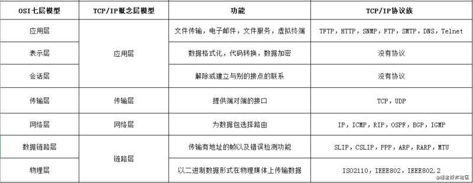

- 数据链路层

  - 在传输比特流的过程中，会产生错传、数据传输不完整的可能，数据链路层定义了**如何格式化数据进行传输**，以及如何控制对物理介质的访问。通常提供错误检测和纠正，以确保数据传输的准确性
  - 本层将比特数据组成帧（Frames），交换机工作在这层，对帧解码，并根据帧中包含的信息把数据发送到正确的接收方
  - 该层负责物理层面上互连的节点之间的通信传输。例如与1个以太网相连的两个节点间的通讯
  - 常见的协议有 `HDLC、PPP、SLIP`等
  - 数据链路层会将 `0,1` 序列划分为具有意义的数据帧传送给对端（数据帧的生成与接收）

- 网络层

  - 随着网络节点的不断增加，点对点通讯需要通过多个节点，如何找到目标节点，如何选择最佳路径成为首要需求
  - 网络层主要功能是将网络地址转化为对应的物理地址，并决定如何将数据从发送方路由到接收方
  - 网络层通过综合考虑发送优先权、网络拥塞程度、服务质量以及可选路由的花费来决定从一个网络中节点A到另一个网络中节点B的最佳路径
  - 由于网络层处理并智能指导数据传送，路由器连接网络隔断，所以路由器属于网络层
  - 此层的数据称之为数据包（Packages），网络层需要关注的协议TCP/IP协议中的IP协议，由 `IP、ICMP` 两个协议组成
  - 网络层负责将数据传输到目标地址，目标地址可以使多个网络通过路由器连接而成的某一个地址。因此这一层主要负责**寻址和路由选择**
  - 网络层将数据从发送端的主机发送到接收端的主机，两台主机间可能会存在很多数据链路，但网络层就是负责找出一条相对顺畅的通路将数据传递过去。传输的地址使用的是IP地址。IP地址通过不断转发到更近的IP地址，最终可以到达目标地址

- 传输层

  - 随着网络通信需求的进一步扩大，通信过程中需要发送大量的数据，如海量文件传输，可能需要很长时间，网络在通信的过程中会中断很多次，此时为了保证传输大量文件时的准确性，需要对发送出去的数据进行切分，切割为一个一个的段落（`Segement`）发送，其中一个段落丢失是否重传，段落是否按顺序到达，是传输层需要考虑的问题
  - 传输层解决了主机间的数据传输，数据间的传输可以是不同网络，并且传输层解决了**传输质量**的问题
  - 传输层需要关注的协议有TCP/IP协议中的`TCP`协议和`UDP`协议

- 会话层

  - 自动收发包，自动寻址
  - 会话层作用是**负责建立和断开通信连接**，何时建立，断开连接以及保持多久的连接
  - 常见的协议有 `ADSP、RPC` 等

- 表示层

  - Linux给Windows发包，不同系统语法不一致，如exe不能在`Linux`下，shell不能在Windows下运行，于是需要表示层
  - 解决不同系统之间通信语法问题，在表示层数据将按照网络能理解的方案进行格式化，格式化因所使用网络的不同而不同
  - 它主要负责数据格式的转换：将设备固有的数据格式转换为网络标准格式。常见的协议有`ASCII、SSL/TLS` 等

- 应用层

  - 规定发送方和接收方必须使用一个固定长度的消息头，消息头必须使用某种固定的组成，消息头中必须记录消息体的长度等信息，方便接收方正确解析发送方发送的数据
  - 应用层旨在更**方便应用从网络中接收的数据**，重点关注`TCP/IP`协议中的HTTP协议

- 总结

  - 四层传输层数据被称作**段**（Segments）；
  - 三层网络层数据被称做**包**（Packages）；
  - 二层数据链路层时数据被称为**帧**（Frames）；
  - 一层物理层时数据被称为**比特流**（Bits）


#### 1.2 TCP/IP网络模型

- OSI模型注重通信协议必要的功能；TCP/IP更强调在计算机上实现协议应该开发哪种程序
- TCP/IP模型是一系列网络协议的总称，这些协议可以划分为四层，分别为链路层、网络层、传输层、应用层
  - 应用层：负责向用户提供应用程序，比如HTTP、FTP、Telnet、DNS、SMTP等。负责web浏览器的HTTP协议， 文件传输的FTP协议，负责电子邮件的SMTP协议，负责域名系统的DNS等
  - 传输层：负责传输应用层的数据包，并以TCP或UDP协议格式封装报文。TCP协议**传输可靠**，UDP协议**特别高效**
  - 网络层：负责路由以及寻址（找到目标设备的位置，把分组报文发送给目标网络或主机）
  - 数据链路层，主要是负责转换数字信号和物理二进制信号，负责封装和解封装IP报文，发送和接受ARP/RARP报文等
- 四层网络协议的作用

  - 发送端是由上至下，把上层来的数据在头部加上各层协议的数据（部首）再下发给下层
  - 接受端则由下而上，把从下层接受到的数据进行解密和去掉头部的部首后再发送给上层
  - 层层加密和解密后，应用层最终拿到了需要的数据
- 例子：需要发送一个index.html，两台电脑在应用层都使用HTTP协议
  - 传输层，TCP协议会将HTTP协议发送的数据看作一个数据包，并在这个数据包前面加上TCP包的一部分信息（部首）
  - 网络层，IP协议会将TCP协议要发送的数据看作一个数据包，同样的在这个数据包前端加上IP协议的部首
  - 数据链路层，对应的协议也会在IP数据包前端加上以太网的部首
  - 物理层，源设备和目标设备通过网线连接，就可以通过物理层的二进制传输数据
  - 数据链路层，使用对应的协议找到物理层的二进制数据，解码得到以太网的部首信息和对应的IP数据包，将IP数据包传给网络层
  - 数据链路层>网络层>传输层>应用层，一层层的解码，最后就可以在浏览器中得到目标设备传送过来的index.html

#### 1.3 交换机

- 交换机可以接入多台电脑
- 每个电脑网卡的 MAC 地址都是不一样的，电脑发送数据时，数据头部携带网卡的 MAC 地址，用 MAC 地址标识来不同的电脑
- 交换机就可以识别数据头部的 MAC 地址来区分不同的电脑
- 交换机除了能识别不同的电脑，还需要找到电脑连接的交换机端口，才能顺利的把数据从相应端口发送出去
- 交换机通过自学机制，把学习到的设备 MAC 地址和交换机端口号添加到 MAC 地址表，并根据 MAC 地址表进行数据转发

#### 1.4 路由器

- 交换机需要记录的 MAC 地址表也越来越多，需要的交换机也越来越多
- 但是交换机的**容量和性能有限**，MAC 地址表无法记录全世界电脑的 MAC 地址和对应的端口号，MAC 地址表太大也无法快速查找到对应的 MAC 地址表项
- 于是就有了三层网络设备路由器，路由器可以把全世界的网络连接起来
- 局域网内的网络连接可以使用**交换机**，例如一个公司内的网络或者一个校园内的网络通过交换机连接
- 不同区域的局域网互联使用**路由器**
- 如何区分不同的网络区域, 如何跨网络区域进行数据转发
  - 路由器有多个端口，分别连接不同的网络区域，不同网络区域的 IP 地址**网络号不同**
  - 它通过识别目的 IP 地址的**网络号**，再根据**路由表**进行数据转发

### 2. HTTP

#### 2.1 HTTP的基本概念

- HTTP(Hypertext Transfer Protocol) 是用于传输超媒体文档的应用层协议，用于从 WWW 服务器传输超文本到本地浏览器
- HTTP工作原理
  - HTTP协议定义Web客户端如何从Web服务器请求Web页面，以及服务器如何把Web页面传送给客户端
  - 客户端向服务器发送一个请求报文，服务器以一个状态行作为响应
- HTTP请求/响应的步骤
  - 客户端连接到Web服务器
  - 发送HTTP请求
  - 服务器接受请求并返回HTTP响应
  - 释放TCP连接
  - 客户端（浏览器）解析HTML内容

- HTTP 9 种请求方法
  - GET：获取资源，要求服务器将URL定位的资源放在响应报文的数据部分，回送给客户端
  - POST：传输创建资源，将数据封装在请求体中，以名称/值的形式出现，可以传输大量数据
  - HEAD：获取报文首部，只返回响应头，而不会发送响应内容，用来查看某个页面的状态
  - PUT：更新资源，从客户端向服务器传送的数据取代指定的文档的内容
  - DELETE：删除资源，请求服务器删除指定的页面
  - CONNECT：HTTP/1.1 协议中预留给能够将连接改为管道方式的代理服务器
  - OPTIONS：允许客户端查看服务器的性能
  - TRACE：回显服务器收到的请求，主要用于测试或诊断
  - PATCH：是对 PUT 方法的补充，用来对已知资源进行局部更新

#### 2.2 GET与POST的区别

- GET从指定的资源请求数据，只读 / POST向指定的资源提交或创建数据

- GET 请求的请求参数是添加到 head 中，可以在 URL 中可以看到；POST 请求的请参数是添加到body中，在URL 中不可见更安全 
- 参数大小不同：GET请求在URL中传送的参数是有长度的限制，而POST请求不用考虑请求参数的长度
- GET请求产生1个数据包，因为只有请求头；POST请求产生2个数据包，先发送请求头，再发送请求体
- 浏览器对响应的处理不同：GET请求参数会被完整的保留在浏览器历史记录里，而POST中的参数不会被保留
- 浏览器回退表现不同：GET在浏览器回退时是无害的，而POST会再次提交请求
- 浏览器对请求地址的处理不同：GET请求地址会被浏览器主动缓存，而POST不会 除非手动设置

#### 2.3 状态码

- 状态码由3位数字组成，第一位定义响应的类别
- 1xx：指示信息--表示请求已接收，继续处理
- 2xx：成功--表示请求已被成功接收、理解、接受 (200 OK)
- 3xx：重定向--客户端请求的资源发送了变动，要完成请求必须用新的 URL 重新发送请求获取资源
- 4xx：客户端错误--请求**报文有误**，服务器无法处理 (400 Bad Request / 401 Unauthorized / 403 Forbidden / 404 Not Found)
- 5xx：服务器端错误--客户端请求报文正确，服务器处理时内部发生了错误 (500 Internal Server Error / 503 Server Unavailable)

#### 2.4 HTTP 请求报文

- HTTP报文是面向文本的，报文中的每一个字段都是一些ASCII码串，各个字段的长度是不确定的

- HTTP有两类报文：请求报文和响应报文

- HTTP 请求报文由4部分组成 请求行 (request line) +请求头 (header) + 空行 + 请求体 (request-body)

  

- **请求行**由请求方法字段、URL字段、HTTP协议版本字段3个字段组成，它们用空格分隔。例如，GET /index.html HTTP/1.1
  - HTTP协议的请求方法有GET、POST、HEAD、PUT、DELETE、OPTIONS、TRACE、CONNECT、PATCH
  - HEAD就像GET，只不过服务端接受到HEAD请求后只返回响应头，而不会发送响应内容。如果只需要查看某个页面的状态，使用HEAD是非常高效的，因为在省去了传输页面内容

- **请求头部**由关键字/值对组成，每行一对，关键字和值用英文冒号 “:” 分隔。请求头部通知服务器有关于客户端请求的信息
  - Accept：指定客户端能够接收的内容类型
  - Accept-Encoding：
    - 这个属性是用来告诉服务器能接受什么编码格式，包括字符编码,压缩形式(一般都是压缩形式)
    - 例如:`Accept-Encoding:gzip, deflate`(这两种都是压缩格式)
  - Accept-Language: zh-CN,zh;q=0.9 //代表客户端可以支持语言zh-CN或者zh
  - Referer：表示这是请求是从哪个URL进来的
  - Cache-control: 指定请求和响应遵循的缓存机制
  - Host：指定要请求的资源所在的主机和端口
  - User-Agent: User-Agent的内容包含发出请求的用户信息
  - Connection: 决定当前事务（三次握手和四次挥手）完成后，需要持久连接
    - 持久连接，事务完成后不关闭网络连接 ：` Connection: keep-alive`
    - 非持久连接，事务完成后关闭网络连接： `Connection: close`
  - If-Modified-Since: 如果请求的部分在指定时间之后被修改则请求成功，未被修改则返回304代码
  - If-None-Match: 如果内容未改变返回304代码，参数为服务器先前发送的Etag，与服务器回应的Etag比较判断是否改变
  - [HTTP响应头和请求头信息对照表](http://tools.jb51.net/table/http_header)

- **空行**在最后一个请求头之后，发送回车符和换行符，通知服务器以下不再有请求头
- 请求报文的**请求体**就是url后面的参数

#### 2.5 HTTP 响应报文

- HTTP 响应报文由4部分组成 状态行 (status-line) + 响应头部 (headers) + 空行 + 响应体 (response-body)

  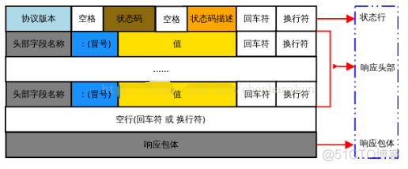

- 在响应报文中唯一区别在于第一行中用状态行代替了请求行, 状态行 (status-line) 通过提供一个状态码来说明所请求的资源情况
- 状态行中**状态代码**有五种可能取值
- **响应头部** 由关键字/值对组成
  - 与请求数据相关的最常使用的请求头是Content-Type和Content-Length
  - Cache-Control：响应输出到客户端后，服务端通过该属性告诉客户端该怎么控制响应内容的缓存
  - ETag：表示请求资源的版本，如果资源发生变化，那么这个属性也会跟着变
  - Location：在重定向中或者创建新资源时使用
  - Set-Cookie：服务端可以设置客户端的cookie

#### 2.6 HTTP 主要特点

- **支持客户/服务器模式**
- **简单快速**
  - 客户向服务器请求服务时，只需传送请求方法和路径。请求方法常用的有GET、HEAD、POST。每种方法规定了客户与服务器联系的类型不同。由于HTTP协议简单，使得HTTP服务器的程序规模小，因而通信速度很快
- **灵活**
  - HTTP允许传输任意类型的数据对象。正在传输的类型由Content-Type（Content-Type是HTTP包中用来表示内容类型的标识，纯文本、html、json、图片）加以标记
- **无连接**
  - 无连接的含义是限制每次连接只处理一个请求。服务器处理完客户的请求，并收到客户的应答后，即断开连接。采用这种方式可以节省传输时间
  - HTTP 协议产生于互联网，因此服务器需要处理同时数十万客户端的网页访问，但每个客户端（即浏览器）与服务器之间交换数据的间歇性较大（即传输具有突发性、瞬时性），并且网页浏览的联想性、发散性导致两次传送的数据关联性很低，大部分通道实际上会很空闲、无端占用资源
  - 因此 HTTP 的设计者有意利用这种特点将协议设计为**请求时建连接、请求完释放连接，以尽快将资源释放出来服务其他客户端**
  - 随着网页变得越来越复杂，网页可能嵌入很多图片，这时候每次访问图片都需要建立一次 TCP 连接就显得很低效。Keep-Alive 被提出用来解决这效率低的问题
  - **Keep-Alive 功能使客户端到服务器端的连接持续有效，当出现对服务器的后继请求时，Keep-Alive 功能避免了建立或者重新建立连接**
  - 但它同样影响了性能，因为在处理暂停期间，本来可以释放的资源仍旧被占用。当Web服务器和应用服务器在同一台机器上运行时，Keep-Alive 功能对资源利用的影响尤其突出
- **无状态**
  - HTTP协议是无状态协议。无状态是指协议对于事务处理没有记忆能力。即给服务器发送 HTTP 请求之后，服务器根据请求发送数据过来，但是发送完不会记录任何信息
  - 缺少状态意味着如果后续处理需要前面的信息，则它必须重传，这样可能导致每次连接传送的数据量增大。另一方面，在服务器不需要先前信息时它的应答就较快
  - 这种特性优点在于解放了服务器，每一次请求“点到为止”**不会造成不必要连接占用**，缺点在于**每次请求会传输大量重复的内容信息**
  - 无状态的特性严重阻碍了**动态交互的 Web 应用程序**的实现，因为交互是需要承前启后的，简单的购物车程序也要知道用户到底在之前选择了什么商品。于是，两种用于保持 HTTP 连接状态的技术就应运而生，**Cookie** 和 **Session**

#### 2.7 HTTP 各版本

- HTTP版本有 0.9, 1.0, 1.1, 2.0, 3.0，当前主流的协议版本还是**HTTP/1.1**版本

- **HTTP0.9**

  - 最早的HTTP协议的版本，功能简单，仅支持**GET**的请求方式

- **HTTP/1.0**

  - 增加了HTTP版本号。如GET /.../ HTTP/1.0
  - HTTP请求和回应格式发生变化：增加了**header**，请求和响应都有**header**
  - 增加了一些状态码, 支持cache
  - 根据content-Type可以支持多种数据格式
  - HTTP1.0版本不支持keep-alive，浏览器与服务器只保持短暂的连接，浏览器的每次请求都需要与服务器建立一个TCP连接 (仅能发送一个请求)，服务器完成请求处理后立即断开TCP连接，服务器不跟踪每个客户也不记录过去的请求

- **HTTP/1.1**

  - 支持**持久连接 Persistent Connection**

    - 请求头connnection:keep-alive，默认TCP不关闭连接；一个TCP连接可以允许多个HTTP请求和响应

  - 引入**管道机制**，一个请求发出去了不用等其回来就可以发送第二个请求出去，减少整体的响应时间

  - 请求消息和响应消息都支持**Host字段**

    - 虚拟机兴起，一台服务器可以有多个虚拟主机，IP地址相同。因为可以有多个域名解析到同一个IP上，要区分请求的到底是哪个域名，HOST字段用来指定服务器的域名

    - 请求消息中如果没有Host头域会报告一个错误（400 Bad Request）

  - 新增**状态码100**

    - 客户端在发送request body之前发送只带request header的请求，如果服务器接受请求就回复响应码100

    - 如果服务器因为权限拒绝了请求，就回送响应码401（Unauthorized）

    - 状态码100 允许客户端在发request body之前先用request header试探一下server，看server要不要接收request body，再决定要不要发request body (节约带宽)

  - 支持**分块传输编码 Chunked Transfer Coding**

    - 发送方将消息分割成若干个任意大小的数据块，每个数据块在发送时都会附上块的长度

    - 不必说明Content-Length，只要请求或者回应的头信息有Transfer-Encoding字段，就表明回应由数量未定的数据块组成。

    - 最后用一个零长度的块作为消息结束的标志

  - 新增请求方式PUT、OPTION、DELETE等

    - HTTP PUT 请求方法使用请求中的负载创建或者替换目标资源

    - PUT 与 POST 方法的区别在于，PUT方法是幂等的：调用一次与连续调用多次是等价­­的（即没有副作用），而连续调用多次POST方法可能会有副作用，比如将一个订单重复提交多次

  - **Cache**

    - HTTP/1.1在1.0的基础上加入了一些Cache的新特性，当缓存对象的Age超过Expire时变为Stable对象，Cache不需要直接抛弃Stable对象，而是与源服务器进行重新激活

  - HTTP/1.1支持**文件断点续传**，RANGE:bytes，HTTP/1.0每次传送文件都是从文件头开始，即0字节处开始。RANGE:bytes=XXXX表示要求服务器从文件XXXX字节处开始传送

  - HTTP1.1的缺陷: 高延迟 — **队头阻塞(Head-Of-Line Blocking)**, 同一TCP连接里面数据通信按照次序来进行，服务器按顺序应答返回response，先接收到的请求需要先响应回来。如果前一个请求遇到了阻塞，后面的请求即使已经处理完毕了，仍然需要等待阻塞的请求处理完毕

    - 针对队头阻塞的解决办法: 将同一页面的资源分散到不同域名下，提升连接上限；合并小文件减少资源数，使用精灵图；内联(Inlining)资源是另外一种防止发送很多小图请求的技巧，将图片的原始数据嵌入在CSS文件里面的URL里，减少网络请求次数；减少请求数量，合并文件

  - 无状态特性 — 阻碍交互；明文传输 — 不安全性；不支持服务端推送

    >记忆口诀：队头阻塞高延迟，无状态阻交互，明文传输不安全，服务推送不支持
  


- **HTTP/2.0**

  - HTTP/2基于SPDY，专注于性能，最大的一个目标是在用户和网站间只用一个连接（connection）

  - **多路复用，连接共享**

    - 每一个request都是是用作连接共享机制的，一个request对应一个id，这样一个连接上可以有多个request，每个连接的request可以随机的混杂在一起，接收方可以根据request的 id将request再归属到各自不同的服务端请求里面

  - **Header压缩**

    - 客户端和服务器共同维护首部字段表，同时发送多个请求如果头一样就消除重复部分，避免重复传输
    - HTTP/2并没有使用传统的压缩算法，而是开发了专门的"HPACK”算法，在客户端和服务器两端建立“字典”，用索引号表示重复的字符串，还采用哈夫曼编码来压缩整数和字符串，可以达到50%~90%的高压缩率

  - **服务端推送 (Server Push)**

    - 改变了传统的“请求-应答”工作模式，服务器不再是完全被动地响应请求，也可以新建“流”主动向客户端发送消息
    - 在浏览器刚请求 HTML 的时候，就提前把可能会用到的 JS、CSS 文件等静态资源主动发给客户端
    - 减少等待的延迟，也就是服务器推送，Server Push 也叫 Cache push

  - **防止队头阻塞**

    - 同时发送多个请求 (开多个tcp连接)，服务器也可以同时处理多个请求。把多个请求打包成一个小块发送过去，即使第一个阻塞了，后面也可以回来；相当于多个文件同时请求，就看谁先回来谁后回来，阻塞的可能就后回来，对带宽的利用是最高的

  - **二进制传输** 

    - HTTP/2 采用二进制格式传输数据，而非HTTP/1.x 里纯文本形式的报文 ，二进制协议解析起来更高效

    - 引入了帧、消息和数据流。每个请求/响应的所有数据包，称为一个数据流 (Stream)，可以承载双向消息，每个流都有一个唯一的整数标识符，由客户端发起的流用奇数编号的流标识符；由服务器发起的用偶数编号的流标识符

    - 每个请求/响应被称为消息，每个消息都被拆分成若干个帧进行传输，每个帧都分配一个序号，采用二进制编码。每个帧在传输是属于一个数据流，而一个连接上可以存在多个流，各个帧在流和连接上独立传输，到达之后在组装成消息，这样就避免了请求/响应阻塞

    - 二进制分帧：在应用层（HTTP2.0）和传输层（TCP或者UDP）之间加了一层：二进制分帧层

    - 消息：逻辑上的HTTP消息，比如请求、响应，由一或多个帧组成

    - 帧：最小的通信单位，承载特定类型的数据，比如HTTP首部、负荷等等

    - 每个数据流都拆分成很多帧，不同流的帧可以交错乱序发送，同一个流内帧按顺序传输。当到达终点时，再根据不同帧首部的流标识符重新连接将不同的数据流进行组装

    - 帧的类型：DATA, HEADERS, PRIORITY...

      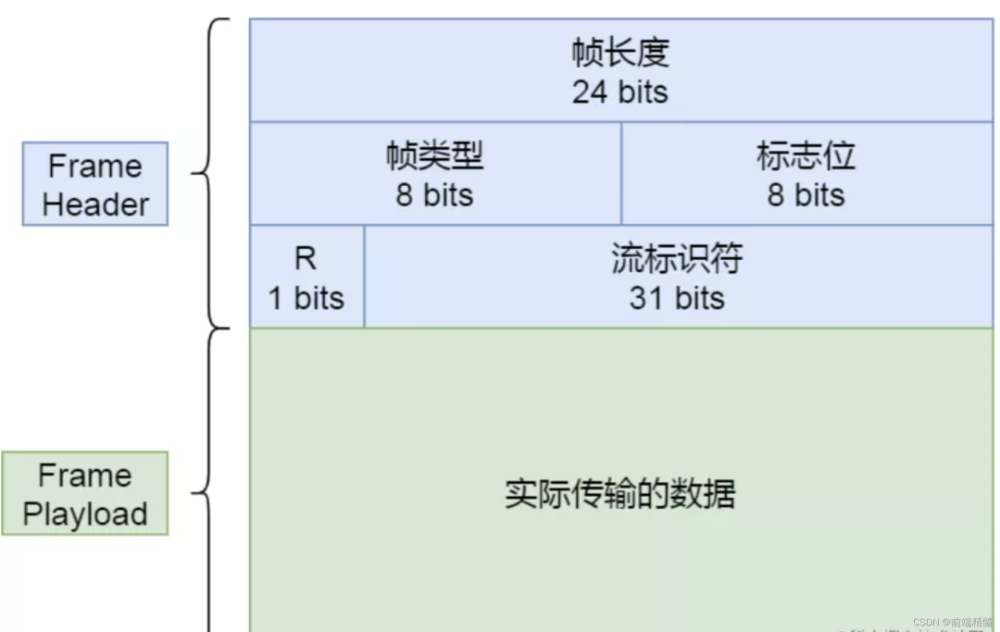

  - 缺陷: 

    - TCP 以及 TCP+TLS 建立连接时延时；
    - HTTP2底层使用的是TCP协议，多个 HTTP 请求在复用一个 TCP 连接，下层的 TCP 协议是不知道有多少个 HTTP 请求的，一旦发生了丢包现象，就会触发 TCP 的重传机制，出现TCP队头阻塞；
    - 多路复用导致服务器压力上升也容易 Timeout

- HTTP/3.0

  - 基于UDP之上重新设计HTTP的传输层，把下层的 TCP 协议改成了 UDP，变成 QUIC（Quick UDP Internet Protocol), HTTP/3 是“HTTP over QUIC”，真正解决了队头阻塞问题
  - QUIC基于UDP，而UDP是“无连接”的，根本就不需要“握手”和“挥手”，所以就比TCP来得快。此外QUIC也实现了可靠传输，保证数据一定能够抵达目的地。它还引入了类似HTTP/2的“流”和“多路复用”，单个“流"是有序的，可能会因为丢包而阻塞，但其他“流”不会受到影响
  - **实现了类似TCP的流量控制、传输可靠性的功能**，QUIC在UDP的基础之上增加了一层来保证数据可靠性传输。它提供了数据包重传、拥塞控制以及其他一些TCP中存在的特性
  - **实现了快速握手功能**，QUIC可以实现使用0-RTT或者1-RTT来建立连接，这意味着QUIC可以用最快的速度来发送和接收数据，0RTT 建连是 QUIC 最大的性能优势
  - **集成了TLS加密功能**
  - **多路复用**，和TCP不同，QUIC实现了在同一物理连接上可以有多个独立的逻辑数据流。实现了数据流的单独传输，就解决了TCP中队头阻塞的问题。
  - **连接迁移**，TCP 是按照 4 要素（客户端 IP、端口, 服务器 IP、端口）确定一个连接的。而 QUIC 则是让客户端生成一个 Connection ID （64 位）来区别不同连接。只要 Connection ID 不变，连接就不需要重新建立，即便是客户端的网络发生变化。由于迁移客户端继续使用相同的会话密钥来加密和解密数据包，QUIC 还提供了迁移客户端的自动加密验证

- 总结

  - HTTP/1.1有两个主要的缺点：安全不足和性能不高。
  - HTTP/2完全兼容HTTP/1，是“更安全的HTTP、更快的HTTPS"，二进制传输、头部压缩、多路复用、服务器推送等技术可以充分利用带宽，降低延迟，从而大幅度提高上网体验；
  - HTTP/3 中的底层支撑协议是基于 UDP 实现的QUIC；该协议基于 UDP，又取了 TCP 中的精华，实现了即快又可靠的协议

#### 2.8 HTTP chunk 分块传输

- 当客户端向服务器请求静态页面或者图片时，服务器可以很清楚的知道内容大小，然后通过Content-Length消息首部字段告诉客户端需要接收多少数据

- 但如果是动态页面等时，服务器是不可能预先知道内容大小，这时就可以使用Transfer-Encoding：chunk模式来传输数据了

- 编码使用若干个chunk组成，由一个标明长度为0的chunk结束

- 每个chunk有两部分组成，第一部分是该chunk的长度，第二部分就是指定长度的内容，每个部分用CRLF隔开

- 在最后一个长度为0的chunk中的内容是称为footer的内容，是一些没有写的头部内容

- chunk编码格式：

  ```http
  [chunk size][\r\n][chunk data][\r\n]
  [chunk size][\r\n][chunk data][\r\n]
  [chunk size = 0][\r\n][\r\n]
  ```

- HTTP分块传输编码允许服务器为动态生成的内容维持HTTP持久连接。对于动态生成的内容来说，在内容创建完之前是不可知的。分块传输能很好的解决这种情形

- 分块传输编码允许服务器在最后发送消息头字段。对于那些头字段值在内容被生成之前无法知道的情形非常重要，例如消息的内容要使用散列进行签名，散列的结果通过HTTP消息头字段进行传输。没有分块传输编码时，服务器必须缓冲内容直到完成后计算头字段的值并在发送内容前发送这些头字段的值。[散列签名，需缓冲完成才能计算]


### 3. HTTPS

#### 3.1 HTTPS的基本概念

- HTTPS的基本概念
  - HTTP + TLS 加密 + 认证 + 完整性保护 = HTTPS
  - https 协议的作用：建立一个信息安全通道，来确保数据的传输，确保网站的真实性
- HTTPS 协议的优缺点
  - https 协议要比 http 协议安全，可防止数据在传输过程中被窃取、改变，确保数据的完整性
  - https 握手阶段比较费时，会使页面加载时间延长 50%，增加10%~20%的耗电
  - https 缓存不如 http 高效，会增加数据开销
  - TLS 证书需要绑定 IP，不能再同一个 IP 上绑定多个域名，ipv4 资源支持不了这种消耗
  - HTTPS基于传输层，HTTP基于应用层
- HTTP 和 HTTPS 的区别
  - http 是超文本传输协议，信息是明文传输，直接将报文信息传输到TCP然后TCP再通过TCP套接字发送给目的主机上；https 则是具有安全性的**TLS加密传输协议**（以前称为SSL安全套接字层），将报文信息传输给TLS套接字进行加密，将整个报文加密(包括url)发送给TCP套接字，作为TCP的payload传输，发送给目的主机，目的主机将通过TCP套接字获取加密后的报文给iiTLS套接字，TLS解密后交给对应进程;
  - https 需要用到CA证书，CA证书需要钱，功能越强大的证书费用越高；而http 不用
  - http和https使用的是完全不同的连接方式，用的端口也不一样，http 标准端口80；https 标准端口443。默认端口可以通过httpd.conf文件修改
  - http 的连接很简单，是无状态的。
  - **记忆口诀：明文传输超文本，安全等级各不同。CA证书费用高，无状连接端难同。**

#### 3.2 HTTPS工作原理

- HTTPS 协议会对传输的数据进行加密，而加密过程是使用了非对称加密实现

- HTTPS的整体过程分为证书验证和数据传输阶段：

  - Client使用 https url 访问服务器，发起HTTPS建立连接请求，根据RFC2818的规定，Client知道需要连接Server的443端口

  - Server把事先配置好的公钥证书 (public key certificate) 返回给Client

  - Client验证公钥证书：比如是否在有效期内，证书的用途是不是匹配Client请求的站点，是不是在CRL吊销列表里面，它的上一级证书是否有效，这是一个递归的过程，直到验证到根证书（操作系统内置的Root证书或者Client内置的Root证书）。如果验证通过则继续，不通过则显示警告信息

  - Client 和 Server 开始协商 `TPL链接的安全等级`，也就是加密等级

  - Client使用伪随机数生成器生成加密所使用的对称密钥，然后用证书的公钥加密这个对称密钥，发给Server

    - `PublicKey publicKey = x509certificate.getPublicKey();`

  - Server使用自己的私钥 private key 解密这个消息，得到对称密钥。至此，Client和Server双方都持有了相同的对称密钥

  - 响应会话

    - Server使用对称密钥加密“明文内容A”，发送给Client
    - Client使用对称密钥解密响应的密文，得到“明文内容A”

  - 发送会话

    - Client再次发起HTTPS的请求，使用对称密钥加密请求的明文内容
    - 然后Server使用对称密钥解密密文，得到明文内容B

    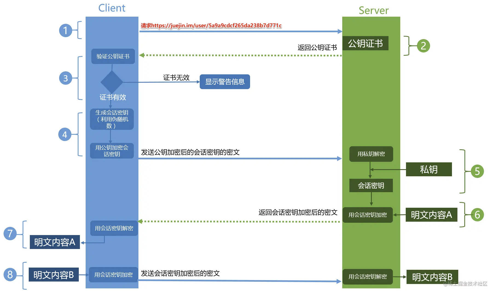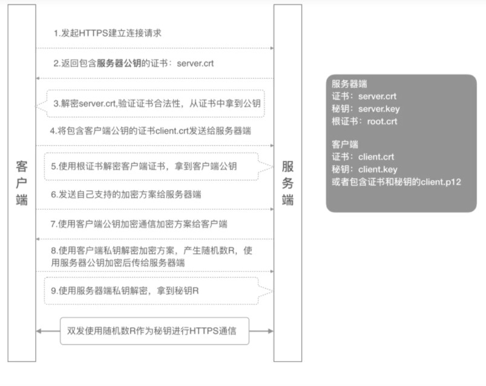  


#### 3.3 HTTPS证书验证

- 客户端先向服务器端索要公钥，然后用公钥加密信息，服务器收到密文后，用自己的私钥解密

  - 如何保证公钥不被篡改和信任度？

  - 需要借助数字证书认证机构 CA ，将服务器公钥放在数字证书中，只要证书是可信的，公钥就是可信的

- 数字证书的主要内容有：公钥、数字证书认证机构 CA 的信息、证书持有者、证书有效期、签名算法、指纹及指纹算法

  - 数字证书在发布的时候，CA机构将证书的【指纹, 指纹算法】通过自己的私钥加密形成数字签名

- **数字证书**是用来认证公钥持有者的身份，以防止第三方进行冒充。只有证书合法，才代表服务端身份是可信的

- **数字签名**是在信息后面加上的一段数字串，校验数据的完整性，证明该信息有没有被修改过

  - **指纹**可以理解为证书身份的唯一代表，是用来保证证书的完整性的，确保证书没有被修改过

  - 证书在发布之前，CA机构对证书的内容用指纹算法Hash函数（sha256）计算得到一个hash值，这个hash值就是指纹

  - 然后用发送者的私钥加密生成数字签名，与原文文一起传送给接收者

  - 接收者只有用发送者的公钥才能解密被加密的指纹，然后用Hash函数对收到的原文产生一个摘要信息，与解密的指纹对比

- 签发证书

  -  CA 会把持有者的公钥、用途、颁发者、有效时间等信息打成一个包，然后对这些信息进行 Hash 计算，得到一个 Hash 值
  -  然后 CA 会使用自己的私钥将该 Hash 值加密，生成 Certificate Signature，也就是 CA 对证书做了签名
  -  最后将 Certificate Signature 添加在文件证书上，形成数字证书

  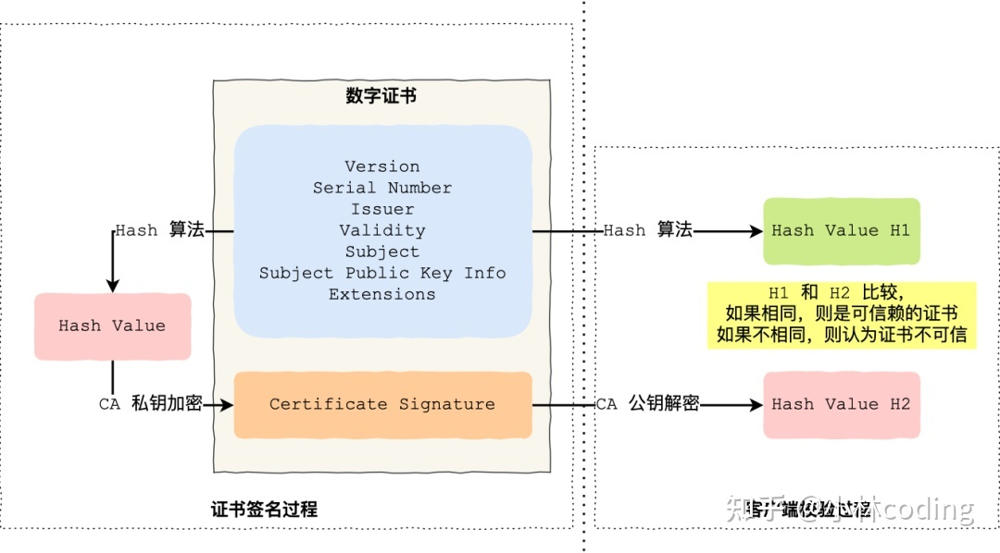

- 验证证书

  - 客户端会使用同样的 Hash 算法获取该证书的 Hash 值 H1
  - 通常浏览器和操作系统中集成了 CA 的公钥信息，浏览器收到证书后可以使用 CA 的公钥解密 Certificate Signature 内容，得到一个 Hash 值 H2
  - 比较 H1 和 H2，如果值相同，则为可信赖的证书，否则则认为证书不可信

#### 3.4 HTTPS加密算法

- 加密算法分对称加密和非对称加密
  - 对称加密算法的加密与解密密钥相同，非对称加密算法的加密密钥与解密密钥不同
  - 常见的 **对称加密** 算法主要有 `DES`、`3DES`、`AES` 等，常见的 **非对称算法** 主要有 `RSA`、`DSA` 等
  - 还有一类不需要密钥的散列算法，**散列算法** 主要有 `SHA-1`、`MD5` 等
- 对称加密 AES
  - **对称加密算法**又称现代加密算法
  - 对称加密算法使用的密钥只有一个，发送和接收双方都使用这个密钥对数据进行 **加密** 和 **解密**
  - 数据加密过程：数据发送方 将 **明文** (原始数据) 和 **加密密钥** 一起经过特殊 **加密处理**，生成复杂的 **加密密文** 进行发送
  - 数据解密过程：**数据接收方** 收到密文后，若想读取原数据，则需要使用 **加密使用的密钥** 及相同算法的 **逆算法** 对加密的密文进行解密，才能使其恢复成 **可读明文**
- 非对称加密 RSA
  - **非对称加密算法**是计算机通信安全的基石，保证了加密数据不会被破解
  - 非对称加密算法需要两个密钥，**公开密钥** (public key)，即**公钥**，和**私有密钥** (private key)，即**私钥**
  - 因为 **加密** 和 **解密** 使用的是两个不同的密钥，所以这种算法称为 **非对称加密算法**
    - 如果使用 **公钥** 对数据 **进行加密**，只有用对应的 **私钥** 才能 **进行解密**
    - 如果使用 **私钥** 对数据 **进行加密**，只有用对应的 **公钥** 才能 **进行解密**
  - 特点： 算法强度复杂，安全性依赖于算法与密钥; 加密解密速度慢
  - RSA应用场景
    - 由于RSA算法的加密解密速度要比对称算法速度慢很多，在实际应用中，通常采取数据本身的加密和解密使用对称加密算法(AES)。 用RSA算法加密并传输对称算法所需的密钥。
- 对称加密算法的对比
  - 对称加密只有一种密钥，并且是非公开的，如果要解密就得让对方知道密钥
  - 非对称加密有两种密钥，其中一个是公开的
- 摘要算法(hash 算法)
  - MD5: 摘要长度为 128 比特，目前以及不安全了，违反了强抗碰撞性攻击。通过 2^80 次数次计算就可以破坏强抗碰撞性（即通过这么多次计算得出两个不同的消息，会得到不同的消息，得到相同的 hash 值）
  - SHA-I 类似 MD5 算法，输出的长度固定为 160 个比特。也会产生碰撞，但是比 MD5 好些
  - SHA2 算法目前是安全的，输出比特分别为 256 比特，512 比特，384 比特等
- 签名，用private key
- [HTTPS的密码学知识](https://zhuanlan.zhihu.com/p/174796611)


### 4. TCP

#### 4.1 TCP的基本概念

- TCP是一个传输层协议，提供可靠传输，支持全双工，是一个连接导向的协议
- 双工/单工
  - 在任何一个时刻，如果数据只能单向发送，就是单工
  - 如果在某个时刻数据可以向一个方向传输，也可以向反方向传输，而且交替进行叫作半双工；半双工需要至少 1 条线路
  - 如果任何时刻数据都可以双向收发，这就是全双工，全双工需要大于 1 条线路
  - TCP 是一个全双工协议，数据任何时候都可以双向传输，意味着客户端和服务端可以平等地发送、接收信息
- TCP协议的主要特点
  - TCP是面向连接的运输层协议；所谓面向连接就是双方传输数据之前，必须先建立一条通道，例如三次握手就是建立通道的一个过程，而四次挥手则是结束销毁通道的一个其中过程
  - 每一条TCP连接只能有两个端点（即两个套接字），只能是点对点的
  - TCP提供可靠的传输服务。传送的数据无差错、不丢失、不重复、按序到达
  - TCP提供全双工通信。允许通信双方的应用进程在任何时候都可以发送数据，因为两端都设有发送缓存和接受缓存
  - 面向字节流。虽然应用程序与TCP交互是一次一个大小不等的数据块，但TCP把这些数据看成一连串无结构的字节流，它不保证接收方收到的数据块和发送方发送的数据块具有对应大小关系，例如，发送方应用程序交给发送方的TCP10个数据块，接收方的TCP可能只用收到的4个数据块字节流交付给上层的应用程序
- TCP的可靠性原理
  - 可靠传输有如下两个特点：
    - 传输信道无差错,保证传输数据正确
    - 不管发送方以多快的速度发送数据,接收方总是来得及处理收到的数据
  - 首先，采用三次握手来建立TCP连接，四次握手来释放TCP连接，从而保证建立的传输信道是可靠的
  - 其次，TCP采用了连续ARQ协议（回退N(Go-back-N)；超时自动重传）来保证数据传输的正确性，使用滑动窗口协议来保证接方能够及时处理所接收到的数据，进行流量控制
  - 最后，TCP使用慢开始、拥塞避免、快重传和快恢复来进行拥塞控制，避免网络拥塞

#### 4.2 报文段

- TCP虽面向字节流，但传送的数据单元为报文段
- 报文段 = 首部 + 数据2部分
- TCP的全部功能体现在它首部中各字段的作用
  - 首部前20个字符固定、后面有4n个字节是根据需而增加的选项
  - 故 TCP首部最小长度 = 20字节
- 端口：源端口号和目地端口各占16位两个字节, 1024以下是系统保留的，从1024-65535是用户使用的端口范围
- seq序号：占4字节，TCP连接中传送的字节流中的每个字节都按顺序编号
- ack确认号：4个字节，是期望收到对方下一个报文段的第一个数据字节的序号
- 数据偏移：头部有可选字段，长度不固定，指出TCP报文段的数据起始处距离报文段的起始处有多远
- 保留：保留今后使用的，被标为1
- 控制位：由8个标志位组成。每个标志位表示一个控制功能
- 窗口：滑动窗口大小，用来告知发送端接收端缓存大小，以此控制发送端发送数据的速率，从而达到流量控制
- 校验和：奇偶校验，此校验和是对整个的TCP报文段（包括TCP头部和TCP数据），以16位进行计算所得，由发送端计算和存储，接收端进行验证
- 紧急指针：只有控制位中的URG为1时才有效，指出本报文段中的紧急数据的字节数
- 选项：其长度可变，定义其他的可选参数

#### 4.3 粘包与拆包

- TCP是面向字节流的协议，把上层应用层的数据看成字节流，所以它发送的不是固定大小的数据包，TCP协议也没有字段说明发送数据包的大小
- 而且TCP不保证接受方应用程序收到的数据块和发送应用程序发送的数据块具有对应的大小关系
- 比如发送方应用程序交给发送方`TCP` 10个数据块，接受方TCP可能只用了4个数据块就完整的把接受到的字节流交给了上层应用程序
- TCP底层并不了解上层业务数据的具体含义，它会根据TCP缓冲区的实际情况进行包的划分，所以在业务上认为，一个完整的包可能会被TCP拆分成多个包进行发送，也有可能把多个小的包封装成一个大的数据包发送，这就是所谓的TCP粘包和拆包问题
- TCP粘包/拆包解决策略
  - 由于TCP无法理解上一层的业务数据特点，所以TCP是无法保证发送的数据包不发生粘包和拆包，这个问题只能通过上层的协议栈设计来解决，解决思路有一下几种
  - 消息定长：每个发送的数据包大小固定，比如100字节，不足100字节的用空格补充，接受方取数据的时候根据这个长度来读取数据
  - 消息末尾增加换行符来表示一条完整的消息：接收方读取的时候根据换行符来判断是否是一条完整的消息，如果消息的内容也包含换行符，那么这种方式就不合适了
  - 将消息分为消息头和消息尾两部分，消息头指定数据长度，根据消息长度来读取完整的消息，例如UDP协议是这么设计的，用两个字节来表示消息长度，所以UDP不存在粘包和拆包问题

#### 4.4 TCP三次握手和四次挥手

- **TCP是主机对主机层的传输控制协议，提供可靠的连接服务**

- **控制位码即TCP标志位**，每个标志位表示一个控制功能，有6种标示：

  - URG (Urgent紧急指针标志，1表示紧急指针有效，为0忽略紧急指针)，ACK (acknowledgement 确认序号标志 1表示确认号有效，为0表示报文不含确认信息)，PSH (Push 推送位,1表示带有push标志的数据, 不是在缓冲区排队)，RST (Reset 重置连接标志，重置因为主机崩溃或其他原因而出现错误的连接) ，SYN(Synchronous 同步序号，用于建立连接过程)，FIN(Finish 终止标志，用于释放连接，为1时表示发送方没有发送)

- ack和ACK区别

  - 小写的ack代表的是头部的确认号Acknowledge number，缩写ack，是对上一个包的序号进行确认的号，`ack=seq+1`
  - 大写的ACK则是TCP首部的标志位，用于标志的TCP包是否对上一个包进行了确认操作，确认则设置成1

- **TCP三次握手**

  - 第一次握手：客户端设置TCP首部报文标志位 `SYN=1`，序列号字段 `seq = 随机序号 x`，指明客户端打算连接的服务器的端口，并将该SYN包发送给服务器端，并进入SYN_SEND状态，等待服务器确认；

  - 第二次握手：服务器收到SYN包后知道客户端请求建立连接，设置首部报文标志位`ACK=1`，`SYN=1`，序列号字段 `ack = x+1`，`seq= 随机序号 y`，发送SYN+ACK报文，此时服务器进入SYN_RECV状态；

  - 第三次握手：客户端收到服务器的ACK + SYN包，检查ack是否为`x+1`，ACK是否为1，向服务器发送ACK包 (ACK置为1，发送ack=y+1)，此包发送完毕，客户端和服务器进入ESTABLISHED状态，完成三次握手

  - 握手过程中传送的包里不包含数据，三次握手完毕后，客户端与服务器才正式开始传送数据。理想状态下，TCP连接一旦建立，在通信双方中的任何一方主动关闭连接之前，TCP连接都将被一直保持下去

  - TCP第三次握手就是HTTP第一次握手，所以传递ACK包的时候，也会发送TLS版本号+所支持加密套件列表+希望使用的TLS选项

    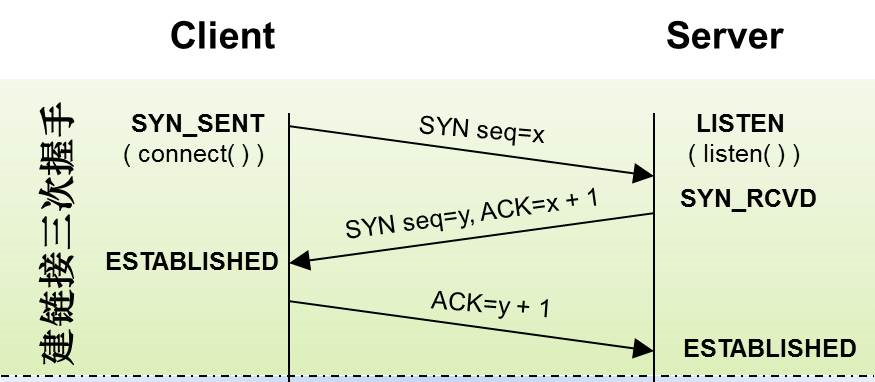

- TCP 四次挥手

  - 挥手请求可以是Client端，也可以是Server端发起的，我们假设是Client端发起

  - 第一次挥手：Client 发出连接释放报文FIN包，并且停止发送数据(在fin包之前发送出去的数据，如果没有收到对应的ack确认报文，主动关闭方依然会重发这些数据)，此时主动关闭方还可以接受数据。首部数据报文 `FIN=1`，序列号`seq=u`，客户端进入FIN_WAIT_1（终止等待1）状态。 TCP规定，FIN报文段即使不携带数据，也要消耗一个序号 (前一个包序号+1)

  - 第二次挥手：Server端收到了Client端发送的FIN包，回复发送一个ACK包，首部报文标志位`ACK=1`，序列号`seq=v`，确认序号 `ack=u+1`，此时 Server 就进入了CLOSE-WAIT（关闭等待）状态

    客户端向服务器的方向就释放了，这时候处于半关闭状态，即客户端已经没有数据要发送了，但是服务器若发送数据，客户端依然要接受。这个状态还要持续一段时间，也就是整个CLOSE-WAIT状态持续的时间，而客户端收到服务器的确认请求后，此时，客户端就进入 FIN_WAIT_2（终止等待2）状态，等待服务器发送连接释放报文

  - 第三次挥手：Server将最后的数据发送完毕后，就向Client发送连接释放报文FIN包，`FIN=1`，`ack=u+1`，由于在半关闭状态，服务器可能又发送了一些数据，假定此时的序列号为`seq=w`，此时服务器进入了LAST_ACK（最后确认）状态，等待客户端的确认

  - 第四次挥手：Client 收到FIN后，向Server端发送标志位是ACK的报文段，`ACK=1`，`ack=w+1`，`seq=u+1`

    此时 Client  就进入了TIME_WAIT（时间等待）状态，注意此时TCP连接还没有释放，必须经过2 * MSL（最长报文段寿命）的时间后依然没有收到回复，才撤销相应的TCB，进入CLOSED状态。服务器只要收到了客户端发出的确认，立即进入CLOSED状态。同样，撤销TCB后，就结束了这次的TCP连接。可以看到，服务器结束TCP连接的时间要比客户端早一些

    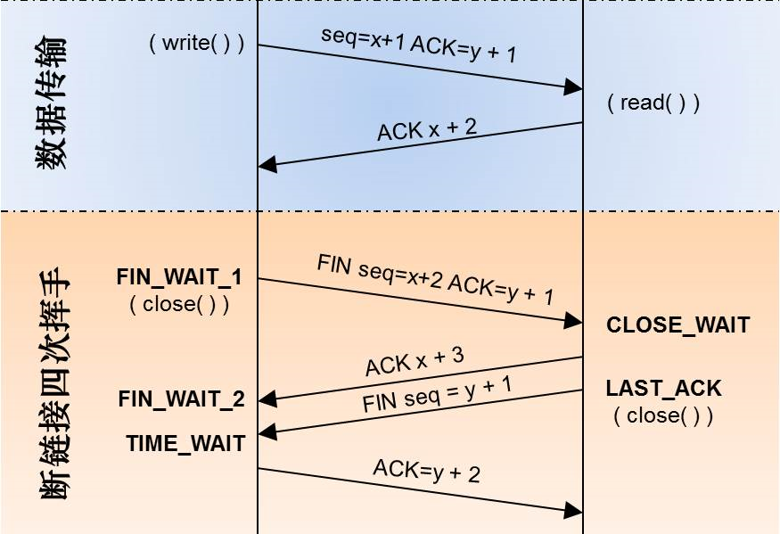

- TCP为什么三次握手而不是两次握手

  - 为了实现可靠数据传输， TCP 协议的通信双方， 都必须维护一个序列号， 以标识发送出去的数据包中， 哪些是已经被对方收到的。 三次握手完成两个重要的功能，通信双方相互告知序列号起始值，同时确认对方已经收到了序列号起始值
  - 如果只是两次握手， 至多只有连接发起方的起始序列号能被确认， 另一方选择的序列号则得不到确认
  - 假设把三次握手改成仅需要两次握手，考虑计算机`client`和`server`之间的通信，假定`client`给`server`发送一个连接请求，`server`收到了这个请求，并发送了确认应答。按照两次握手的协定，`server`认为连接已经成功地建立了，可以开始发送数据分组。如果`client`在`server`的应答在传输中被滞留延误，连接释放以后的某个时间才到达`server`，`server`收到失效的连接请求误认为是`client`发出的一个新的连接请求，于是发出确认报文段，同意建立连接。由于现在`client`并没有发出建立连接的请求，将忽略`server`发来的任何数据，`server`在发出的数据分组超时后，重复发送同样的数据分组，资源浪费

- 为什么建立连接协议是三次握手，而关闭连接却是四次握手

  - 建立连接时，因为服务端的LISTEN状态下的SOCKET当收到SYN报文的建连请求后，它可以把ACK和SYN放在一个报文里来发送，其中ACK报文是用来应答的，SYN报文是用来同步的，所以建立连接只需要三次握手
  - 关闭连接时，当收到主动关闭方的FIN报文通知时，它仅仅表示对方没有数据发送给你了；但被动关闭方未必所有数据都全部发送给对方了，所以被动关闭方可能不会马上会关闭SOCKET，即可能还需要发送一些数据给对方之后，再发送FIN报文给对方来表示同意现在可以关闭连接了，所以它这里的ACK报文和FIN报文多数情况下都是分开发送的

- 为什么TIME_WAIT状态还需要等2MSL后才能返回到CLOSED状态

  - MSL：报文段最大生存时间，它是任何报文段被丢弃前在网络内的最长时间
  - TIME_WAIT状态的作用就是用来重发可能丢失的ACK报文
  - 两个原因：
    - 第一点：保证TCP协议的全双工连接能够可靠关闭：由于IP协议的不可靠性或者是其它网络原因，导致了Server端没有收到Client端的ACK报文，那么Server端就会在超时之后重新发送FIN，如果此时Client端的连接已经关闭处于`CLOESD`状态，那么重发的FIN就找不到对应的连接了，从而导致连接错乱，所以，Client端发送完最后的ACK不能直接进入`CLOSED`状态，而要保持`TIME_WAIT`，当再次收到FIN的时候，能够保证对方收到ACK，最后正确关闭连接
    - 第二点：保证这次连接的重复数据段从网络中消失 如果Client端发送最后的ACK直接进入`CLOSED`状态，然后又再向Server端发起一个新连接，这时不能保证新连接的与刚关闭的连接的端口号是不同的，也就是新连接和老连接的端口号可能一样了，那么就可能出现问题：如果前一次的连接某些数据滞留在网络中，这些延迟数据在建立新连接后到达Client端，由于新老连接的端口号和IP都一样，TCP协议就认为延迟数据是属于新连接的，新连接就会接收到脏数据，这样就会导致数据包混乱，所以TCP连接需要在`TIME_WAIT`状态等待2倍MSL，才能保证本次连接的所有数据在网络中消失

#### 4.5 流量控制

- RTT和RTO
  - RTT：发送一个数据包到收到对应的ACK，所花费的时间
  - RTO：重传时间间隔（TCP在发送一个数据包后会启动一个重传定时器，RTO即定时器的重传时间）
  - 开始预先算一个定时器时间
    - 如果回复ACK，重传定时器就自动失效，即不需要重传
    - 如果没有回复ACK，RTO定时器时间就到了，重传
  - RTO是本次发送当前数据包所预估的超时时间，RTO不是固定写死的配置，是经过RTT计算出来的
- 滑动窗口
  - TCP的滑动窗口主要有两个作用：
    - 保证TCP的可靠性
    - 保证TCP的流控特性
  - TCP报文头有个字段叫Window，用于接收方通知发送方自己还有多少缓存区可以接收数据，发送方根据接收方的处理能力来发送数据，不会导致接收方处理不过来，这便是流量控制
  - 发送方都维持了一个连续的允许发送的帧的序号，称为发送窗口；同时，接收方也维持了一个连续的允许接收的帧的序号，称为接收窗口
  - 发送窗口和接收窗口的序号的上下界不一定要一样，甚至大小也可以不同
  - 不同的滑动窗口协议窗口大小一般不同
  - 发送方窗口内的序列号代表了那些已经被发送，但是还没有被确认的帧，或者是那些可以被发送的帧
  - 滑动窗口由四部分组成每个字节的数据都有唯一顺序的编码，随着时间发展，未确认部分与可以发送数据包编码部分向右移动，形式滑动窗口
    - 绿色：发送成功并已经ACK确认的数据
    - 黄色：发送成功等待ACK确认的数据(占用滑动窗口大小)
    - 紫色：滑动窗口剩余大小可以发送的字节数量(滑动窗口可用大小)
    - 灰色：后续数据编码
  - 接收窗口的大小就是滑动窗口的最大值，数据传输过程中滑动窗口的可用大小是动态变化的
  - 但是还有这么一点，滑动窗口的设计仅仅是考虑到了处理方的处理能力，但是没有考虑到道路的通畅问题
  - 就好像服务端可以处理100M数据，但是传输的数据99M都堵在路上了，这不就是导致道路阻塞了么？这就需要另外一个设计拥塞避免
- 流量控制的目的
  - 如果发送者发送数据过快，接收者来不及接收，那么就会有分组丢失
  - 为了避免分组丢失，控制发送者的发送速度，使得接收者来得及接收，这就是流量控制
  - 流量控制根本目的是防止分组丢失，它是构成TCP可靠性的一方面
- 如何实现流量控制
  - 由滑动窗口协议（连续ARQ协议）实现。滑动窗口协议既保证了分组无差错、有序接收，也实现了流量控制
  - 主要的方式就是接收方返回的 ACK 中会包含自己的接收窗口的大小，并且利用大小来控制发送方的数据发送
- 流量控制引发的死锁
  - 当发送者收到了一个窗口为0的应答，发送者便停止发送，等待接收者的下一个应答
  - 但是如果这个窗口不为0的应答在传输过程丢失，发送者一直等待下去，而接收者以为发送者已经收到该应答，等待接收新数据，这样双方就相互等待，从而产生死锁
  - 为了避免流量控制引发的死锁，TCP使用了持续计时器。每当发送者收到一个零窗口的应答后就启动该计时器。时间一到便主动发送报文询问接收者的窗口大小。若接收者仍然返回零窗口，则重置该计时器继续等待；若窗口不为0，则表示应答报文丢失了，此时重置发送窗口后开始发送，这样就避免了死锁的产生

#### 4.6 拥塞控制

- 为什么要进行拥塞控制
  - 假设网络已经出现拥塞，如果不处理拥塞，那么延时增加，出现更多丢包，触发发送方重传数据，加剧拥塞情况，继续恶性循环直至网络瘫痪
  - 拥塞控制与流量控制的适应场景和目的均不同
  - 拥塞发生前，可避免流量过快增长拖垮网络；拥塞发生时，唯一的选择就是降低流量
- 主要使用4种算法完成拥塞控制
  - 慢启动
  - 拥塞避免
  - 快重传算法
  - 快速恢复算法
  - 算法1、2适用于拥塞发生前，算法3适用于拥塞发生时，算法4适用于拥塞解决后
- rwnd与cwnd
  - rwnd（Receiver Window，接收者窗口）与cwnd（Congestion Window，拥塞窗口）
  - rwnd是用于流量控制的窗口大小，主要取决于接收方的处理速度，由接收方通知发送方被动调整
  - cwnd是用于拥塞处理的窗口大小，取决于网络状况，由发送方探查网络主动调整
  - 同时考虑流量控制与拥塞处理，则发送方窗口的大小不超过min{rwnd, cwnd}
- 慢启动算法
  - 慢开始算法的思路是，不要一开始就发送大量的数据，先探测一下网络的拥塞程度，也就是说由小到大逐渐增加拥塞窗口的大小
  - 这里用报文段的个数作为拥塞窗口的大小举例说明慢开始算法，实际的拥塞窗口大小是以字节为单位的
    - 一个传输轮次所经历的时间其实就是往返时间RTT，而且每经过一个传输轮次，拥塞窗口cwnd就加倍
    - 为了防止cwnd增长过大引起网络拥塞，还需设置一个慢开始门限ssthresh状态变量
  - ssthresh的用法如下：
    - cwnd<ssthresh时，使用慢开始算法
    - 当cwnd>ssthresh时，改用拥塞避免算法
    - 当cwnd=ssthresh时，慢开始与拥塞避免算法任意
  - 这里的慢并不是指cwnd的增长速率慢，而是指在TCP开始发送报文段时先设置cwnd=1，然后逐渐增大，这当然比按照大的cwnd一下子把许多报文段突然注入到网络中要慢得多
- 拥塞避免算法
  - 让拥塞窗口cwnd缓慢地增大，即每经过一个往返时间RTT就把发送方的拥塞窗口cwnd加1，而不是加倍
  - 这样拥塞窗口cwnd按线性规律缓慢增长，比慢开始算法的拥塞窗口增长速率缓慢得多
  - 无论是在慢开始阶段还是在拥塞避免阶段，只要发送方判断网络出现拥塞（其根据就是没有按时收到确认，虽然没有收到确认可能是其他原因的分组丢失，但是因为无法判定，所以都当做拥塞来处理），就把慢开始门限ssthresh设置为出现拥塞时的发送窗口大小的一半（但不能小于2）
  - 然后把拥塞窗口cwnd重新设置为1，执行慢开始算法
  - 这样做的目的就是要迅速减少主机发送到网络中的分组数，使得发生拥塞的路由器有足够时间把队列中积压的分组处理完毕
- 整个拥塞控制的流程：
  - 假定cwnd=24时，网络出现超时（拥塞），则更新后的ssthresh=12，cwnd重新设置为1，并执行慢开始算法
  - 当cwnd=12=ssthresh时，改为执行拥塞避免算法
  - 注意：拥塞避免并非完全能够避免了阻塞，而是使网络比较不容易出现拥塞
- 快重传算法
  - 快重传要求接收方在收到一个失序的报文段后就立即发出重复确认（为的是使发送方及早知道有报文段没有到达对方，可提高网络吞吐量约20%）而不要等到自己发送数据时捎带确认
  - 快重传算法规定，发送方只要一连收到三个重复确认就应当立即重传对方尚未收到的报文段，而不必继续等待设置的重传计时器时间到期
- 快恢复算法
  - 快重传配合使用的还有快恢复算法，有以下两个要点：
    - 当发送方连续收到三个重复确认时，就把ssthresh门限减半（为了预防网络发生拥塞）
    - 但是接下去并不执行慢开始算法
  - 考虑到如果网络出现拥塞的话就不会收到好几个重复的确认，所以发送方现在认为网络可能没有出现拥塞
  - 所以此时不执行慢开始算法，而是将cwnd设置为ssthresh减半后的值，然后执行拥塞避免算法，使cwnd缓慢增大

#### 4.7 Socket

- 即套接字，是应用层 与 TCP/IP 协议族通信的中间软件抽象层，表现为一个封装了 TCP / IP协议族 的编程接口（API）
- Socket不是一种协议，而是一个编程调用接口（API），属于传输层（主要解决数据如何在网络中传输）
- 对用户来说，只需调用Socket去组织数据，以符合指定的协议，即可通信


### 5. UDP

- UDP协议特点
  - UDP是无连接的传输层协议；
  - UDP使用尽最大努力交付，不保证可靠交付；
  - UDP是面向报文的，对应用层交下来的报文，不合并，不拆分，保留原报文的边界；
  - UDP没有拥塞控制，因此即使网络出现拥塞也不会降低发送速率；
  - UDP支持一对一，一对多，多对多的交互通信；
  - UDP的首部开销小，只有８字节

- TCP和UDP的区别
  - TCP是可靠传输，UDP是不可靠传输;
  - TCP面向连接，UDP无连接;
  - TCP传输数据有序，UDP不保证数据的有序性;
  - TCP不保存数据边界，UDP保留数据边界;
  - TCP传输速度相对UDP较慢;
  - TCP有流量控制和拥塞控制，UDP没有;
  - TCP是重量级协议，UDP是轻量级协议;
  - TCP首部较长20字节，UDP首部较短８字节;

- 基于TCP和UDP的常用协议
  - HTTP、HTTPS、FTP、TELNET、SMTP(简单邮件传输协议)协议基于可靠的TCP协议
  - TFTP、DNS、DHCP、TFTP、SNMP(简单网络管理协议)、RIP基于不可靠的UDP协议

- 报文段
  - UDP的报文段共有2个字段：数据字段 + 首部字段
  - UDP报文中每个字段的含义
    - 源端口：这个字段占据 UDP 报文头的前 16 位，通常包含发送数据报的应用程序所使用的 UDP 端口，接收端的应用程序利用这个字段的值作为发送响应的目的地址，这个字段是可选的，所以发送端的应用程序不一定会把自己的端口号写入该字段中，如果不写入端口号，则把这个字段设置为 0，这样，接收端的应用程序就不能发送响应了
    - 目的端口：接收端计算机上 UDP 软件使用的端口，占据 16 位
    - 长度：该字段占据 16 位，表示 UDP 数据报长度，包含 UDP 报文头和 UDP 数据长度，因为 UDP 报文头长度是 8 个字节，所以这个值最小为 8
    - 校验值：该字段占据 16 位，可以检验数据在传输过程中是否被损坏

- TCP和UDP的区别

  - TCP是面向连接的，而UDP是面向无连接的。

  - TCP仅支持单播传输，UDP 提供了单播，多播，广播的功能。

  - TCP的三次握手保证了连接的可靠性; UDP是无连接的、不可靠的一种数据传输协议，首先不可靠性体现在无连接上，通信都不需要建立连接，对接收到的数据也不发送确认信号，发送端不知道数据是否会正确接收。

  - UDP的头部开销比TCP的更小，数据传输速率更高，实时性更好。


### 6. 网络层

#### 6.1 MAC地址

- MAC称为物理地址，也叫硬件地址，用来定义网络设备的位置，MAC地址是网卡出厂时设定的，是固定的
  - 但可以通过在设备管理器中或注册表等方式修改，同一网段内的MAC地址必须唯一
- MAC地址采用十六进制数表示，长度是6个字节（48位），分为前24位和后24位
  - 前24位16进制数代表了网络硬件制造商的编号，由IEEE分配，后24位16进制数是由网络产品制造产商自行分配
  - MAC地址对应于OSI参考模型的第二层数据链路层，工作在数据链路层的交换机维护着计算机MAC地址和自身端口的数据库，交换机根据收到的数据帧中的目的MAC地址字段来转发数据帧

#### 6.2 IP地址

- 常见的IP地址分为IPv4与IPv6两大类，当前广泛应用的是IPv4，目前IPv4几乎耗尽，下一阶段必然会进行版本升级到IPv6
- IP地址是以网络号和主机号来标示网络上的主机的，我们把网络号相同的主机称之为本地网络，网络号不相同的主机称之为远程网络主机
- 本地网络中的主机可以直接相互通信；远程网络中的主机要相互通信必须通过本地网关（Gateway）来传递转发数据
- IP地址对应于OSI参考模型的第三层网络层，工作在网络层的路由器根据目标IP和源IP来判断是否属于同一网段，如果是不同网段，则转发数据包
- IP地址格式和表示
  - IP地址(IPv4)由32位二进制数组成，分为4段（4个字节），每一段为8位二进制数（1个字节）
  - 每一段8位二进制，中间使用英文的标点符号`.`隔开
  - 由于二进制数太长，为了便于记忆和识别，把每一段8位二进制数转成十进制，大小为0至255
  - IP地址的这种表示法叫做**点分十进制表示法**
  - IP地址表示为：`xxx.xxx.xxx.xxx`
- 计算机的IP地址由两部分组成，一部分为网络标识，一部分为主机标识，同一网段内的计算机网络部分相同，主机部分不能同时重复出现
- **路由器**连接不同网段，负责不同网段之间的数据转发，**交换机**连接的是同一网段的计算机

#### 6.3 子网掩码

- 子网掩码的概念及作用
  - 通过子网掩码，才能表明一台主机所在的子网与其他子网的关系，使网络正常工作。
  - 子网掩码和IP地址做与运算，分离出IP地址中的网络地址和主机地址，用于判断该IP地址是在本地网络上，还是在远程网络网上
  - 子网掩码还用于将网络进一步划分为若干子网，以避免主机过多而拥堵或过少而IP浪费
- 子网掩码的组成
  - 同IP地址一样，子网掩码是由长度为32位二进制数组成的一个地址
  - 子网掩码32位与IP地址32位相对应，IP地址如果某位是网络地址，则子网掩码为1，否则为0
- 为什么要使用子网掩码
  - 两台主机要通信，首先要判断是否处于同一网段，即网络地址是否相同
  - 如果相同，那么可以把数据包直接发送到目标主机，否则就需要路由网关将数据包转发送到目的地
  - A主机要与B主机通信，A和B各自的IP地址与A主机的子网掩码进行And与运算，看得出的结果：
    - 结果如果相同，则说明这两台主机是处于同一个网段，这样A可以通过ARP广播发现B的MAC地址，B也可以发现A的MAC地址来实现正常通信
    - 如果结果不同，ARP广播会在本地网关终结，这时候A会把发给B的数据包先发给本地网关，网关再根据B主机的IP地址来查询路由表，再将数据包继续传递转发，最终送达到目的地B
- 子网掩码和IP地址的关系
  - 子网掩码是用来判断任意两台主机的IP地址是否属于同一网络的依据
  - 拿双方主机的IP地址和自己主机的子网掩码做与运算，如结果为同一网络，就可以直接通信

#### 6.4 网关

- 网关实质上是一个网络通向其他网络的IP地址
- 比如有网络A和网络B
  - 网络A的IP地址范围为`192.168.1.1~192. 168.1.254`，子网掩码为`255.255.255.0`
  - 网络B的IP地址范围为`192.168.2.1~192.168.2.254`，子网掩码为`255.255.255.0`
- 在没有路由器的情况下，两个网络之间是不能进行TCP/IP通信的，即使是两个网络连接在同一台交换机(或集线器)上，TCP/IP协议也会根据子网掩码(`255.255.255.0`)判定两个网络中的主机处在不同的网络里
- 而要实现这两个网络之间的通信，则必须通过网关
- 如果网络A中的主机发现数据包的目的主机不在本地网络中，就把数据包转发给它自己的网关，再由网关转发给网络B的网关，网络B的网关再转发给网络B的某个主机。网络B向网络A转发数据包的过程
- **只有设置好网关的IP地址，TCP/IP协议才能实现不同网络之间的相互通信**
- 这个IP地址是哪台机器的IP地址
  - 网关的IP地址是具有路由功能的设备的IP地址，具有路由功能的设备有路由器、启用了路由协议的服务器(实质上相当于一台路由器)、代理服务器(也相当于一台路由器)

#### 6.5 Ping

- Ping是我们测试网络连接的常用指令，它利用ICMP报文检测网络连接
- **假设A ping B**
  - ping通知系统建立一个固定格式的ICMP请求数据包
  - ICMP协议打包这个数据包和B的IP地址转交给IP协议层
  - IP层协议将机器B的IP地址为目的地址，本机的IP地址为源地址，加上一些头部必要的控制信息，构建一个IP数据包
  - 获取B的MAC地址，做这个操作首先机器A会判断B是否在同一网段内，若IP层协议通过B的IP地址和自己的子网掩码，发现它跟自己属于同一网络，就直接在本网络查找这台机器的MAC，否则则通过路由器进行类似查找
  - 接下来是ARP协议根据IP地址查找MAC地址的过程:
    - 若两台机器之前有过通信，在机器A的ARP缓存表里应该存有B的IP与其MAC地址的映射关系
    - 若没有，则通过发送ARP请求广播，得到回应的B机器MAC地址，并交给数据链路层
  - 数据链路层构建一个数据帧，目的地址是IP层传过来的MAC地址，源地址是本机的MAC地址，再附加一些必要的控制信息，依据以太网的介质访问规则将他们传送出去
  - 机器B收到这个数据帧后，先检查目的地址，和本机MAC地址对比
  - 符合，接受，接收后检查该数据帧，将IP数据包从帧中提取出来，交给本机的的IP地址协议层协议，IP协议层检查之后，将有用的信息提取给ICMP协议，后者处理，马上构建一个ICMP应答包，发送给A，其过程和主机A发送ICMP请求包到B的过程类似，但不用ARP广播收取A的信息，因为请求包中已经有足够的信息用于B回应A；若不符合，丢弃
- 可以知道PING的过程即一段发送报文和接受确认报文的过程，在来回直接可以计算时延

#### 6.6 DNS

- DNS通过主机名，最终得到该主机名对应的IP地址的过程叫做域名解析（或主机名解析）

- 通俗的讲，我们更习惯于记住一个网站的名字，www.baidu.com，而不是记住它的ip地址，比如：167.23.10.2

- 工作原理

  - 将主机域名转换为ip地址，属于应用层协议，使用UDP传输

  - 第一步，客户端向本地DNS服务器发送解析请求

    第二步，本地DNS如有相应记录会直接返回结果给客户端，如没有就向DNS根服务器发送请求

    第三步,DSN根服务器接收到请求，返回给本地服务器一个所查询域的主域名服务器的地址

    第四步，本地dns服务器再向返回的主域名服务器地址发送查询请求

    第五步，主域名服务器如有记录就返回结果，没有的话返回相关的下级域名服务器地址

    第六步，本地DNS服务器继续向接收到的地址进行查询请求

    第七步，下级域名服务器有相应记录，返回结果

    第八步，本地dns服务器将收到的返回地址发给客户端，同时写入自己的缓存，以便下次查询

    DNS域名查询实际上就是个不断递归查询的过程，直到查找到相应结果，需要注意的时，当找不到相应记录，会返回空结果，而不是超时信息

- DNS记录

  - A记录

    ```tex
    定义www.example.com的ip地址
    www.example.com.	IN	A	139.18.28.5;
    定义www.example.com的别名
    a.example.com.	IN	CNAME	b.example.com.
    ```

  - www.example.com 是要解析的域名
  - A 是记录的类型，A 记录代表着这是一条用于解析 IPv4 地址的记录
  - AAAA 记录则是域名和 IPv6 地址的映射关系
  - MX 记录是邮件记录，用来描述邮件服务器的域名
  - CNAME用于定义域名的别名
    - 在浏览器中输入 a.example.com 时候，通过 DNS 查询会知道 a.example.com 是 b.example.com 的别名，因此需要实际 IP 的时候，会去拿 b.example.com 的 A 记录
  - NS记录是描述 DNS 服务器网址。从 DNS 的存储结构上说，Name Server 中含有权威 DNS 服务的目录

#### 6.7 ARP协议

- ARP即地址解析协议， 用于实现从 IP 地址到 MAC 地址的映射，即询问目标IP对应的MAC地址
- **ARP协议的工作过程**
  - 首先，每个主机都会有自己的ARP缓存区中建立一个ARP列表，以表示IP地址和MAC地址之间的对应关系
  - 当源主机要发送数据时，首先检测ARP列表中是否对应IP地址的目的主机的MAC地址，如果有，则直接发送数据，如果没有，就向本网段的所有主机发送ARP数据包
  - 当本网络的所有主机收到该ARP数据包时，首先检查数据包中的IP地址是否是自己的IP地址，如果不是，则忽略该数据包，如果是，则首先从数据包中取出源主机的IP和MAC地址写入到ARP列表中，如果存在，则覆盖然后将自己的MAC地址写入ARP响应包中，告诉源主机自己是它想要找的MAC地址
  - 源主机收到ARP响应包后，将目的主机的IP和MAC地址写入ARP列表，并利用此信息发送数据，如果源主机一直没有收到ARP响应数据包，表示ARP查询失败


### 7. Cookie 和 Session

- cookie和session都是用来跟踪浏览器用户身份的会话方式

- Cookie的工作原理

  - 浏览器端第一次发送请求到服务器端

  - 服务器端创建Cookie，该Cookie中包含用户的信息，然后将该Cookie发送到浏览器端

  - 浏览器端再次访问服务器端时会携带服务器端创建的Cookie

  - 服务器端通过Cookie中携带的数据区分不同的用户

    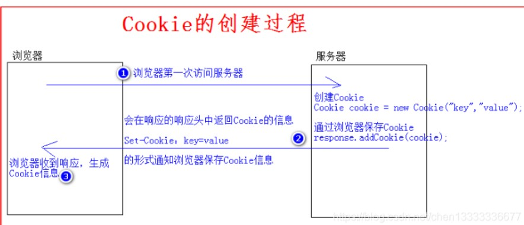

- Session的工作原理

  - 浏览器端第一次发送请求到服务器端，服务器端创建一个Session，同时会创建一个特殊的Cookie（name为JSESSIONID的固定值，value为session对象的ID），然后将该Cookie发送至浏览器端

  - 之后浏览器端访问服务器端时就会携带该name为JSESSIONID的Cookie对象

  - 服务器端根据name为JSESSIONID的Cookie的value(sessionId),去查询Session对象，从而区分不同用户

    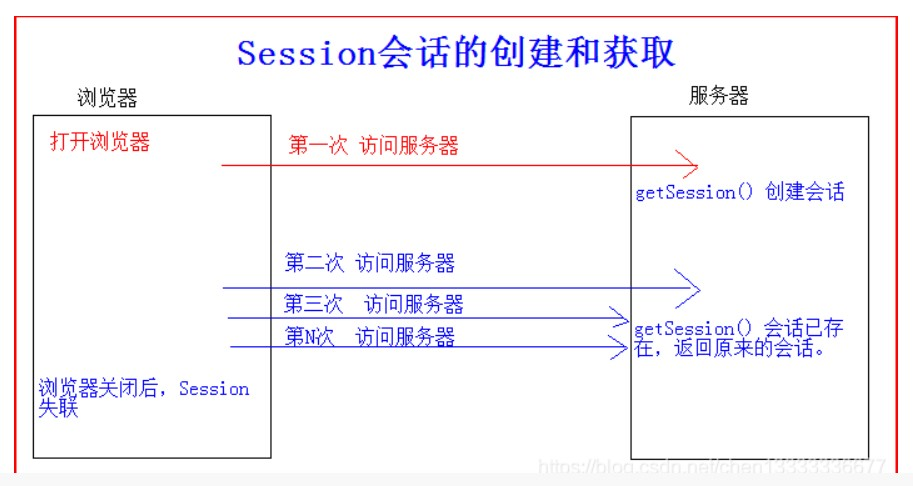

  

- 两者区别
  - cookie存在浏览器，session在服务器
  - 单个cookie保存的数据<=4KB，一个站点最多保存20个Cookie
  - 对于session来说并没有上限，但出于对服务器端的性能考虑，session内不要存放过多的东西，并且设置session删除机制
  - cookie不是很安全，别人可以分析存放在本地的COOKIE并进行COOKIE欺骗，考虑到安全应当使用session

- sessionStorage 和 localStorage
  - sessionStorage和localStorage数据保存在本地
  - sessionStorage 用于存储一个会话（session）中的数据，这些数据只有在同一个会话中的页面才能访问，会话结束后数据也随之销毁。
  - localStorage 用于存储一个域名下的需要永久存在在本地的数据，这些数据可以被一直访问，直到这些数据被删除。
  - 主要区别在于他们存储数据的生命周期，sessionStorage 存储的数据的生命周期是一个会话，而 localStorage 存储的数据的生命周期是永久，直到被主动删除，否则数据永远不会过期的


### 8. 浏览器的缓存机制

- 浏览器与服务器通信的方式为应答模式，即是：浏览器发起HTTP请求 – 服务器响应该请求。那么浏览器第一次向服务器发起该请求后拿到请求结果，会根据响应报文中HTTP头的缓存标识，决定是否缓存结果，是则将请求结果和缓存标识存入浏览器缓存中

- 浏览器每次发起请求，都会**先在浏览器缓存中查找该请求的结果以及缓存标识**，如果有就直接从浏览器缓存而不是从原始服务器中提取资源

- 浏览器每次拿到返回的请求结果都会**将该结果和缓存标识存入浏览器缓存中**

  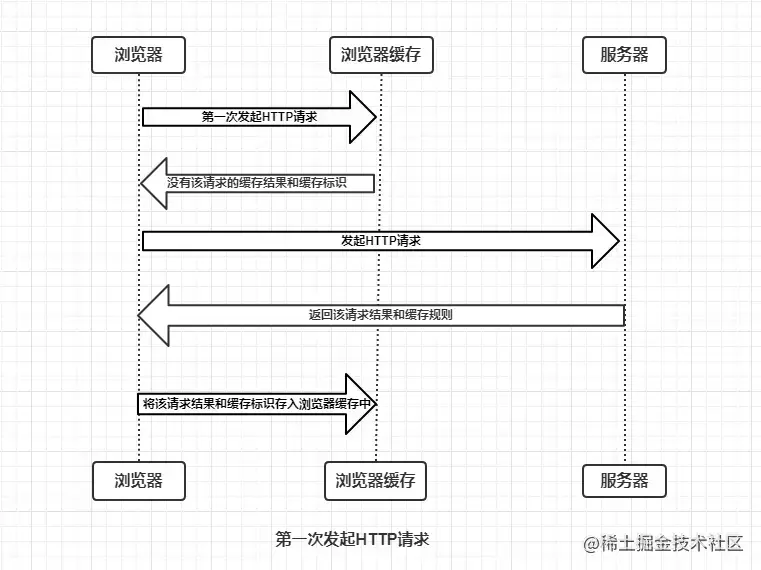

- HTTP缓存机制是根据HTTP报文的缓存标识进行的，分为强缓存和协商缓存。优先级最高的是强缓存，在命中强缓存失败的情况下，才会走协商缓存

  - 强缓存：直接从本地副本比对读取，不去请求服务器，返回的状态码是 200
  - 协商缓存：会去服务器比对，若没改变才直接读取本地缓存，返回的状态码是 304

- **强缓存**

  - **强制缓存就是向浏览器缓存查找该请求结果，并根据该结果的缓存规则来决定是否使用该缓存结果的过程。**
  - 当浏览器向服务器发起请求时，服务器会将缓存规则放入HTTP响应报文的HTTP头中和请求结果一起返回给浏览器
  - 控制强制缓存的字段分别是 `Expires` 和 `Cache-Control`，其中Cache-Control优先级比Expires高
    - Cache-Control字段
      - public：表明响应可以被任何对象（包括：发送请求的客户端、代理服务器等等）缓存。
      - private：表明响应只能被客户端缓存。
      - no-cache：跳过强缓存，直接进入协商缓存阶段。
      - no-store：表示当前请求资源禁用缓存
      - max-age=：设置缓存存储的最大周期，超过这个时间缓存被认为过期（单位秒）
  - 强制缓存的情况主要有三种(暂不分析协商缓存过程)，如下：
    - 不存在该缓存结果和缓存标识，强制缓存失效，则直接向服务器发起请求（跟第一次发起请求一致）。
    - 存在该缓存结果和缓存标识，但该结果已失效，强制缓存失效，则使用协商缓存。
    - 存在该缓存结果和缓存标识，且该结果尚未失效，强制缓存生效，直接返回该结果

- **协商缓存**

  - **协商缓存就是强制缓存失效后，浏览器携带缓存标识向服务器发起请求，由服务器根据缓存标识决定是否使用缓存的过程。**
  - 协商缓存的标识也是在响应报文的HTTP头中和请求结果一起返回给浏览器的
  - 控制协商缓存的字段分别有：`Last-Modified / If-Modified-Since` 和 `Etag / If-None-Match`
    - last-modified: 记录资源最后修改的时间。启用后，请求资源之后的响应头会增加一个 last-modified 字段
    - 只要编辑了，不管内容是否真的有改变，都会以这最后修改的时间作为判断依据，当成新资源返回，从而导致了没必要的请求响应
    - 时间的精确度只能到秒，如果在一秒内的修改是检测不到更新的，仍会告知浏览器使用旧的缓存
  - `Etag` / `If-None-Match`的优先级比`Last-Modified` / `If-Modified-Since`高
    - 为了解决 last-modified 上述问题，有了 etag。 etag 会基于资源的内容编码生成一串唯一的标识字符串，只要内容不同，就会生成不同的 etag。
    - 启用 etag 之后，请求资源后的响应返回会增加一个 etag 字段
  - 协商缓存主要有以下两种情况：
    - 协商缓存生效，返回304
    - 协商缓存失效，返回200和请求结果结果

- 缓存过程

  - 浏览器请求资源时首先命中资源的Expires 和 Cache-Control，Expires 受限于本地时间，如果修改了本地时间，可能会造成缓存失效。

  - 可以通过Cache-control: max-age指定最大生命周期，状态仍然返回200，但不会请求数据，在浏览器中能明显看到from cache字样

  - 强缓存失效，进入协商缓存阶段。首先验证ETag可以保证每一个资源是唯一的，资源变化都会导致ETag变化。

  - 当再次请求该资源时，请求头会带有 If-None-Match 字段，值是之前返回的 etag 值。服务器根据客户端上送的If-None-Match值来进行对比，若一致则代表未改变可直接使用本地缓存并返回 304，若不一致则返回新的资源（状态码200）并修改返回的 etag 字段为新的值

  - 协商缓存Last-Modify/If-Modify-Since阶段，客户端第一次请求资源时，服务服返回的header中会加上Last-Modify，Last-modify是一个时间标识该资源的最后修改时间。再次请求该资源时，request的请求头中会包含If-Modify-Since，该值为缓存之前返回的Last-Modify。服务器收到If-Modify-Since后，会对比该字段和资源的最后修改时间，若一致则证明没有被修改，告知浏览器可直接使用缓存并返回 304；若不一致则直接返回修改后的资源，并修改 last-modified 为新的值

  - [彻底理解浏览器的缓存机制](https://juejin.cn/post/6992843117963509791 "https://juejin.cn/post/6992843117963509791")

    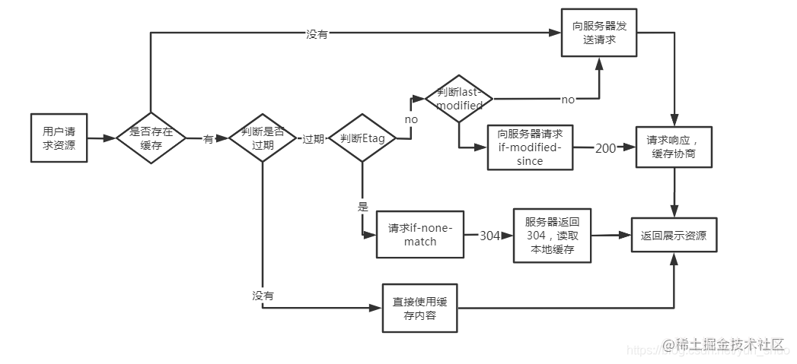


### 9. 网络攻击

#### CSRF和XSS

- `XSS`(`Cross-Site Scripting`，**跨站脚本攻击**)是一种代码注入攻击。攻击者在目标网站上注入恶意代码，当被攻击者登陆网站时就会执行这些恶意代码，这些脚本可以读取 `cookie，session tokens`，或者其它敏感的网站信息，对用户进行钓鱼欺诈，甚至发起蠕虫攻击等
- XSS攻击分类
  - 反射性XSS攻击 (非持久性XSS攻击)
  - 持久性XSS攻击 (留言板场景)
- XSS避免方式
  - `url`参数使用`encodeURIComponent`方法转义
  - 尽量不是有`InnerHtml`插入`HTML`内容
  - 使用特殊符号、标签转义符
- `CSRF`（`Cross-site request forgery`）**跨站请求伪造**：攻击者诱导受害者进入第三方网站，在第三方网站中，向被攻击网站发送跨站请求。利用受害者在被攻击网站已经获取的注册凭证，绕过后台的用户验证，达到冒充用户对被攻击的网站执行某项操作的目的
- `CSRF`避免方式
  - 添加验证码
  - 使用token，服务端给用户生成一个token，加密后传递给用户, 用户在提交请求时，需要携带这个token, 服务端验证token是否正确

#### DOS攻击

- DOS：拒绝服务，该攻击的效果是使得计算机或网络无法提供正常的服务
- DOS攻击的原理：
  - 攻击者向被攻击的服务器发送大量的虚假IP请求，被攻击者在收到请求后返回确认信息，等待攻击者进行确认，该过程需要TCP的三次握手，由于攻击者发送的请求信息是虚假的，所以服务器接收不到返回的确认信息，在一段时间内服务器会处与等待状态，而分配给这次请求的资源却被有被释放
    - 当被攻击者等待一定的时间后，会因连接超时而断开，这时攻击者在次发送新的虚假信息请求，这样最终服务器资源被耗尽，直到瘫痪

- `DDoS`又叫分布式拒绝服务
  - 全称 `Distributed Denial of Service`，其原理就是利用大量的请求造成资源过载，导致服务不可用
- DDOS如何攻击
  - 最流行也是最好用的攻击方法就是使用SYN-Flood进行攻击，SYN-Flood也就是SYN洪水攻击
  - SYN-Flood不会完成TCP三次握手的第三步，也就是不发送确认连接的信息给服务器，这样，服务器无法完成第三次握手，但服务器不会立即放弃，服务器会不停的重试并等待一定的时间后放弃这个未完成的连接，这段时间叫做SYN timeout，这段时间大约30秒-2分钟左右
  - 若是一个用户在连接时出现问题导致服务器的一个线程等待1分钟并不是什么大不了的问题，但是若有人用特殊的软件大量模拟这种情况，那后果就可想而知了。一个服务器若是处理这些大量的半连接信息而消耗大量的系统资源和网络带宽，这样服务器就不会再有空余去处理普通用户的正常请求(因为客户的正常请求比率很小)，这样这个服务器就无法工作了，这种攻击就叫做SYN-Flood攻击
- `DDos`避免方式
  - 限制同时打开的SYN半连接数目
  - 限制单IP请求频率
  - 防火墙等防护设置禁止`ICMP`包等
  - 检查特权端口的开


### 10. 计算机网络八股文

#### DNS域名系统采用的是TCP协议还是UDP协议？为啥？

- UDP协议，因为对于用户来说，响应时间越快越好，而TCP连接建立时间比较慢，所以采用UDP协议来实现

#### 讲讲DNS解析过程？

- DNS解析，就是将域名解析成具体的ip地址的过程。会一步步向上解析，知道解析出结果
  - 浏览器缓存，浏览器缓存一般会有一个TTL有效期
  - 系统hosts文件
  - 本地DNS解析器缓存，每个完整的内网通常都会配置本地DNS服务器，例如用户是在学校或工作单位接入互联网，那么用户的本地DNS服务器肯定在学校或工作单位里面
  - 根DNS服务器，根DNS服务器返回给本地DNS域名服务器一个顶级DNS服务器地址
  - 顶级DNS服务器，它是国际顶级域名服务器，如.com、.cn、.org等，全球只有13台左右
  - 权威域名服务器，这个权威域名服务器就是我要访问的网站域名提供商的服务器，其实该域名的解析任务就是由域名提供商的服务器来完成
  - 返回真实IP并缓存结果

#### 浏览器一次URL按下回车发生了什么？

- 进行DNS解析操作，根据DNS解析结果查找到服务器IP地址
- 通过IP寻址找到服务器，并利用三次握手建立TCP连接
- 浏览器生成HTTP报文，发送HTTP请求，等待服务器响应
- 服务器处理请求，返回服务器
- 根据HTTP是否开启长链接，进行TCP挥手
- 浏览器根据静态资源进行页面渲染

#### tcp和udp的差别？

- 是否连接：TCP面向连接；UDP面向非连接
- 传输可靠性：TCP可靠；UDP不可靠的
- 应用场合：TCP传输大量的数据；UDP少量数据
- 速度：TCP 慢；UDP快


#### UDP如何实现可靠传输

- 由于UDP是不可靠传输，要实现可靠传输，可在应用层模仿TCP的可靠传输机制
  - 增加seq/ack机制
  - 在发送方和接收方设置缓冲区
  - 增加超时重传机制

#### tcp滑动窗口？

- TCP 会将较大数据拆分成一个个小的数据包再进行发送。发送完一个包，等待 ACK，这种模式是最简单的
- 但是问题也很明显，慢，吞吐量低。所以我们在等待 ACK 的同时，可以继续发送接下来的包
- 滑动窗口就是在发送完一个数据包后，不需要等待 ACK 消息返回，可以发送后面的数据包，解决吞吐量问题

#### tcp超时重传？

- 超时重传就是设置一个定时器，当发送的数据包没有在规定的时间内到达的时候就会发生超时重传，其定时器的时间选择应该大于RTT,对于多次重传，其定时器的时间会比上一次多一倍

#### TCP流量控制

- 流量控制就是让发送方能根据接受方的接受能力可以控制发送方的发送能力。其中窗口中存储的数据都是放置在操作系统的缓存区中的，缓冲区的大小操作系统会根据情况自己调节

#### TCP拥塞控制

- 拥塞控制是为了防止发送方把数据填满整个网络
  - 慢启动
  - 快速失败就降一半滑动窗口长度
  - 超时重传就降滑动窗口为1
  - 每次ack翻倍滑动窗口长度

#### 为啥三次握手四次挥手

- TCP进行可靠传输的关键就在于维护一个序列号，本质上需要四次交互，双方请求对方并发送序列号，加上双方的应答
- 但是握手阶段，可以将应答和请求合并
- 而挥手不能合并，服务端有可能有没完成的传输任务，所以会先回应，然后任务完成后再去主动请求释放

#### TCP连接释放中time_wait状态的作用？

- 首先根据两军悖论，双方至少有一个需要持有连接，等待对方的释放，所以只好有一方用定时器的方式，来进行被动关闭
  - 为了被动关闭连接能够正常的关闭
  - 连接关闭了，才能防止历史连接中的数据被后面相同四元组错误的接收

#### TCP沾包

- 对于TCP沾包主要是因为TCP是流式协议，这样的话当多次发送数据包的时候，容易接受到的数据包会沾在一起，解决方法可以是自己定义一个包头，其中记录数据的大小，这样的话，当接受到这个包头数据的时候，就可以通过其记录数据的大小再接收这个大小的数据包
- **发生 TCP 粘包的原因:**
  - 发送的数据小于 TCP 缓冲区大小，TCP 将缓冲区中的数据一次发送出去可能就会发生粘包
  - 接收数据端的应用层没有及时读取接收缓冲区中的数据，将发生粘包
- **发生 TCP 拆包的原因:**
  - 待发送数据大于最大报文长度，TCP 在传输前将进行拆包
  - 发送的数据大于 TCP 发送缓冲区剩余空间大小，将会发生拆包
- **解决方案:**
  - 发送端给每个数据包添加包首部，首部中包含数据包的长度，这样接收端在接收到数据后，通过该字段就可以知道每个数据包的实际长度了
  - 发送端将每个数据包设置固定长度，这样接收端每次从读取固定长度的数据把每个数据包拆分开
  - 可以在数据包之间设置边界，如添加特殊符号，接收端可以通过这个特殊符号来拆分包


